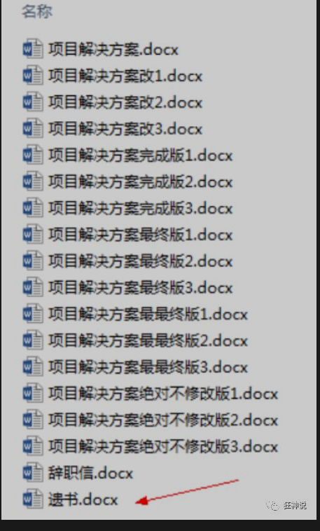
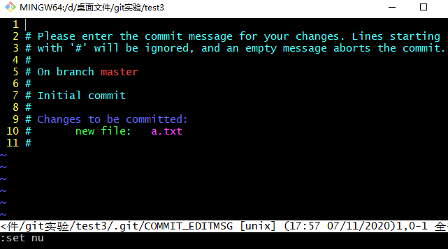
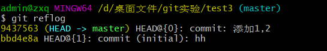
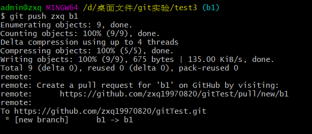

# 一.基本概念

仓库(Repository):存放项目代码，多个开源项目存放多个仓库。

收藏（star）：收藏项目。

复制克隆项目（fork）：该fork的项目时独立存在的，复制过来自己用

发起请求（Pull request）：你新增了功能，觉得不错，想和原本项目一起

关注（watch）：关注别人项目，及时收到更新的消息。

事物卡片（lssue）：发现代码BUG，但是目前没有成型代码，需要讨论时用。

主页：（1）github（2）仓库（3）个人


# 二.仓库管理


# 狂神版


版本控制

## 什么是版本控制

版本控制（Revision control）是一种在开发的过程中用于管理我们对文件、目录或工程等内容的修改历史，方便查看更改历史记录，备份以便恢复以前的版本的软件工程技术。

- 实现跨区域多人协同开发
- 追踪和记载一个或者多个文件的历史记录
- 组织和保护你的源代码和文档
- 统计工作量
- 并行开发、提高开发效率
- 跟踪记录整个软件的开发过程
- 减轻开发人员的负担，节省时间，同时降低人为错误

简单说就是用于管理多人协同开发项目的技术。

没有进行版本控制或者版本控制本身缺乏正确的流程管理，在软件开发过程中将会引入很多问题，如软件代码的一致性、软件内容的冗余、软件过程的事物性、软件开发过程中的并发性、软件源代码的安全性，以及软件的整合等问题。

无论是工作还是学习，或者是自己做笔记，都经历过这样一个阶段！我们就迫切需要一个版本控制工具！




多人开发就必须要使用版本控制！

## 常见的版本控制工具

我们学习的东西，一定是当下最流行的！

主流的版本控制器有如下这些：

- **Git**
- **SVN**（Subversion）
- **CVS**（Concurrent Versions System）
- **VSS**（Micorosoft Visual SourceSafe）
- **TFS**（Team Foundation Server）
- Visual Studio Online

版本控制产品非常的多（Perforce、Rational ClearCase、RCS（GNU Revision Control System）、Serena Dimention、SVK、BitKeeper、Monotone、Bazaar、Mercurial、SourceGear Vault），现在影响力最大且使用最广泛的是Git与SVN

## 版本控制分类

**1、本地版本控制**

记录文件每次的更新，可以对每个版本做一个快照，或是记录补丁文件，适合个人用，如RCS。


**2、集中版本控制  SVN**

所有的版本数据都保存在服务器上，协同开发者从服务器上同步更新或上传自己的修改


所有的版本数据都存在服务器上，用户的本地只有自己以前所同步的版本，如果不连网的话，用户就看不到历史版本，也无法切换版本验证问题，或在不同分支工作。而且，所有数据都保存在单一的服务器上，有很大的风险这个服务器会损坏，这样就会丢失所有的数据，当然可以定期备份。代表产品：SVN、CVS、VSS

**3、分布式版本控制 	Git**

每个人都拥有全部的代码！安全隐患！

所有版本信息仓库全部同步到本地的每个用户，这样就可以在本地查看所有版本历史，可以离线在本地提交，只需在连网时push到相应的服务器或其他用户那里。由于每个用户那里保存的都是所有的版本数据，只要有一个用户的设备没有问题就可以恢复所有的数据，但这增加了本地存储空间的占用。

不会因为服务器损坏或者网络问题，造成不能工作的情况！


## Git与SVN的主要区别

SVN是集中式版本控制系统，版本库是集中放在中央服务器的，而工作的时候，用的都是自己的电脑，所以首先要从中央服务器得到最新的版本，然后工作，完成工作后，需要把自己做完的活推送到中央服务器。集中式版本控制系统是必须联网才能工作，对网络带宽要求较高。


Git是分布式版本控制系统，没有中央服务器，每个人的电脑就是一个完整的版本库，工作的时候不需要联网了，因为版本都在自己电脑上。协同的方法是这样的：比如说自己在电脑上改了文件A，其他人也在电脑上改了文件A，这时，你们两之间只需把各自的修改推送给对方，就可以互相看到对方的修改了。Git可以直接看到更新了哪些代码和文件！

**Git是目前世界上最先进的分布式版本控制系统。**


聊聊Git的历史

同生活中的许多伟大事物一样，Git 诞生于一个极富纷争大举创新的年代。

Linux 内核开源项目有着为数众广的参与者。绝大多数的 Linux 内核维护工作都花在了提交补丁和保存归档的繁琐事务上(1991－2002年间)。到 2002 年，整个项目组开始启用一个专有的分布式版本控制系统 BitKeeper 来管理和维护代码。

Linux社区中存在很多的大佬！破解研究 BitKeeper ！

到了 2005 年，开发 BitKeeper 的商业公司同 Linux 内核开源社区的合作关系结束，他们收回了 Linux 内核社区免费使用 BitKeeper 的权力。这就迫使 Linux 开源社区(特别是 Linux 的缔造者 Linus Torvalds)基于使用 BitKeeper 时的经验教训，开发出自己的版本系统。（2周左右！） 也就是后来的 Git！

**Git是目前世界上最先进的分布式版本控制系统。**

Git是免费、开源的，最初Git是为辅助 Linux 内核开发的，来替代 BitKeeper！


inux和Git之父李纳斯·托沃兹（Linus Benedic Torvalds）1969、芬兰


Git环境配置

## 软件下载

打开 [git官网] https://git-scm.com/，下载git对应操作系统的版本。

所有东西下载慢的话就可以去找镜像！

官网下载太慢，我们可以使用淘宝镜像下载：http://npm.taobao.org/mirrors/git-for-windows/


下载对应的版本即可安装！

安装：无脑下一步即可！安装完毕就可以使用了！


## 启动Git

安装成功后在开始菜单中会有Git项，菜单下有3个程序：任意文件夹下右键也可以看到对应的程序！


**Git Bash：**Unix与Linux风格的命令行，使用最多，推荐最多

**Git CMD：**Windows风格的命令行

**Git GUI**：图形界面的Git，不建议初学者使用，尽量先熟悉常用命令


## 常用的Linux命令

平时一定要多使用这些基础的命令！

1）、cd : 改变目录。

2）、cd . . 回退到上一个目录，直接cd进入默认目录

3）、pwd : 显示当前所在的目录路径。

4）、ls(ll):  都是列出当前目录中的所有文件，只不过ll(两个ll)列出的内容更为详细。

5）、touch : 新建一个文件 如 touch index.js 就会在当前目录下新建一个index.js文件。

6）、rm:  删除一个文件, rm index.js 就会把index.js文件删除。

7）、mkdir:  新建一个目录,就是新建一个文件夹。

8）、rm -r :  删除一个文件夹, rm -r src 删除src目录

```
rm -rf / 切勿在Linux中尝试！删除电脑中全部文件！
```

9）、mv 移动文件, mv index.html src index.html 是我们要移动的文件, src 是目标文件夹,当然, 这样写,必须保证文件和目标文件夹在同一目录下。

10）、reset 重新初始化终端/清屏。

11）、clear 清屏。

12）、history 查看命令历史。

13）、help 帮助。

14）、exit 退出。

15）、#表示注释


## Git配置

所有的配置文件，其实都保存在本地！

查看配置 git config -l


查看不同级别的配置文件：

```
#查看系统configgit config --system --list　
#查看当前用户（global）配置git config --global  --list
```

**Git相关的配置文件：**

1）、Git\etc\gitconfig  ：Git 安装目录下的 gitconfig   --system 系统级

2）、C:\Users\Administrator\ .gitconfig   只适用于当前登录用户的配置  --global 全局


这里可以直接编辑配置文件，通过命令设置后会响应到这里。


## 设置用户名与邮箱（用户标识，必要）

当你安装Git后首先要做的事情是设置你的用户名称和e-mail地址。这是非常重要的，因为每次Git提交都会使用该信息。它被永远的嵌入到了你的提交中：

```
git config --global user.name "kuangshen"  #名称
git config --global user.email 24736743@qq.com   #邮箱
```

只需要做一次这个设置，如果你传递了--global 选项，因为Git将总是会使用该信息来处理你在系统中所做的一切操作。如果你希望在一个特定的项目中使用不同的名称或e-mail地址，你可以在该项目中运行该命令而不要--global选项。总之--global为全局配置，不加为某个项目的特定配置。


## 三个区域

Git本地有三个工作区域：工作目录（Working Directory）、暂存区(Stage/Index)、资源库(Repository或Git Directory)。如果在加上远程的git仓库(Remote Directory)就可以分为四个工作区域。文件在这四个区域之间的转换关系如下：


- Workspace：工作区，就是你平时存放项目代码的地方
- Index / Stage：暂存区，用于临时存放你的改动，事实上它只是一个文件，保存即将提交到文件列表信息
- Repository：仓库区（或本地仓库），就是安全存放数据的位置，这里面有你提交到所有版本的数据。其中HEAD指向最新放入仓库的版本
- Remote：远程仓库，托管代码的服务器，可以简单的认为是你项目组中的一台电脑用于远程数据交换

本地的三个区域确切的说应该是git仓库中HEAD指向的版本：


- Directory：使用Git管理的一个目录，也就是一个仓库，包含我们的工作空间和Git的管理空间。
- WorkSpace：需要通过Git进行版本控制的目录和文件，这些目录和文件组成了工作空间。
- .git：存放Git管理信息的目录，初始化仓库的时候自动创建。
- Index/Stage：暂存区，或者叫待提交更新区，在提交进入repo之前，我们可以把所有的更新放在暂存区。
- Local Repo：本地仓库，一个存放在本地的版本库；HEAD会只是当前的开发分支（branch）。
- Stash：隐藏，是一个工作状态保存栈，用于保存/恢复WorkSpace中的临时状态。


## 工作流程

git的工作流程一般是这样的：

１、在工作目录中添加、修改文件；

２、将需要进行版本管理的文件放入暂存区域；

３、将暂存区域的文件提交到git仓库。


因此，git管理的文件有三种状态：已修改（modified）,已暂存（staged）,已提交(committed)


Git项目搭建

## 创建工作目录与常用指令

工作目录（WorkSpace)一般就是你希望Git帮助你管理的文件夹，可以是你项目的目录，也可以是一个空目录，建议不要有中文。

日常使用只要记住下图6个命令：


## 本地仓库搭建

创建本地仓库的方法有两种：一种是创建全新的仓库，另一种是克隆远程仓库。

1、创建全新的仓库，需要用GIT管理的项目的根目录执行：

```
# 在当前目录新建一个Git代码库
$ git init
```

2、执行后可以看到，仅仅在项目目录多出了一个.git目录，关于版本等的所有信息都在这个目录里面。

## 克隆远程仓库

1、另一种方式是克隆远程目录，由于是将远程服务器上的仓库完全镜像一份至本地！

```
# 克隆一个项目和它的整个代码历史(版本信息)
$ git clone [url] 
# https://gitee.com/kuangstudy/openclass.git
```

2、去 gitee 或者 github 上克隆一个测试！


Git文件操作

## 文件的四种状态

版本控制就是对文件的版本控制，要对文件进行修改、提交等操作，首先要知道文件当前在什么状态，不然可能会提交了现在还不想提交的文件，或者要提交的文件没提交上。

- Untracked: 未跟踪, 此文件在文件夹中, 但并没有加入到git库, 不参与版本控制. 通过==git add==状态变为==Staged==.
- Unmodify: 文件已经入库, 未修改, 即版本库中的文件快照内容与文件夹中完全一致. 这种类型的文件有两种去处, 如果它被修改, 而变为==Modified==. 如果使用==git rm==移出版本库, 则成为==Untracked==文件
- Modified: 文件已修改, 仅仅是修改, 并没有进行其他的操作. 这个文件也有两个去处, 通过==git add==可进入暂存==staged==状态, 使用==git checkout== 则丢弃修改过, 返回到==unmodify==状态, 这个==git checkout==即从库中取出文件, 覆盖当前修改 !
- Staged: 暂存状态. 执行==git commit==则将修改同步到库中, 这时库中的文件和本地文件又变为一致, 文件为==Unmodify==状态. 执行==git reset HEAD filename==取消暂存, 文件状态为==Modified==

## 查看文件状态

上面说文件有4种状态，通过如下命令可以查看到文件的状态：


```
#查看指定文件状态
git status [filename]

#查看所有文件状态
git status

# git add .                  添加所有文件到暂存区
# git commit -m "消息内容"    提交暂存区中的内容到本地仓库 -m 提交信息
```


## 忽略文件

有些时候我们不想把某些文件纳入版本控制中，比如数据库文件，临时文件，设计文件等

在主目录下建立".gitignore"文件，此文件有如下规则：

1. 忽略文件中的空行或以井号（#）开始的行将会被忽略。
2. 可以使用Linux通配符。例如：星号（*）代表任意多个字符，问号（？）代表一个字符，方括号（[abc]）代表可选字符范围，大括号（{string1,string2,...}）代表可选的字符串等。
3. 如果名称的最前面有一个感叹号（!），表示例外规则，将不被忽略。
4. 如果名称的最前面是一个路径分隔符（/），表示要忽略的文件在此目录下，而子目录中的文件不忽略。
5. 如果名称的最后面是一个路径分隔符（/），表示要忽略的是此目录下该名称的子目录，而非文件（默认文件或目录都忽略）。

```
#为注释
*.txt        #忽略所有 .txt结尾的文件,这样的话上传就不会被选中！
!lib.txt     #但lib.txt除外
/temp        #仅忽略项目根目录下的TODO文件,不包括其它目录temp
build/       #忽略build/目录下的所有文件doc/*.txt    #会忽略 doc/notes.txt 但不包括 doc/server/arch.txt
```


使用码云

## github 是有墙的，比较慢，在国内的话，我们一般使用 gitee ，公司中有时候会搭建自己的gitlab服务器

这个其实可以作为大家未来找工作的一个重要信息！

1、注册登录码云，完善个人信息


2、设置本机绑定SSH公钥，实现免密码登录！（免密码登录，这一步挺重要的，码云是远程仓库，我们是平时工作在本地仓库！)

```
# 进入 C:\Users\Administrator\.ssh 目录
# 生成公钥
ssh-keygen  -t rsa
```


3、将公钥信息public key 添加到码云账户中即可！


4、使用码云创建一个自己的仓库！


许可证：开源是否可以随意转载，开源但是不能商业使用，不能转载，...  限制！


克隆到本地！


IDEA中集成Git


1、新建项目，绑定git。


注意观察idea中的变化


2、修改文件，使用IDEA操作git。

- 添加到暂存区
- commit 提交
- push到远程仓库

3、提交测试


这些都是单个人的操作！

学习的方式最重要！学会学习！我上课的更多时候都是在教大家去学习一种理念和思想（学习方式）

有道无术、术尚可求。有术无道、止于术！

真正的教学，授人以渔！


## 说明：GIT分支

分支在GIT中相对较难，分支就是科幻电影里面的平行宇宙，如果两个平行宇宙互不干扰，那对现在的你也没啥影响。不过，在某个时间点，两个平行宇宙合并了，我们就需要处理一些问题了！


git分支中常用指令：


```
# 列出所有本地分支
git branch

# 列出所有远程分支
git branch -r

# 新建一个分支，但依然停留在当前分支git branch [branch-name]

# 新建一个分支，并切换到该分支
git checkout -b [branch]

# 切换分支
git checkout [分支名]

# 合并指定分支到当前分支
$ git merge [branch]

# 删除分支
$ git branch -d [branch-name]

# 删除远程分支
$ git push origin --delete [branch-name]
$ git branch -dr [remote/branch]
```

IDEA中操作


如果同一个文件在合并分支时都被修改了则会引起冲突：解决的办法是我们可以修改冲突文件后重新提交！选择要保留他的代码还是你的代码！

master主分支应该非常稳定，用来发布新版本，一般情况下不允许在上面工作，工作一般情况下在新建的dev分支上工作，工作完后，比如上要发布，或者说dev分支代码稳定后可以合并到主分支master上来。

作业练习：找一个小伙伴，一起搭建一个远程仓库，来练习Git！

1、不要把Git想的很难，工作中多练习使用就自然而然的会了！

2、Git的学习也十分多，看完我的Git教程之后，可以多去思考，总结到自己博客！


# 尚硅谷版


## 基本命令

查看git版本     git --version

显示文件   la或ll

显示隐藏文件    ls -la


初始化git   git  init


### 设置签名（签名与guthub账号无关）

#### 项目级别/仓库级别：

仅在当前本地库范围内有效

​		git config user.name zxq

​		git config user.email 1415990264@qq.com


#### 系统用户级别：

登录当前操作系统的用户范围

git config --global user.name zxq
git config --global user.email  1415990264@qq.com


#### 级别优先级

就近原则：项目级别优先于系统用户级别，二者都有时采用项目级别
的签名

如果只有系统用户级别的签名，就以系统用户级别的签名为准

**二者都没有不允许**


### 查看项目级签名

信息保存位置：./.git/config 文件

 cat .git/config


### 查看系统用户级别签名（常用）

~表示家目录

信息保存位置：~/.gitconfig 文件

1. 进入家目录      cd ~

2. ls -lA|less

   

3.cat  .gitconfig


## 基本操作

新建的文件要先加到暂存区，然后再提交到本地库，暂存区的文件可以撤销

提交过的文件可以直接提交，不用再加到暂存区，但是不能撤销


#### 状态查看

​        git status
 查看工作区、暂存区状态


#### 添加

git add  [file name]
将工作区的“新建/修改”添加到暂存区


#### 从暂存区移除文件

git  rm --cached [file name]


#### 提交

git commit -m "commit message" [file name]
将暂存区的内容提交到本地库


如果是git	commit	文件名  就进入vim模式输入描述

#### 显示行号

:set nu




#### 进入编辑模式

i


#### 输入提交信息


#### 查看历史记录

最详细         git   log   

多屏显示控制方式：
空格向下翻页
b 向上翻页
q 退出


一行显示		git log --pretty=oneline


缩短哈希值  只显示过去版本，不显示之后的较新版本		git log --oneline 


​	显示到某一个版本需要步数		git reflog

HEAD@{移动到当前版本需要多少步}



#### 前进后退

基于索引值操作[推荐]
git reset --hard [局部索引值]
git reset --hard a6ace91

使用^符号：只能后退
git reset --hard HEAD^
注：一个^表示后退一步，n 个表示后退 n 步

使用~符号：只能后退

git reset --hard HEAD~n

注：表示后退 n 步


#### reset 命令的三个参数对比

##### --soft 参数(相当于撤销提交)

仅仅在本地库移动 HEAD 指针


##### --mixed 参数（相当于撤销添加到暂存区）

在本地库移动 HEAD 指针

重置暂存区

##### --hard 参数


在本地库移动 HEAD 指针
重置暂存区
重置工作区


#### 删除文件并找回


前提：删除前，文件存在时的状态提交到了本地库。

操作：git reset --hard [指针位置]


删除操作已经提交到本地库：指针位置指向历史记录

删除操作尚未提交到本地库：指针位置使用 HEAD

git reset --hard HEAD


#### 比较文件差异


git diff [文件名]

**将工作区中的文件和暂存区进行比较**


git diff [本地库中历史版本] [文件名]

**将工作区中的文件和本地库历史记录比较**

不带文件名比较多个文件


## 分支管理


#### 什么是分支？

在版本控制过程中，使用多条线同时推进多个任务。


#### 分支的好处？

同时并行推进多个功能开发，提高开发效率
各个分支在开发过程中，如果某一个分支开发失败，不会对其他分支有任
何影响。失败的分支删除重新开始即可

#### 分支操作

##### 创建分支

git branch [分支名]


##### 查看分支

git branch -v


##### 切换分支

git checkout [分支名]


##### 合并分支

**第一步**：切换到接受修改的分支（被合并，增加新内容）上
git checkout [被合并分支名]

**第二步**：执行 merge 命令
git merge [有新内容分支名]


##### 解决冲突

###### **冲突的表现**


###### **冲突的解决**

第一步：编辑文件，删除特殊符号
第二步：把文件修改到满意的程度，保存退出
第三步：git add [文件名]
第四步：git commit -m "日志信息"

**注意：此时 commit 一定不能带具体文件名**


## 创建远程库地址别名

git remote -v   	 查看当前所有远程地址别名

git remote add  [别名] [远程地址]  		添加别名

git remote remove 别名    删除别名


给git地址取别名为zxq


## 推送

git push [别名] [分支名]  	



## 克隆

git   clone [远程地址]

**效果**

完整的把远程库下载到本地

创建 origin 远程地址别名

初始化本地库


## 团队成员邀请


# 案例

## 1.实例化

~~~git
git init
~~~


## 2.提交到本地库

~~~java
git add .    提交到暂存区
~~~

~~~java
git commit -m "commit message"   提交到本地库
~~~

如果是删除文件，不用add，直接commit

然后推送


## 3.关联远程仓库

~~~java
git remote -v   	 查看当前所有远程地址别名

git remote add  [别名] [远程地址]  		添加别名

git remote remove 别名    删除别名
~~~


## 4.从远程仓库拉取

~~~java
git pull 别名  分支名
~~~


## 5.推送到远程库

~~~java
git push  别名  分支名
~~~


## 6.关于分支

##### 创建分支

git branch [分支名]


##### 查看分支

git branch -v


##### 切换分支

git checkout [分支名]


##### 合并分支

**第一步**：切换到接受修改的分支（被合并，增加新内容）上
git checkout [被合并分支名]

**第二步**：执行 merge 命令
git merge [有新内容分支名]


##### 解决冲突

###### **冲突的表现**


###### **冲突的解决**

第一步：编辑文件，删除特殊符号
第二步：把文件修改到满意的程度，保存退出
第三步：git add [文件名]
第四步：git commit -m "日志信息"

**注意：此时 commit 一定不能带具体文件名**


## 创建远程库地址别名

git remote -v   	 查看当前所有远程地址别名

git remote add  [别名] [远程地址]  		添加别名

git remote remove 别名    删除别名


给git地址取别名为zxq


## 推送

git push [别名] [分支名]  	


## 克隆


**一、普通克隆方式：
**

```
git clone <远程仓库地址>
```

这种克隆方式默认是克隆master主分支，而且通过命令 git branch --list 能看到克隆后在本地也只有这一个分支，如果再通过新建分支再拉取指定分支，甚至可能还需要解决冲突，太繁琐。


**二、克隆远程指定分支**

那么，如何快速有效的直接克隆远程指定分支？

只需要一条命令：

```
git clone -b <指定分支名> <远程仓库地址>
```

会自动在克隆该分支在本地，同样克隆后本地只有这一个分支。


**附：常用git配置命令**

**1、npm使用淘宝镜像源**

（能加快npm下载速度）

```
npm config  set  registry https://registry.npm.taobao.org
```

2、node-sass使用淘宝镜像

（能解决node-sass安装失败问题）

```
npm config  set  sass_binary_site https://npm.taobao.org/mirrors/node-sass/
```

3、npm恢复官方镜像源

（发布npm包时必须切换回官方镜像源）

```
npm config set registry https://registry.npmjs.org
```

4、git 配置全局用户名、邮箱

（用于提交代码时记录用户信息）

```
git config --global user.name neohan git config --global user.email neohan666@qq.com
```

5、git 配置ssh

```
ssh  -keygen -t rsa
```

6、git 配置全局字符集编码

（防止中文commit信息乱码）

```
git config --global i18n.commitencoding utf-8  git config --global i18n.logoutputencoding utf-8  export   LESSCHARSET=utf-8
```

7、git 配置全局不自动转换换行符

（解决windows和max系统的默认换行符不一致问题）

```
git config --global core.autocrlf  false
```

8、git 设置能检测文件名大小写

（在需要的项目中运行该命令）

```
git config core.ignorecase  false
```