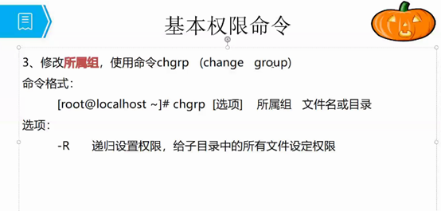
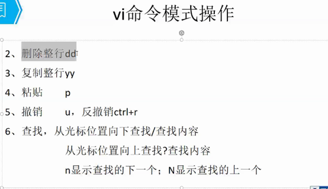
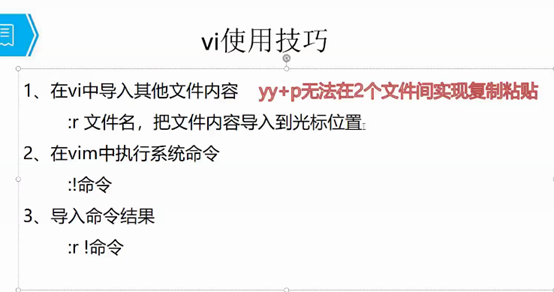
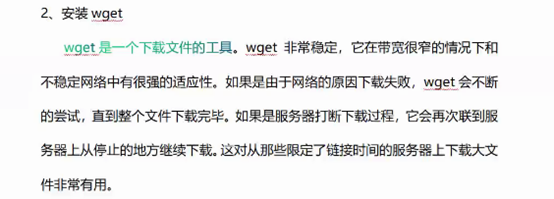
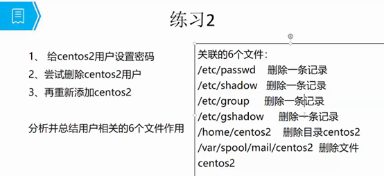
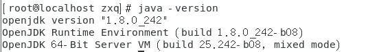

# Linux简介


 

 Linux简介


# Linux目录结构


# 查看目录结构

/ 表示根目录

~ 表示root


## 打开根目录  只显示名字

ls /  

 

 

 

## 打开长目录

ls  -l  /  

ll /

 

pwd 展示所在目录

cd 切换所在目录

 

 


## 选项


# 查看主机名命令


# 目录操作命令


## 创建目录-p


## 文件操作命令

### 删除文件-r


### 创建或修改文件时间 touch


### 输出或打印 echo

echo 打印

echo xx >> 文件名

### 查看文件详细信息 stat


### 查看文件内容 cat


## 练习


mkdir tmp/myfiles

 

cd myfiles

 

touch file1

 

cd file1

 

echo xx >> file1

 

ll file1

 

cat file1

 

 

 

 

 

 

 

 

 

 

 

# 文件操作命令

### 分屏显示More

##### 百分比显示


### 分行显示less


### 查看头部和尾部 head  tail -n


# 目录和文件都能操作的命令

## 删除rm -r


## 复制 cp -r


## 剪切 mv -f


# 打包压缩

打包：tar -xvf  

打包并压缩：tar -zcvf

解压	tar  -zxvf

# 总结1


## 文件类型


# 关于权限

​                               

​                                                              


## 数字权限 chmod

chmod  644 demo（文件名）


## 等于 设置权限

u  g o  rwx

chmod o=r+w demo（文件名）

 

 

## 加减 设置权限

chmod  g+w demo（文件名）

 

 

 

 

 

# 创建新用户

Useradd  用户名；

passwd 密码；


## 修改所有者  chown

​              所有者  所属组  文件名

Chown  user1  **:**  user1  demo

**：或  .** 


## 修改所属组Chgrp  tom  demo




# Vi工作模式

## Vi 文件名 进入命令模式


## 命令模式aio


## 编辑模式 保存退出


# 移动光标


## 删除行dd

## 复制行yy

## 粘贴p

## 撤销u

## 反撤销 ctrl +r

 

## 查找 向上？ N  向下/  n

 

 



# 导入内容



# 设置快捷键


# 字符替换


# 多文件打开


# 总结2


# 安装软件


# 开启网络


## 安装weget




## 安装openjdk


## 安装tomcat


Openjdk在     /usr/lib/jvm


Linux环境变量   /etc/profile

通过tomcat访问项目的index.Jsp

访问地址 http：//localhost:8080/上下文/index.Jsp

 

浏览器


# 6用户相关

## /Etc下

### Passwd 用户信息


### Shadow影子文件 SHA512


### Group 组信息


**附加组：除了root****用户之外的其他用户**

 

 

### Gshadow 组密码


##  /home/   目录  家目录

 


## /var/spool/mail/  文件 邮件 


## 模板目录


## 删除用户（删除6条信息）




# 5用户管理

## 添加用户


# 安装软件


tomcat端口号   http://192.168.186.128:8080/
dubbo端口号    http://192.168.186.128:8080/dubbo-admin-2.6.0/


## 1.jdk

### 	1.**卸载系统自带的OpenJDK以及相关的java文件**


①在命令窗口键入：

```
java -version
```





## 2.tomcat

cd /usr/local/tomcat8081/bin

启动    ./startup.sh 

关闭	 ./shutdown.sh


更改启动端口号

cd /usr/local/tomcat8081/conf

vim  vim server.xml 

查找   /8080  更改为8081


## 3.mysql


## 4.redis


## 5.zookeeper


# docker

## 安装docker

Docker可以运行在MAC、Windows、CentOS、UBUNTU等操作系统上，本课程基于CentOS 7 安装Docker。官网：https://www.docker.com

1、yum 包更新到最新 

yum update

2、安装需要的软件包， yum-util 提供yum-config-manager功能，另外两个是devicemapper驱动依赖的

yum install -y yum-utils device-mapper-persistent-data lvm2

3、 设置yum源

yum-config-manager --add-repo https://download.docker.com/linux/centos/docker-ce.repo

4、 安装docker，出现输入的界面都按 y 

yum install -y docker-ce

5、 查看docker版本，验证是否验证成功

docker -v


## 常用Docker命令

### 进程相关命令

1、启动docker服务

​     [root@localhost~]# systemctl start docker

2、查看docker版本

​     [root@localhost~]# docker -v

3、停止docker服务

​     [root@localhost~]# systemctl stop docker

4、重启docker服务

[root@localhost~]# systemctl restart docker

5、查看docker服务的状态

  [root@localhost~]# systemctl status docker

6、开机启动docker服务

​     [root@localhost~]# systemctl enable docker

### 镜像相关命令

docker镜像库网址： https://hub.docker.com/

1、搜索镜像

•    docker search 关键字: 从仓库搜索关键字的镜像

•    docker search mysql

2、 拉取镜像

•    docker pull 镜像名:tag 

从Docker仓库下载镜像到本地，镜像名称格式为 名称:版本号，如果版本号不指定则是最新的版本。如果不知道镜像版本，可以去docker hub 搜索对应镜像查看。

docker pull mysql

3、 查看镜像：查看本地所有的镜像

docker images

docker images –q # 查看所用镜像的id

4、 删除镜像：删除本地镜像

docker rmi 镜像id # 删除指定本地镜像

docker rmi `docker images -q` # 删除所有本地镜像

### 容器相关命令

1、查看容器

docker ps # 查看正在运行的容器

docker ps –a # 查看所有容器

2、创建并启动容器

docker run 参数

参数说明：

-i：保持容器运行。通常与 -t 同时使用。加入it这两个参数后，容器创建后自动进入容器中，退出容器后，容器自动关闭。

-t：为容器重新分配一个伪输入终端，通常与 -i 同时使用。

-d：以守护（后台）模式运行容器。创建一个容器在后台运行，需要使用docker exec 进入容器。退出后，容器不会关闭。

-it 创建的容器一般称为交互式容器，-id 创建的容器一般称为守护式容器

--name：为创建的容器命名。

3、进入容器

docker exec 参数 # 退出容器，容器不会关闭

4、停止容器

docker stop 容器名称

5、 启动容器

docker start 容器名称

6、 删除容器：如果容器是运行状态，需要停止容器才能删除

docker rm 容器名称

7、 查看容器信息

docker inspect 容器名称


**附一些，更多命令详解，请访问：http://www.docker.org.cn/dockerppt/106.html:**

 -----------------   docker ps 查看当前正在运行的容器

 -----------------  docker ps -a 查看所有容器的状态

 -----------------  docker start/stop id/name 启动/停止某个容器

 -----------------  docker attach id 进入某个容器(使用exit退出后容器也跟着停止运行)

 -----------------  docker exec -ti id 启动一个伪终端以交互式的方式进入某个容器（使用exit退出后容器不停止运行）

 -----------------  docker images 查看本地镜像
 -----------------  docker rm id/name 删除某个容器
-----------------   docker rmi id/name 删除某个镜像

 -----------------  docker run --name test -ti ubuntu /bin/bash 复制ubuntu容器并且重命名为test且运行，然后以伪终端交互式方式进入容器，运行bash

-----------------   docker build -t soar/centos:7.1 . 通过当前目录下的Dockerfile创建一个名为soar/centos:7.1的镜像

 -----------------  docker run -d -p 2222:22 --name test soar/centos:7.1 以镜像soar/centos:7.1创建名为test的容器，并以后台模式运行，并做端口映射到宿主机2222端口，P参数重启容器宿主机端口会发生改变

------------------  systemctl restart docker  重启docker

##  阿里专属的镜像加速

在宿主机器编辑文件：vi /etc/docker/daemon.json

阿里专属的镜像加速地址，类似于“[https://91cntlkt.mirror.aliyuncs.com](https://91cntlkt.mirror.aliyuncs.com/)”。

请在该配置文件中加入（没有该文件的话，请先建一个）：

 

{

 "registry-mirrors": ["[https://91cntlkt.mirror.aliyuncs.com](https://91cntlkt.mirror.aliyuncs.com/)"]

}

 

最后，需要重启docker服务

之后再使用pull命令拉取镜像，这时候是从ustc获取镜像，而且速度杠杠的

## [yum update 更新失败](https://www.cnblogs.com/wei9593/p/11683623.html)

1、yum安装东西的时候,老是报:There are unfinished transactions remaining. You might consider running yum-complete-transaction first to finish them.

意思是:有未完成的yum事务,建议先运行

yum-complete-transaction　命令清除

解决方法：

这是强制结束yum引起的

\# 安装 yum-complete-transaction（这是一个能发现未完成或被中断的yum事务的程序）
yum -y install yum-utils
\# 清除yum缓存
yum clean all
\# 运行 yum-complete-transaction,清理未完成事务
yum-complete-transaction --cleanup-only


 

1、检查内核版本，必须是3.10及以上

​     [root@localhost~]# uname ‐r

2、安装docker

​     [root@localhost~]# yum install docker

3、输入y确认安装

4、启动docker

​     [root@localhost~]# systemctl start docker

​     [root@localhost~]# docker -v

5、开机启动docker

​     [root@localhost~]# systemctl enable docker

6、停止docker

​     [root@localhost~]# systemctl stop docker


## mysql


根据镜像启动容器

docker pull mysql5.6


~~~java
 docker run -p 3306:3306 --name testmysql -e MYSQL_ROOT_PASSWORD=123456 -d mysql:5.6
~~~


​      -d: 后台运行

​      -p: 将主机的端口映射到容器的一个端口 主机端口:容器内部的端口

4、==查看==运行中的容器 docker ps 

5、==查看==所有的容器 docker ps -a

6、==停止==运行中的容器 docker stop 容器的id

7、==启动==容器 docker start 容器id

8、==删除==一个容器 docker rm 容器id

9、为了演示简单关闭了linux的防火墙

​    service firewalld status:查看防火墙状态

​    service firewalld stop:关闭防火墙

10、查看容器的日志

​     docker logs container-name/container-id

其它命令参考说明：https://docs.docker.com/engine/reference/commandline/docker/


## redis


拉取

~~~java
docker  pull redis
~~~


映射

~~~java
docker run -d -p 6379:6379 --name myredis redis
~~~


## tomcat

~~~java
docker pull tomcat
~~~


映射

~~~java
docker run --name mytomcat -d -p 8081:8080 tomcat
~~~

docker run --name ytomcat -d -p 8081:8080 tomcat:8.0.52 (根据镜像启动一个容器)
run:启动容器
–name :给容器自定义一个名字,
-d:后台运行,
-p:端口映射(8081:主机端口,8080:容器端口)
tomcat:8.0.52:启动的镜像名字并指定版本(如果启动时不知道版本,就会运行最新版本,如果docker里面没有最新版本的tomcat,就会自动的去阿里云镜像仓库重新拉取)

重启docker

~~~java
systemctl restart docker
~~~


# 一些常用命令

--centos7版本

--查看==正在运行==的服务

systemctl | grep running


--查看==正在运行==的服务

pstree


--查看==指定服务==运行状态

ps -ef |grep tomcat


如果出现以下信息说明已经关掉了


==杀死==指定进程

我们可以用 kill -9 加进程ID 

~~~linux
kill -9 7010
~~~


**查看==启动==的进程**

~~~linux
ps -a -H
~~~


==杀死==进程

~~~java
kill -9 -H
~~~


# linux中的备份   /usr/local/src/


# 安装jdk

jdk安装位置   /usr/local/java


相关命令

复制    cp jdk-8u144-linux-x64.tar.gz       /usr/local/src/
解压     tar -zxvf jdk-8u144-linux-x64.tar.gz
配置jdk环境变量      vim /etc/profile


jdk环境变量

~~~java
#java environment
JAVA_HOME=/usr/local/java/jdk1.8.0_161
$JAVA_HOME/jre/lib/rt.jar
PATH=$PATH$JAVA_HOME/bin
CLASSPATH=.:$JAVA_HOME/lib/dt.jar:$JAVA_HOME/lib/tools.jar
export JAVA_HOME CLASSPATH PATH
~~~


# 安装mysql

1.安装wget	yum -y install wget  
2.在线安装mysql	yum -y install mysql-community-server
3.启动mysql服务	systemctl start  mysqld
  查看mysql运行状态  systemctl status mysqld.service
4.设置开机启动	systemctl enable  mysqld
		systemctl  daemon-reload
5.修改本地root本地登录密码
    mysql安装完成之后，在/var/log/mysqld.log文件中给root生成了一个临时的默认密码。

		vi /var/log/mysqld.log
	或             grep "password" /var/log/mysqld.log


进入数据库

~~~java
mysql -uroot -p
输入密码
~~~


7.修改MySQL默认密码之后才能操作数据库

```
mysql> ALTER USER 'root'@'localhost' IDENTIFIED BY 'root';
输入密码
```


7.1这里有个问题，新密码设置的时候如果设置的过于简单会报错


7.2原因是因为MySQL有密码设置的规范，具体是与validate_password_policy的值有关


7.3可以通过如下命令设置

```
mysql> set global validate_password_policy=0;
mysql> set global validate_password_length=1;

```

设置之后此时密码就可以设置的很简单，例如1234之类的。


7.4重新设置密码

```
mysql> ALT
ER USER 'root'@'localhost' IDENTIFIED BY 'root';
```


7. 5但此时还有一个问题，就是因为安装了Yum Repository，以后每次yum操作都会自动更新，需要把这个卸载掉

```
[root@localhost ~]# yum -y remove mysql57-community-release-el7-10.noarch
```


7.6CentOS7防火墙配置，重启

开放端口：

```shell
firewall-cmd --zone=public --add-port=3306/tcp --permanent
```

关闭端口：

```shell
firewall-cmd --permanent --remove-port=3306/tcp

```

查询端口是否开放：

```shell
firewall-cmd --query-port=3306/tcp

```

重启：

```shell
firewall-cmd --reload
```


关闭防火墙

~~~java
firewall-cmd --zone=public --add-port=3306/tcp --permanent
~~~


安装时遇到的问题一：
使用Navicat工具连接MySQL报错解决方案：2013-Lost connection to MySQL server：


解决方式：
找到mysql安装配置文件：my.cnf；路径因环境而异。如果你的是Liunx的环境，可以去目录：/etc/my.cnf中查找
编辑文件：my.cnf，找到【mysqld】模块
在其下增加一行：skip-name-resolve 如下图所示：
保存退出，并重启mysql服务 systemctl restart mysqld.service 即可，再重新连接看看！


安装时遇到的问题二：
远程MYSQL 1103错误 ERROR 1130: Host *.*.*.* is not allowed to connect to
解决很简单：
1.进入mysql

```
[root@localhost ~]# mysql  -u  root -p
```

2.选择mysql库

```
mysql> use mysql；
```

3.查看mysql库中的user表的host值（即可进行连接访问的主机/IP名称）

```
mysql> select  host,user  FROM USER WHERE user='root';
```

4修改host值（以通配符%的内容增加主机/IP地址），当然也可以直接增加IP地址

```
mysql> update user set host= '%'  WHERE user ='root';
```

5 刷新MySQL的系统权限相关表

```
 mysql> flush privileges;
```


# 安装tomcat

tomcat端口号   http://192.168.186.128:8080/


~~~java
usr/local
~~~

1）上传Tomcat到linux上

2）解压Tomcat到/usr/local下

~~~java
tar -zxvf apache-tomcat-9.0.38.tar.gz 
~~~


3）开放Linux的对外访问的端口8080

~~~java
firewall-cmd --zone=public --add-port=8080/tcp --permanent
~~~

重启防火墙

~~~java
firewall-cmd --reload
~~~


4）启动关闭Tomcat

进入tomcat的==bin==下启动：

~~~java
./startup.sh
~~~


进入tomcat的bin下关闭：

~~~java
./shutdown.sh
~~~


cd /usr/local/tomcat8081/bin

启动    ./startup.sh 

关闭	 ./shutdown.sh


更改启动端口号

cd /usr/local/tomcat8081/conf

vim  vim server.xml 

查找   /8080  更改为8081


# 安装Zookeeper

下载地址：http://archive.apache.org/dist/zookeeper/

安装步骤：

第一步：安装 jdk（略）

第二步：把 zookeeper 的压缩包（zookeeper-3.4.6.tar.gz）上传到 linux 系统

~~~java
usr/local
~~~


第三步：解压缩压缩包

~~~java
  tar -zxvf zookeeper-3.4.6.tar.gz
~~~


第四步：进入zookeeper-3.4.6目录，创建data目录

~~~java
  mkdir data
~~~


第五步：进入conf目录 ，把zoo_sample.cfg 改名为zoo.cfg

~~~java
  cd conf

  mv zoo_sample.cfg zoo.cfg
~~~


第六步：打开zoo.cfg文件, 修改data属性：

~~~javav
dataDir=/usr/local/zookeeper-3.4.6/data
~~~


启动、停止Zookeeper

进入Zookeeper的bin目录，启动服务命令

~~~java
 ./zkServer.sh start
~~~


停止服务命令

~~~java
./zkServer.sh stop
~~~


查看服务状态：

./zkServer.sh status

./zkCli.sh  

客户端启动成功，就连上服务端了。


查看当前的所有节点，

[zk: localhost:2181(CONNECTED) 0] ls /


继续查看dubbo下的子节点：

[zk: localhost:2181(CONNECTED) 1] ls /dubbo


## 安装redis

1.1.1.  下载

官网：https://redis.io/download，选择稳定版本。


1.1.2.  安装

1.解压

通过xftp把redis安装包上传到指定文件夹。解压：

tar -zxvf redis-6.0.6.tar.gz


2．安装

由于redis依赖c语言环境，所以先安装gcc

[root@localhost ~]# yum install gcc

如果是线上下载安装包的话，先进入目录  usr/local，下载安装包

[root@localhost local]# wget http://download.redis.io/releases/redis-6.0.6.tar.gz

解压

[root@localhost local]# tar -xvf redis-6.0.6.tar.gz

安装好了c语言环境以后，需要编译redis，进入解压后的目录

[root@localhost local]# cd /usr/local/redis-6.0.6/

编译

[root@localhost local]# **make**

安装，如果不指明安装路径，就会在当前路径下安装，指明安装路径，会在指明的路径下生成bin文件夹，bin里面是redis的命令

[root@localhost redis-6.0.1]# make PREFIX=/usr/local/redis.6.0.6 install


进入bin


注意：如果在编译的时候报错如下：等等，太长了，不列举了。

make[1]: *** [server.o] 错误 1

make[1]: 离开目录“/usr/redis-6.0.6/src”

make: *** [all] 错误 2

server.c:2402:11: 错误：‘struct redisServer’没有名为‘assert_file’的成员

   server.assert_file = "<no file>";

​      ^

server.c:2403:11: 错误：‘struct redisServer’没有名为‘assert_line’的成员

   server.assert_line = 0;

​      ^

server.c:2404:11: 错误：‘struct redisServer’没有名为‘bug_report_start’的成员

   server.bug_report_start = 0;

​      ^

解决办法：升级gcc版本

[root@localhost redis-6.0.6]# gcc -v               # 查看gcc版本

[root@localhost redis-6.0.6]# yum -y install centos-release-scl # 升级到9.1版本

[root@localhost redis-6.0.6]# yum -y install devtoolset-9-gcc devtoolset-9-gcc-c++ devtoolset-9-binutils

[root@localhost redis-6.0.6]# scl enable devtoolset-9 bash

以上为临时启用，如果要长期使用gcc 9.1的话：

[root@localhost redis-6.0.6]# echo "source /opt/rh/devtoolset-9/enable" >>/etc/profile

在执行编译就没有问题了，安装成功，会提示：


执行make test，可能会出现如下错误：

[root@localhost redis-6.0.6]# make test

cd src && make test

make[1]: 进入目录“/usr/redis-6.0.6/src”

  CC Makefile.dep

make[1]: 离开目录“/usr/redis-6.0.6/src”

make[1]: 进入目录“/usr/redis-6.0.6/src”

You need tcl 8.5 or newer in order to run the Redis test

make[1]: *** [test] 错误 1

make[1]: 离开目录“/usr/redis-6.0.6/src”

make: *** [test] 错误 2

解决办法：

[root@localhost redis-6.0.6]# yum install tcl

[root@localhost redis-6.0.6]# make test

重新测试成功。


1.1.3.  运行redis

以某个配置文件启动redis服务，一定要注意配置文件的路径


1.1.4.  后台启动

上面redis的启动方式，是前端启动，一关闭客户端，redis的服务也就停掉了，所以这种启动方式非常不友好。我们可以修改配置文件中的启动方式：

[root@localhost redis-6.0.6]# vim redis.conf

进到redis.conf文件里，然后找到daemonize no把no改为yes


启动的时候指定修改之后的配置文件即可。

1.1.5.  查看是否启动成功


1.1.6.  关闭redis服务


或者：


如果redis设置了密码，则以下面方式关闭，123456为密码


1.1.7.  使用桌面管理工具连接Linux redis

修改redis配置文件，注释掉bind 127.0.0.1


保护模式关闭：


 

设置密码：


1.1.8.  以服务方式启动redis

\1.   把redis加入service服务

vim /lib/systemd/system/redis.service

\2. 写入

[Unit]

Description=redis

After=network.target

 

[Service]

Type=forking

PIDFile=/var/run/redis_6379.pid

ExecStart=/usr/local/redis-6.0.6/src/redis-server /usr/local/redis-6.0.6/etc/redis.conf

ExecReload=/bin/kill -s HUP $MAINPID

ExecStop=/bin/kill -s QUIT $MAINPID

PrivateTmp=true

 

[Install]

WantedBy=multi-user.target

**注意路径问题，以及PIDFile的路径对应的是redis-6.0.6/redis.conf里面的PIDFile**

保存，退出。

\3.   运行以下

[root@localhost redis-6.0.6]# systemctl enable redis.service     # 加入开机启动

 

[root@localhost redis-6.0.6]# systemctl is-enabled redis.service   # 查看开机是否启动成功

enabled

 

[root@localhost redis-6.0.6]# systemctl start redis         #开启redis服务

 

[root@localhost redis-6.0.6]# systemctl status redis       //查看redis运行状态

1.2. 清缓存命令

flushall 

把缓存键值对清空。


# 启动tomcat

~~~java
cd /usr/local/apache-tomcat-9.0.38/bin/
~~~


~~~java
./startup.sh
~~~


tomcat端口号   

~~~java
http://192.168.186.130:8080/
~~~


# 启动zookeeper

~~~java
cd /usr/local/zookeeper-3.4.6/bin/
~~~


~~~java
./zkServer.sh start
~~~

~~~java
./zkCli.sh
~~~

~~~java
http://192.168.186.130:8080/dubbo-admin-2.6.0/
~~~


# 启动redis


1.1.1.  运行redis

以某个配置文件启动redis服务，一定要注意配置文件的路径

~~~java
./redis-server ../redis-6.0.6/redis.conf 
~~~


1.1.2.  后台启动

上面redis的启动方式，是前端启动，一关闭客户端，redis的服务也就停掉了，所以这种启动方式非常不友好。我们可以修改配置文件中的启动方式：

[root@localhost redis-6.0.6]# vim redis.conf

进到redis.conf文件里，然后找到daemonize no把no改为yes


启动的时候指定修改之后的配置文件即可。

1.1.3.  查看是否启动成功


1.1.4.  关闭redis服务


或者：


如果redis设置了密码，则以下面方式关闭，123456为密码


## 关闭防火墙

1、 查看firwwall状态

systemctl status firewalld  

或者

firewall-cmd --state

2、添加端口

（1）、直接添加
firewall-cmd --zone=public --permanent --add-port=6379/tcp
（2）、添加访问规则
firewall-cmd --permanent --zone=public  --add-rich-rule="rule family="ipv4" source address=" 192.168.*.*" port protocol="tcp" port="6379" accept"

3、防火墙重新载入

firewall-cmd --reload

4、查看防火墙规则

firewall-cmd --list-all


查看是否启动成功

~~~java
ps -ef|grep redis
~~~


关闭redis

~~~java
kill -9 922772
~~~


或者：


如果redis设置了密码，则以下面方式关闭，123456为密码


以服务方式启动redis

1. 把redis加入service服务

~~~java
vim /lib/systemd/system/redis.service
~~~


2. 写入

~~~java
[Unit]

Description=redis

After=network.target

 

[Service]

Type=forking

PIDFile=/var/run/redis_6379.pid

ExecStart=/usr/local/redis-6.0.6/src/redis-server /usr/local/redis-6.0.6/etc/redis.conf

ExecReload=/bin/kill -s HUP $MAINPID

ExecStop=/bin/kill -s QUIT $MAINPID

PrivateTmp=true

 

[Install]

WantedBy=multi-user.target
~~~


**注意路径问题，以及PIDFile的路径对应的是redis-6.0.6/redis.conf里面的PIDFile**

保存，退出。


3. 运行以下

~~~java
[root@localhost redis-6.0.6]# systemctl enable redis.service     # 加入开机启动
~~~


~~~java
[root@localhost redis-6.0.6]# systemctl is-enabled redis.service   # 查看开机是否启动成功
~~~


enabled

 

~~~java
[root@localhost redis-6.0.6]# systemctl start redis         #开启redis服务
~~~


 ~~~java
[root@localhost redis-6.0.6]# systemctl status redis       //查看redis运行状态
 ~~~


清除缓存

~~~java
flushall  
把缓存键值对清空。

~~~


# 关于防火墙

7.6CentOS7防火墙配置，重启

开放端口：

```shell
firewall-cmd --zone=public --add-port=9200/tcp --permanent
```

关闭端口：

```shell
firewall-cmd --permanent --remove-port=9200/tcp
```

查询端口是否开放：

```shell
firewall-cmd --query-port=9200/tcp

```

重启防火墙：

```shell
firewall-cmd --reload
```


# 故障

执行ll命令时报找不到命令，原因是环境变量PATH被修改，

​	


解决办法：

执行  export PATH=/bin:/usr/bin:$PATH


