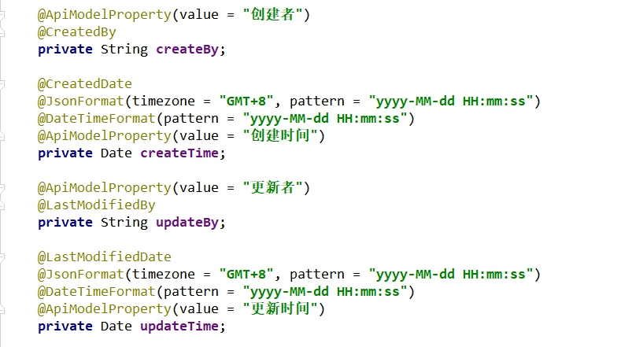

# jpa简介

**JPA是Java Persistence API的简称，中文名Java持久层API**。**是SUN公司推出的一套基于ORM的规范**。Hibernate框架中提供了JPA的实现，`Spring Data JPA`是`Spring`基于`Hibernate`开发的一个`JPA`框架。可以极大的简化`JPA`的写法，可以在几乎不用写具体代码的情况下，实现对数据的访问和操作。除了`CRUD`外，还包括如`分页`、`排序`等一些常用的功能。此外更强大的是，它还**可以通过`方法命名规则`进行数据库查询操作**

　　Spring Data JPA提供的接口：

1. `Repository`：最顶层的接口，是一个空的接口，目的是为了统一所有Repository的类型，且能让组件扫描的时候自动识别。
2. `CrudRepository` ：是Repository的子接口，提供CRUD的功能（内置默认的简单的CURD方法，可以直接引用）
3. `PagingAndSortingRepository`：是CrudRepository的子接口，添加分页和排序的功能。
4. **`JpaRepository`**：是PagingAndSortingRepository的子接口，增加了一些实用的功能，比如：批量操作等。（相对最完整的内置方法：简单的CURD/分页/批量）
5. `JpaSpecificationExecutor`：用来做负责查询的接口
6. `Specification`：是`Spring Data JPA`提供的一个查询规范，要做复杂的查询，只需围绕这个规范来设置查询条件即可。


# 方法命名规范

其中，自定义查询，方法名命名规范如下：

| 命名可选关键字    | 方法命名举例                   | 执行方法时对应产生的SQL，Where子句 |
| ----------------- | ------------------------------ | ---------------------------------- |
| And               | findByNameAndPwd               | where name= ? and pwd =?           |
| Or                | findByNameOrSex                | where name= ? or sex=?             |
| Is,Equals         | findById，findByIdEquals       | where id= ?                        |
| Between           | findByIdBetween                | where id between ? and ?           |
| LessThan          | findByIdLessThan               | where id < ?                       |
| LessThanEquals    | findByIdLessThanEquals         | where id <= ?                      |
| GreaterThan       | findByIdGreaterThan            | where id > ?                       |
| GreaterThanEquals | findByIdGreaterThanEquals      | where id > = ?                     |
| After             | findByIdAfter                  | where id > ?                       |
| Before            | findByIdBefore                 | where id < ?                       |
| IsNull            | findByNameIsNull               | where name is null                 |
| isNotNull,NotNull | findByNameNotNull              | where name is not null             |
| Like              | findByNameLike                 | where name like ?                  |
| NotLike           | findByNameNotLike              | where name not like ?              |
| StartingWith      | findByNameStartingWith         | where name like ‘?%’               |
| EndingWith        | findByNameEndingWith           | where name like ‘%?’               |
| Containing        | findByNameContaining           | where name like ‘%?%’              |
| OrderBy           | findByIdOrderByXDesc           | where id=? order by x desc         |
| Not               | findByNameNot                  | where name <> ?                    |
| In                | findByIdIn(Collection<?> c)    | where id in (?)                    |
| NotIn             | findByIdNotIn(Collection<?> c) | where id not in (?)                |
| True              | findByAaaTue                   | where aaa = true                   |
| False             | findByAaaFalse                 | where aaa = false                  |
| IgnoreCase        | findByNameIgnoreCase           | where UPPER(name)=UPPER(?)         |

**这个确实，够强大！但查询条件一多，这个方法名就也会很长了哦……**

　　**Spring Data JPA简单总结：**

1. **提供了基本的CURD方法，批处理，分页方法等。**
2. **允许自定义方法名，根据指定命名规则实现查询。**
3. **允许使用@Query注解，自定义更高级，更复杂的SQL**


# **1.准备工作**


引入***\*`spring-data-jap依赖`\****

```
1 <!-- SpringBoot整合JPA -->
2 <dependency>
3     <groupId>org.springframework.boot</groupId>
4     <artifactId>spring-boot-starter-data-jpa</artifactId>
5 </dependency>
```

修改yml配置文件设置JPA配置及数据库配置

[](javascript:void(0);)

```
 1 spring:
 2   datasource:
 3     #根据MySQL版本配置驱动类5.x----8.x 驱动类“com.mysql.jdbc.Driver” 或 “com.mysql.cj.jdbc.Driver”。
 4     driver-class-name: com.mysql.cj.jdbc.Driver
 5     #useSSL：SSL协议提供服务主要作用：（不建议在没有服务器身份验证的情况下建立SSL连接。）     
 6     #   1）认证用户服务器，确保数据发送到正确的服务器； 　　 .
 7     #   2）加密数据，防止数据传输途中被窃取使用；
 8     #   3）维护数据完整性，验证数据在传输过程中是否丢失；
 9     #serverTimezone：设置时区，不设置会报错。GMT%2B8：东八区北京时间  Asia/Shanghai：上海时间
10     #useServerPrepStmts：在url中给出useServerPrepStmts=true参数，开启预编译（默认PS是关闭的）
11     #allowMultiQueries：设置为true，开启批量执行sql的开关。更多请持续关注博主文档
12     url: jdbc:mysql://localhost:3306/springboot?useSSL=false&serverTimezone=GMT%2B8
13     username: root
14     password: xsge
15   #JPA配置——————————————————————————————————————————————————————————————————————————
16   jpa:
17     #是否显示SQL
18     show-sql: true 
19     hibernate:
20       #表结构处理方式方式。update表示，第一次执行时根据实体类创建表结构，之后的操作只做数据更新
21       ddl-auto: update
```

[](javascript:void(0);)

新增实体类对应数据库表

配置实体常用注解：（这里仅仅列举，更多详情请关注博主Hibernate文章）

@Entity

作用：标识当前实体为数据实体类

@Table（name=值）

作用：标识当前实体对应的是数据库表

属性：Name：指定当前实体对应数据库表名称

@Id

作用：标识当前属性为主键列属性

@Column

作用：标识当前属性对应数据库的字段

属性：Name：指定当前属性所对应的数据库字段列名称

@GeneratedValue

作用：指定字段列的主键策略

属性：Generator：该属性值，指定Hibernate中提供的主键策略声明别名

　　Strategy：该属性，标注JPA提供的主键生成策略（即主键生成方式）。

　　取值GenerationType：

　　AUTO：自适应，选择一下三种，默认选择TABLE

　　==IDENTITY==：Mysql自增长，要判断是否支持

​        SEQUENCE：Oracle自增长，要判断是否支持

  TABLE：类似于Helw高低位算法，无需判断，因为使用的是固定格式的算法生成。

[](javascript:void(0);)

```
 1 @Entity    // 标识当前实体为数据实体类
 2 @Data    // 自动生成get/set等
 3 @AllArgsConstructor    // 全参构造函数
 4 @NoArgsConstructor // 无参构造函数
 5 @Table(name = "student") // 标识实体对应的表名
 6 @EntityListeners(AuditingEntityListener.class) // spring-data-jap实体类数据更新的监听器注解
 7 public class Student {
 8     // 标识当前属性为主键列属性
 9     @Id    
10     // 标识字段列的主键策略（主键生成方式）GenerationType.IDENTITY表示shiyongMySQL默认自增长生成主键值
11     @GeneratedValue(strategy = GenerationType.IDENTITY) 
12     private Integer sid;
13     
14     // 标识当前属性对应数据库的字段
15     @Column(name = "name") 
16     private String name;
17     @Column(name = "age")
18     private Integer age;
19     
20     // spring-data-jap中提供的自动填充，新增时自动填充时间（配合SPRING-DATA-JPA监听注解使用）
21     @CreatedDate 
22     private Date createTime;
23     
24     // spring-data-jap中提供的自动填充，有更新时自动填充更新时间（配合SPING-DATA-JPA监听注解使用）
25     @LastModifiedDate    
26     private Date updateTime;
27 }
```

[](javascript:void(0);)

**这里需要注意，在《Mybatis-Plus使用全解》中，介绍过如何设置公共字段自动填充功能。比如创建时间和修改时间，创建人和修改人等等，都是可以一进行赋值的。在`spring-data-jap`中，是使用`@CreatedDate`和`@LastModifiedDate`标记，同时，需要在实体类上，加`@EntityListeners(AuditingEntityListener.class)`，然后在启动类上加入注解`@EnableJpaAuditing（开启JPA自动填充）`，这样就实现类似公共字段自动填充的功能了。（JPA自动填充注解如下图）
**

**修改SpringBoot主程序
\**在启动类上加入注解`@EnableJpaAuditing`\**
**

[](javascript:void(0);)

```
 1 @SpringBootApplication
 2 @EnableJpaAuditing  // 开启JPA自动填充功能
 3 @Slf4j
 4 public class AnnotaticSpringBootApplication {
 5     // 主函数
 6     public static void main(String[] args) {
 7         // 启动App
 8         SpringApplication.run(AnnotaticSpringBootApplication.class, args);
 9         log.info("主程序启动了………………");
10     }
11 }
```

[](javascript:void(0);)


l 常用注解的说明

 

​    ==@Entity==

​      作用：指定当前类是实体类。

​    ==@Table==

​      作用：指定实体类和表之间的对应关系。

​      属性：

​       name：指定数据库表的名称

​      ==@Id==

​       作用：指定当前字段是主键。

​      ==@GeneratedValue==

​        作用：指定主键的生成方式。。

​      属性：

​       strategy ：指定主键生成策略。

​    ==@Column==

​      作用：指定实体类属性和数据库表之间的对应关系

​      属性：

​       name：指定数据库表的列名称。

​       unique：是否唯一 

​       nullable：是否可以为空 

​       inserttable：是否可以插入 

​       updateable：是否可以更新 

​       columnDefinition: 定义建表时创建此列的DDL 

​       secondaryTable: 从表名。如果此列不建在主表上（默认建在主表），该属性定义该列所在从表的名字搭建开发环境[重点]


# 2.主键生成策略


```java
@GeneratedValue(strategy = GenerationType.IDENTITY) 
```


通过annotation（注解）来映射hibernate实体的,基于annotation的hibernate主键标识为@Id, 其生成规则由@GeneratedValue设定的.这里的@id和@GeneratedValue都是JPA的标准用法。

 

JPA提供的四种标准用法为==TABLE==, 	==SEQUENCE==,	==IDENTITY==,	==AUTO==。

 

##    **TABLE**：

使用一个特定的数据库表格来保存主键**

用法：

~~~java
@Id  
    @GeneratedValue(strategy = GenerationType.TABLE, generator="payablemoney_gen")  
    @TableGenerator(name = "pk_gen",  
        table="tb_generator",  
        pkColumnName="gen_name",  
        valueColumnName="gen_value",  
        pkColumnValue="PAYABLEMOENY_PK",  
        allocationSize=1  
    ) 
private Long custId;


//@TableGenerator的定义：
    @Target({TYPE, METHOD, FIELD})   
    @Retention(RUNTIME)  
    public @interface TableGenerator {  
      //表示该表主键生成策略的名称，它被引用在@GeneratedValue中设置的“generator”值中
      String name();  
      //表示表生成策略所持久化的表名，例如，这里表使用的是数据库中的“tb_generator”。
      String table() default "";  
      //catalog和schema具体指定表所在的目录名或是数据库名
      String catalog() default "";  
      String schema() default "";  
      //属性的值表示在持久化表中，该主键生成策略所对应键值的名称。例如在“tb_generator”中将“gen_name”作为主键的键值
      String pkColumnName() default "";  
      //属性的值表示在持久化表中，该主键当前所生成的值，它的值将会随着每次创建累加。例如，在“tb_generator”中将“gen_value”作为主键的值 
      String valueColumnName() default "";  
      //属性的值表示在持久化表中，该生成策略所对应的主键。例如在“tb_generator”表中，将“gen_name”的值为“CUSTOMER_PK”。 
      String pkColumnValue() default "";  
      //表示主键初识值，默认为0。 
      int initialValue() default 0;  
      //表示每次主键值增加的大小，例如设置成1，则表示每次创建新记录后自动加1，默认为50。
      int allocationSize() default 50;  
      UniqueConstraint[] uniqueConstraints() default {};  
    } 

    //这里应用表tb_generator，定义为 ：
    CREATE TABLE  tb_generator (  
      id NUMBER NOT NULL,  
      gen_name VARCHAR2(255) NOT NULL,  
      gen_value NUMBER NOT NULL,  
      PRIMARY KEY(id)  
    )

~~~


 

## **IDENTITY:** 

  **主键由数据库自动生成（主要是自动增长型**

 

用法：

 ~~~java
    @Id  
    @GeneratedValue(strategy = GenerationType.IDENTITY) 
    private Long custId;

 ~~~


 

## **SEQUENCE**

：根据底层数据库的序列来生成主键，条件是数据库支持序列。

 

用法：

~~~java
    @Id  
    @GeneratedValue(strategy = GenerationType.SEQUENCE,generator="payablemoney_seq")  
    @SequenceGenerator(name="payablemoney_seq", sequenceName="seq_payment")  
	private Long custId;


    //@SequenceGenerator源码中的定义
    @Target({TYPE, METHOD, FIELD})   
    @Retention(RUNTIME)  
    public @interface SequenceGenerator {  
       //表示该表主键生成策略的名称，它被引用在@GeneratedValue中设置的“generator”值中
       String name();  
       //属性表示生成策略用到的数据库序列名称。
       String sequenceName() default "";  
       //表示主键初识值，默认为0
       int initialValue() default 0;  
       //表示每次主键值增加的大小，例如设置1，则表示每次插入新记录后自动加1，默认为50
       int allocationSize() default 50;  
    }

~~~


##  **AUTO**：主键由程序控制

 

用法：

    ~~~java
    @Id  
    @GeneratedValue(strategy = GenerationType.AUTO)  
    private Long custId;

    ~~~


