# 1.spring是什么

Spring 是分层的 Java SE/EE 应用 **full-stack** 轻量级开源框架，以 ==**IoC**==（Inverse Of Control：

反转控制）和 ==**AOP**==（Aspect Oriented Programming：

面向切面编程）为内核，提供了展现层 Spring

MVC 和持久层 Spring JDBC 以及业务层事务管理等众多的企业级应用技术，还能整合开源世界众多
著名的第三方框架和类库，逐渐成为使用最多的 Java EE 企业应用开源框架。


ctrl +alt+b

查看实现类


# 2.spring 的优势

**方便解耦，简化开发**
通过 Spring 提供的 IoC 容器，可以将对象间的依赖关系交由 Spring 进行控制，避免硬编码所造
成的过度程序耦合。用户也不必再为单例模式类、属性文件解析等这些很底层的需求编写代码，可
以更专注于上层的应用。


**AOP 编程的支持**
通过 Spring 的 AOP 功能，方便进行面向切面的编程，许多不容易用传统 OOP 实现的功能可以

通过 AOP 轻松应付。


**声明式事务的支持**
可以将我们从单调烦闷的事务管理代码中解脱出来，通过声明式方式灵活的进行事务的管理，
提高开发效率和质量。


**方便程序的测试**
可以用非容器依赖的编程方式进行几乎所有的测试工作，测试不再是昂贵的操作，而是随手可
做的事情。


**方便集成各种优秀框架**
Spring 可以降低各种框架的使用难度，提供了对各种优秀框架（Struts、Hibernate、Hessian、Quartz
等）的直接支持。


**降低 JavaEE API 的使用难度**
Spring 对 JavaEE API（如 JDBC、JavaMail、远程调用等）进行了薄薄的封装层，使这些 API 的
使用难度大为降低。


**Java 源码是经典学习范例**
Spring 的源代码设计精妙、结构清晰、匠心独用，处处体现着大师对 Java 设计模式灵活运用以
及对 Java 技术的高深造诣。它的源代码无意是 Java 技术的最佳实践的范例。


# 3.spring 的体系结构

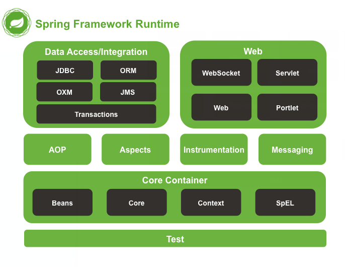


# 4.IoC 的概念和作用


## 4.1什么是程序的耦合

耦合性(Coupling)，也叫耦合度，是对模块间关联程度的度量。耦合的强弱取决于模块间接口的复杂性、调
用模块的方式以及通过界面传送数据的多少。模块间的耦合度是指模块之间的依赖关系，包括控制关系、调用关
系、数据传递关系。模块间联系越多，其耦合性越强，同时表明其独立性越差( 降低耦合性，可以提高其独立
性)。耦合性存在于各个领域，而非软件设计中独有的，但是我们只讨论软件工程中的耦合。

在软件工程中，耦合指的就是就是**对象之间**的依赖性。对象之间的耦合越高，维护成本越高。因此对象的设计
应使类和构件之间的耦合最小。软件设计中通常用耦合度和内聚度作为衡量模块独立程度的标准。划分模块的一个
准则就是高内聚低耦合。
它有如下分类：
（1） **内容耦合**。当一个模块直接修改或操作另一个模块的数据时，或一个模块不通过正常入口而转入另
一个模块时，这样的耦合被称为内容耦合。内容耦合是最高程度的耦合，应该避免使用之。
（2） **公共耦合**。两个或两个以上的模块共同引用一个全局数据项，这种耦合被称为公共耦合。在具有大
量公共耦合的结构中，确定究竟是哪个模块给全局变量赋了一个特定的值是十分困难的。
（3） **外部耦合** 。一组模块都访问同一全局简单变量而不是同一全局数据结构，而且不是通过参数表传
递该全局变量的信息，则称之为外部耦合。
（4） **控制耦合** 。一个模块通过接口向另一个模块传递一个控制信号，接受信号的模块根据信号值而进
行适当的动作，这种耦合被称为控制耦合。
（5） **标记耦合** 。若一个模块 A 通过接口向两个模块 B 和 C 传递一个公共参数，那么称模块 B 和 C 之间
存在一个标记耦合。
（6） **数据耦合**。模块之间通过参数来传递数据，那么被称为数据耦合。数据耦合是最低的一种耦合形
式，系统中一般都存在这种类型的耦合，因为为了完成一些有意义的功能，往往需要将某些模块的输出数据作为另
一些模块的输入数据。
（7） **非直接耦合** 。两个模块之间没有直接关系，它们之间的联系完全是通过主模块的控制和调用来实
现的。


**总结：**
耦合是影响软件复杂程度和设计质量的一个重要因素，在设计上我们应采用以下原则：如果模块间必须
存在耦合，就尽量使用数据耦合，少用控制耦合，限制公共耦合的范围，尽量避免使用内容耦合。

**内聚与耦合**
内聚标志一个模块内各个元素彼此结合的紧密程度，它是信息隐蔽和局部化概念的自然扩展。内聚是从功能角度来度量模块内的联系，一个好的内聚模块应当恰好做一件事。它描述的是模块内的功能联系。

耦合是软件结构中各模块之间相互连接的一种度量，耦合强弱取决于模块间接口的复杂程度、进入或访问一个模块的点以及通过接口的数据。 程序讲究的是低耦合，高内聚。就是同一个模块内的各个元素之间要高度紧密，但是各个模块之间的相互依存度却要不那么紧密。

内聚和耦合是密切相关的，同其他模块存在高耦合的模块意味着低内聚，而高内聚的模块意味着该模块同其他
模块之间是低耦合。在进行软件设计时，应力争做到**高内聚，低耦合。**


## 4.2工厂模式解耦


​	在实际开发中我们可以把三层的对象都使用配置文件配置起来，当启动服务器应用加载的时候，让一个类中的
方法通过读取配置文件，把这些对象创建出来并**存起来**。在接下来的使用的时候，直接拿过来用就好了。
那么，这个读取配置文件，创建和获取三层对象的类就是工厂。


~~~java
public class BeanFactory {
 /*   一个创建Bean对象的工厂

         Bean：在计算机英语中，有可重用组件的含义。
             JavaBean：用java语言编写的可重用组件。
                 javabean >  实体类

            它就是创建我们的service和dao对象的。

     第一个：需要一个配置文件来配置我们的service和dao
           配置的内容：唯一标识=全限定类名（key=value)
      第二个：通过读取配置文件中配置的内容，反射创建对象
            我的配置文件可以是xml也可以是properties*/

    //定义一个Properties对象
    private static Properties props;

    //    定义一个Map，用于存放我们要创建的对象，我们把它称之为容器
    private static Map<String, Object> beans;

    //    使用静态的门槛为Properties对象赋值
    static {

        try {
//        实例化对象
            props = new Properties();
//    获取properties文件的流对象
            InputStream in = BeanFactory.class.getClassLoader().getResourceAsStream("bean.properties");
            try {
                props.load(in);
            } catch (IOException e) {
                e.printStackTrace();
            }

//            实例化容器
            beans = new HashMap<String, Object>();

//            取出配置文件中所有的key
            Enumeration keys = props.keys();

            //遍历枚举
            while (keys.hasMoreElements()) {
//                取出每个key
                String key = keys.nextElement().toString();
//                根据key获取value
                String beanPath = props.getProperty(key);
//                反射创建对象
                Object values = null;
                try {
                    values = Class.forName(beanPath).newInstance();
                } catch (ClassNotFoundException e) {
                    throw new ExceptionInInitializerError("初始化properties失败");
                }
//                把key和value存入容器中
                beans.put(key, values);
            }

//
        } catch (IllegalAccessException e) {
            e.printStackTrace();
        } catch (InstantiationException e) {
            e.printStackTrace();
        }

    }


    /**
     * 根据bean的名称来获取对象，这个对象为单例对象
     * @param beanName
     * @return
     */

    public static Object getBean(String beanName) {
        return beans.get(beanName);

    }
~~~


## 4.3控制反转-Inversion Of Control

上一小节解耦的思路有 2 个问题：
1、存哪去？

分析：由于我们是很多对象，肯定要找个集合来存。这时候有 Map 和 List 供选择。
到底选 Map 还是 List 就看我们有没有查找需求。有查找需求，选 Map。
所以我们的答案就是
在应用加载时，创建一个 Map，用于存放三层对象。
我们把这个 map 称之为**容器**。

2、还是没解释什么是工厂？
工厂就是负责给我们从容器中获取指定对象的类。这时候我们获取对象的方式发生了改变。


原来：
我们在获取对象时，都是采用 new 的方式。是**主动**的。


现在：
我们获取对象时，同时跟工厂要，有工厂为我们查找或者创建对象。是被动的。

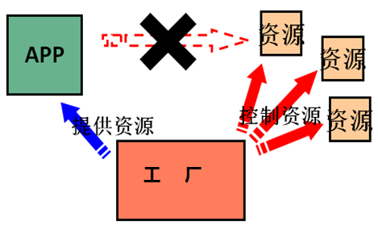

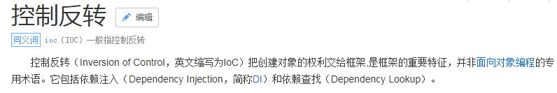

明确 ioc 的作用：
削减计算机程序的耦合(解除我们代码中的依赖关系)。


# 5.基于 XML 的配置（入门案例）[掌握]


bean模块


## 5.1导入依赖


~~~java
<dependency>
            <groupId>org.springframework</groupId>
            <artifactId>spring-context</artifactId>
            <version>5.1.5.RELEASE</version>
</dependency>
~~~


## 5.2创建 xml 文件

在类的根路径下创建一个任意名称的 xml 文件（不能是中文）

让 spring 管理资源，在配置文件中配置 service 和 dao

~~~java
<?xml version="1.0" encoding="UTF-8"?>
<beans xmlns="http://www.springframework.org/schema/beans"
xmlns:xsi="http://www.w3.org/2001/XMLSchema-instance"
xsi:schemaLocation="http://www.springframework.org/schema/beans
http://www.springframework.org/schema/beans/spring-beans.xsd">

<!-- 配置 service -->
<bean id="accountService" class="com.itheima.service.impl.AccountServiceImpl">
</bean>
    
<!-- 配置 dao -->
<bean id="accountDao" class="com.itheima.dao.impl.AccountDaoImpl"></bean>

</beans>
~~~


## 5.3测试配置是否成功


~~~java
  public static void main(String[] args) {


//获取核心容器对象
        ApplicationContext ac = new ClassPathXmlApplicationContext("bean.xml");

//根据id获取Bean对象
        AccountService as = (AccountService) ac.getBean("accountService");
        AccountDao adao = ac.getBean("accountDao", AccountDao.class);
        System.out.println(as);
        System.out.println(adao);

        //        accountService.saveAccount();
    }
}
~~~


# 6.    Spring 基于 XML 的 IOC 细节[掌握]

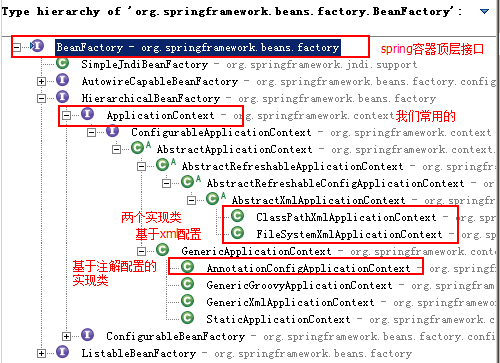


## 6.1 BeanFactory 和 ApplicationContext 的区别

BeanFactory 才是 Spring 容器中的顶层接口。

ApplicationContext 是它的子接口。

**BeanFactory 和 ApplicationContext 的区别：**

创建对象的时间点不一样。
ApplicationContext：只要一读取配置文件，默认情况下就会创建对象。
BeanFactory：什么使用什么时候创建对象。


~~~java
     * *  ApplicationContext:     单例对象适用              采用此接口
     * *      它在构建核心容器时，创建对象采取的策略是采用立即加载的方式。
     * 也就是说，只要一读取完配置文件马上就创建配置文件中配置的对象。
     * *
     * *  BeanFactory:            多例对象使用
     * *      它在构建核心容器时，创建对象采取的策略是采用延迟加载的方式。
     * 也就是说，什么时候根据id获取对象了，什么时候才真正的创建对象。
~~~


## 6.2ApplicationContext 接口的实现类

**==ClassPathXmlApplicationContext：==**
它是从类的根路径下加载配置文件   推荐使用这种

**==FileSystemXmlApplicationContext==：**
它是从磁盘路径上加载配置文件，配置文件可以在磁盘的任意位置。


**==WebXmlApplicationContext==**：

此容器加载一个 XML 文件，此文件定义了一个 WEB 应用的所有 bean。


**==AnnotationConfigApplicationContext:==**
当我们使用注解配置容器对象时，需要使用此类来创建 spring 容器。它用来读取注解。


## 6.3   IOC 中 bean 标签和管理对象细节

### 6.3.1 bean 标签


```java
Bean：在计算机英语中，有可重用组件的含义。
    JavaBean：用java语言编写的可重用组件。
        javabean >  实体类
```


**作用：**
用于配置对象让 spring 来创建的。
默认情况下它调用的是类中的==无参构造函数==。如果没有无参构造函数则不能创建成功。


eg.

~~~java
 <bean id="accountService" class="com.zxq.service.impl.AccountServiceImpl"
        scope="prototype"></bean>
~~~


**属性：**
id：给对象在容器中提供一个唯一标识。用于获取对象。
class：指定类的全限定类名。用于反射创建对象。默认情况下调用无参构造函数。
scope：指定对象的作用范围。


~~~java
				singleton：单例的（默认值）
                prototype：多例的
                request：作用于web应用的请求范围
                session：作用于web应用的会话范围
                global-session：作用于集群环境的会话范围（全局会话范围），当不是集群环境时，它就是								session
~~~

* singleton :默认值，单例的.

* prototype :多例的.

* request
  :WEB 项目中,Spring 创建一个 Bean 的对象,将对象存入到 request 域中.

* session
  :WEB 项目中,Spring 创建一个 Bean 的对象,将对象存入到 session 域中.

* global session
  :WEB 项目中,应用在 Portlet 环境.如果没有 Portlet 环境那么
  globalSession 相当于 session.
  init-method：指定类中的初始化方法名称。
  destroy-method：指定类中销毁方法名称。

  


### 6.3.2 bean 的作用范围和生命周期

**单例对象：scope="singleton"**

一个应用只有一个对象的实例。它的作用范围就是整个引用。
**生命周期：**
对象出生：当应用加载，创建容器时，对象就被创建了。
对象活着：只要容器在，对象一直活着。
对象死亡：当应用卸载，销毁容器时，对象就被销毁了。


**多例对象：scope="prototype"**
每次访问对象时，都会重新创建对象实例。

**生命周期：**
对象出生：当使用对象时，创建新的对象实例。
对象活着：只要对象在使用中，就一直活着。
对象死亡：当对象长时间不用时，被 java 的垃圾回收器回收了。


```java
request：作用于web应用的请求范围
session：作用于web应用的会话范围
global-session：作用于集群环境的会话范围（全局会话范围），当不是集群环境时，它就是session
```


### 6.3.3实例化 Bean 的三种方式

**第一种方式**：

使用默认**无参构造函数**

在默认情况下：
它会根据默认无参构造函数来创建类对象。如果 bean 中没有默认无参构造函数，将会创建失败。

\<bean id="accountService" class="com.itheima.service.impl.AccountServiceImpl"/>


**第二种方式：**

spring 管理静态工厂-使用静态工厂的方法创建对象
/**

* 模拟一个静态工厂，创建业务层实现类
*/
public class StaticFactory {
      public static IAccountService createAccountService(){
       return new AccountServiceImpl();
}
}
<!-- 此种方式是:
使用 StaticFactory 类中的静态方法 createAccountService 创建对象，并存入 spring 容器
id 属性：指定 bean 的 id，用于从容器中获取
class 属性：指定静态工厂的全限定类名
factory-method 属性：指定生产对象的静态方法
-->
\<bean id="accountService"  class="com.itheima.factory.StaticFactory"

   factory-thod="createAccountService">\</bean>


**第三种方式：**

spring 管理实例工厂-使用实例工厂的方法创建对象
/**

* 模拟一个实例工厂，创建业务层实现类

* 此工厂创建对象，必须现有工厂实例对象，再调用方法
  */
  public class InstanceFactory {
  public IAccountService createAccountService(){
  return new AccountServiceImpl();
  }
  }
  <!-- 此种方式是：
  先把工厂的创建交给 spring 来管理。
  然后在使用工厂的 bean 来调用里面的方法
  factory-bean 属性：用于指定实例工厂 bean 的 id。
  factory-method 属性：用于指定实例工厂中创建对象的方法。

  **常用**

  -->
  \<bean id="instancFactory" class="com.itheima.factory.InstanceFactory">\</bean>
  \<bean id="accountService"  factory-bean="instancFactory"
  factory-method="createAccountService">\</bean>


## 6.4依赖注入


### 6.4.1依赖注入的概念

依赖注入：Dependency Injection。它是 spring 框架核心 ioc 的具体实现。
我们的程序在编写时，通过控制反转，把对象的创建交给了 spring，但是代码中不可能出现没有依赖的情况。
ioc 解耦只是降低他们的依赖关系，但不会消除。例如：我们的业务层仍会调用持久层的方法。
那这种业务层和持久层的依赖关系，在使用 spring 之后，就让 spring 来维护了。
简单的说，就是坐等框架把持久层对象传入业务层，而不用我们自己去获取。


```java
依赖注入：
         Dependency Injection
        IOC的作用：
            降低程序间的耦合（依赖关系）
        依赖关系的管理：
            以后都交给spring来维护
        在当前类需要用到其他类的对象，由spring为我们提供，我们只需要在配置文件中说明
 依赖关系的维护：
    就称之为依赖注入。
 依赖注入：
    能注入的数据：有三类
        基本类型和String
        其他bean类型（在配置文件中或者注解配置过的bean）
        复杂类型/集合类型
    
     注入的方式：有三种
        第一种：使用构造函数提供
        第二种：使用set方法提供
        第三种：使用注解提供（明天的内容）
```


### 6.4.2构造函数注入


```java
<!--构造函数注入：
    使用的标签:constructor-arg
    标签出现的位置：bean标签的内部
    标签中的属性
        type：用于指定要注入的数据的数据类型，该数据类型也是构造函数中某个或某些参数的类型
        index：用于指定要注入的数据给构造函数中指定索引位置的参数赋值。索引的位置是从0开始
        name：用于指定给构造函数中指定名称的参数赋值                                   常用的
        =============以上三个用于指定给构造函数中哪个参数赋值===============================
        value：用于提供基本类型和String类型的数据
        ref：用于指定其他的bean类型数据。它指的就是在spring的Ioc核心容器中出现过的bean对象

    优势：
        在获取bean对象时，注入数据是必须的操作，否则对象无法创建成功。
    弊端：
        改变了bean对象的实例化方式，使我们在创建对象时，如果用不到这些数据，也必须提供。
-->
```


业务层AccountServiceImpl

~~~java
public class AccountServiceImpl implements IAccountService {
	private String name;
	private Integer age;
	private Date birthday;
	public AccountServiceImpl(String name, Integer age, Date birthday) {
		this.name = name;
		this.age = age;
		this.birthday = birthday;
	}
	@Override
	public void saveAccount() {
	System.out.println(name+","+age+","+birthday);
	}
}
~~~


bean.xml

~~~java
 <bean id="accountService" class="com.zxq.service.impl.AccountServiceImpl">
        <constructor-arg name="name" value="泰斯特"></constructor-arg>
        <constructor-arg name="age" value="18"></constructor-arg>
        <constructor-arg name="birthday" ref="now"></constructor-arg>

    </bean>

    <!-- 配置一个日期对象  读取全限定类名（class的内容），创建反射对象，
                存入spring的核心容器中，通过id将对象取出来-->
    <bean id="now" class="java.util.Date"></bean>
~~~


测试类

~~~html
    public static void main(String[] args) {
        //1.获取核心容器对象
        ApplicationContext ac = new ClassPathXmlApplicationContext("bean.xml");
        //2.根据id获取Bean对象
        AccountService as  = (AccountService)ac.getBean("accountService3");
        as.saveAccount();

    }
~~~


### 6.4.3set方法注入


```
set方法注入                更常用的方式
    涉及的标签：property
    出现的位置：bean标签的内部
    标签的属性
        name：用于指定注入时所调用的set方法名称
        value：用于提供基本类型和String类型的数据
        ref：用于指定其他的bean类型数据。它指的就是在spring的Ioc核心容器中出现过的bean对象
    优势：
        创建对象时没有明确的限制，可以直接使用默认构造函数
    弊端：
        如果有某个成员必须有值，则获取对象是有可能set方法没有执行。
```


bean.xml

~~~html
 <bean id="accountService2" class="com.zxq.service.impl.AccountServiceImpl2">
        <property name="name" value="TEST" ></property>
        <property name="age" value="21"></property>
        <property name="birthday" ref="now"></property>
 </bean>
~~~


测试类

~~~java
    public static void main(String[] args) {


//        获取核心容器对象
        ApplicationContext ac = new ClassPathXmlApplicationContext("bean.xml");

//根据id获取Bean对象
        AccountService as = (AccountService) ac.getBean("accountService2");
        System.out.println(as);
~~~


### 6.4.4注入集合属性


```
    复杂类型的注入/集合类型的注入
    用于给List结构集合注入的标签：
        list array set
    用于个Map结构集合注入的标签:
        map  props
    结构相同，标签可以互换
```


AccountServiceImpl

~~~java
public class AccountServiceImpl implements IAccountService {
	private String[] myStrs;
	private List<String> myList;
	private Set<String> mySet;
	private Map<String,String> myMap;
	private Properties myProps;
	public void setMyStrs(String[] myStrs) {
		this.myStrs = myStrs;
	}
	public void setMyList(List<String> myList) {
		this.myList = myList;
	}
	public void setMySet(Set<String> mySet) {
		this.mySet = mySet;
    }
	public void setMyMap(Map<String, String> myMap) {
		this.myMap = myMap;
	}
	public void setMyProps(Properties myProps) {
			this.myProps = myProps;
}
	@Override
	public void saveAccount() {
		System.out.println(Arrays.toString(myStrs));
		System.out.println(myList);
		System.out.println(mySet);
		System.out.println(myMap);
    }
}
~~~


bean.xml

```java
<bean id="accountService3" class="com.zxq.service.impl.AccountServiceImpl3">
    <property name="myStrs">
        <set>
            <value>AAA</value>
            <value>BBB</value>
            <value>CCC</value>
        </set>
    </property>

    <property name="myList">
        <array>
            <value>AAA</value>
            <value>BBB</value>
            <value>CCC</value>
        </array>
    </property>

    <property name="mySet">
        <list>
            <value>AAA</value>
            <value>BBB</value>
            <value>CCC</value>
        </list>
    </property>

    <property name="myMap">
        <props>
            <prop key="testC">ccc</prop>
            <prop key="testD">ddd</prop>
        </props>
    </property>

    <property name="myProps">
        <map>
            <entry key="testA" value="aaa"></entry>
            <entry key="testB">
                <value>BBB</value>
            </entry>
        </map>
    </property>
</bean>
```


# 7.    Spring基于注解的 IOC 配置


## 7.1曾经XML的配置：

<bean id="accountService" class="com.itheima.service.impl.AccountServiceImpl"

scope=""  init-method="" destroy-method="">

<property name=""  value="" | ref="">\</property>

\</bean>


## 7.2**用于创建对象的**

他们的作用就和在XML配置文件中编写一个<bean>标签实现的功能是一样的

**Component:**

作用：用于把当前类对象存入spring容器中

属性：

value：用于指定bean的id。当我们不写时，它的默认值是当前类名，且首字母改小写。


**Controller**：一般用在表现层

**Service：**一般用在业务层

**Repository**：一般用在持久层

以上三个注解他们的作用和属性与Component是一模一样。

他们三个是spring框架为我们提供明确的三层使用的注解，使我们的三层对象更加清晰


**细节：如果注解中有且只有一个属性要赋值时，且名称是 value，value 在赋值是可以不写。**


## 7.3用于注入数据的

他们的作用就和在xml配置文件中的bean标签中写一个<property>标签的作用是一样的


**Autowired:**

作用：自动按照类型注入。只要容器中有唯一的一个bean对象类型和要注入的变量类型匹配，就可以注				入成功

如果ioc容器中没有任何bean的类型和要注入的变量类型匹配，则报错。

如果Ioc容器中有多个类型匹配时：


这是按照  **数据类型**  匹配  **接口** 来查找的，如果出现多个  相同接口的实现类，

则根据变量名去匹配key的值

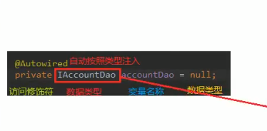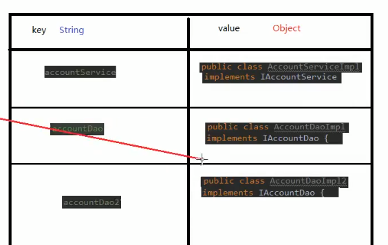

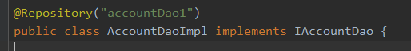

出现位置：

可以是变量上，也可以是方法上

细节：

在使用注解注入时，set方法就不是必须的了。


**Qualifier:**

作用：在按照类中注入的基础之上再按照名称注入。它在给类成员注入时不能单独使用。但是在给方法参数注入时可以（稍后我们讲）

属性：

value：用于指定注入bean的id。


**Resource**

作用：直接按照bean的id注入。它可以独立使用

属性：

name：用于指定bean的id。

以上三个注入都只能注入其他bean类型的数据，而基本类型和String类型无法使用上述注解实现。

另外，**集合类型的注入只能通过XML来实现。**


**Value**

作用：用于注入基本类型和String类型的数据

属性：

value：用于指定数据的值。它可以使用spring中SpEL(也就是spring的el表达式）

SpEL的写法：${表达式}


 

## 7.4用于改变作用范围的

他们的作用就和在bean标签中使用scope属性实现的功能是一样的

**Scope**

作用：用于指定bean的作用范围

属性：

value：指定范围的取值。常用取值：singleton prototype


## 7.5和生命周期相关  （了解）

他们的作用就和在bean标签中使用init-method和destroy-methode的作用是一样的

**PreDestroy**

作用：用于指定销毁方法

**PostConstruct**

作用：用于指定初始化方法


使用@Component 注解配置管理的资源

~~~java
@Component("accountService")
public class AccountServiceImpl implements IAccountService {
	private IAccountDao accountDao;
	public void setAccountDao(IAccountDao accountDao) {
		this.accountDao = accountDao;
	}
}
~~~


测试类

~~~java
    public static void main(String[] args) {
        //1.获取核心容器对象
        ClassPathXmlApplicationContext ac =
            new   ClassPathXmlApplicationContext("bean.xml");
        //2.根据id获取Bean对象
        IAccountService as  = (IAccountService)ac.getBean("accountService");
                as.saveAccount();
    }
}
~~~


bean.xml

~~~java
<?xml version="1.0" encoding="UTF-8"?>
<beans xmlns="http://www.springframework.org/schema/beans"
       xmlns:xsi="http://www.w3.org/2001/XMLSchema-instance"
       xmlns:context="http://www.springframework.org/schema/context"
       xsi:schemaLocation="http://www.springframework.org/schema/beans
        http://www.springframework.org/schema/beans/spring-beans.xsd
        http://www.springframework.org/schema/context
        http://www.springframework.org/schema/context/spring-context.xsd">

    <!--告知spring在创建容器时要扫描的包，配置所需要的标签不是在beans的约束中，而是一个名称为
    context名称空间和约束中-->
    <context:component-scan base-package="com.itheima"></context:component-scan>
        
</beans>
~~~


# 8.动态代理

```
*  特点：字节码随用随创建，随用随加载
*  作用：不修改源码的基础上对方法增强
```

**==基于接口的动态代理==**

提供者：JDK 官方的 Proxy 类。
要求：被代理类最少实现一个接口。

**==基于子类的动态代理==**
提供者：第三方的 CGLib，如果报 asmxxxx 异常，需要导入 asm.jar。
要求：被代理类不能用 final 修饰的类（最终类）。


## 1.jdk官方代理


### 1.接口

~~~java
/**
 * 对生产厂家要求的接口
 */
public interface IProducer {

    /**
     * 销售
     * @param money
     */
    public void saleProduct(float money);

    /**
     * 售后
     * @param money
     */
    public void afterService(float money);
}

~~~


### 2.接口实现类

~~~java
/**
 * 一个生产者
 */
public class Producer implements IProducer{

    /**
     * 销售
     * @param money
     */
    @Override
    public void saleProduct(float money){
        System.out.println("销售产品，并拿到钱："+money);
    }

    /**
     * 售后
     * @param money
     */
    @Override
    public void afterService(float money){

        System.out.println("提供售后服务，并拿到钱："+money);
    }
}
~~~


### 3.实现代理类

==Proxy.newProxyInstance==

~~~java
public class Client {

    public static void main(String[] args) {


        //被代理对象
        final Producer producer = new Producer();

        /**
         * 动态代理：
         *  特点：字节码随用随创建，随用随加载
         *  作用：不修改源码的基础上对方法增强
         *  分类：
         *      基于接口的动态代理
         *      基于子类的动态代理
         *  基于接口的动态代理：
         *      涉及的类：Proxy
         *      提供者：JDK官方
         *  如何创建代理对象：
         *      使用Proxy类中的newProxyInstance方法
         *  创建代理对象的要求：
         *      被代理类最少实现一个接口，如果没有则不能使用
         *  newProxyInstance方法的参数：
         *      ClassLoader：类加载器
         *          它是用于加载代理对象字节码的。和被代理对象使用相同的类加载器。固定写法。
         *      Class[]：字节码数组
         *          它是用于让代理对象和被代理对象有相同方法。固定写法。
         *      InvocationHandler：用于提供增强的代码
         *          它是让我们写如何代理。我们一般都是些一个该接口的实现类，通常情况下都是匿名内部类，但不是必须的。
         *          此接口的实现类都是谁用谁写。
         */
       IProducer proxyProducer = (IProducer) Proxy.newProxyInstance(
               producer.getClass().getClassLoader(),producer.getClass().getInterfaces(),
                new InvocationHandler() {
                    /**
                     * 作用：执行被代理对象的任何接口方法都会经过该方法
                     * 方法参数的含义
                     * @param proxy   代理对象的引用
                     * @param method  当前执行的方法
                     * @param args    当前执行方法所需的参数
                     * @return        和被代理对象方法有相同的返回值
                     * @throws Throwable
                     */
                    @Override
                    public Object invoke(Object proxy, Method method, Object[] args) throws Throwable {
                        //提供增强的代码
                        Object returnValue = null;

                        //1.获取方法执行的参数
                        Float money = (Float)args[0];

                        //2.判断当前方法是不是销售
                        if("saleProduct".equals(method.getName())) {
                            returnValue = method.invoke(producer, money*0.8f);
                        }

//                        2.判断当前方法是不是售后
                        if("afterService".equals(method.getName())) {
                            returnValue = method.invoke(producer, money*0.8f);
                        }
                        return returnValue;
                    }
                });
        proxyProducer.afterService(10000f);
    }
}
~~~


## 2.cglib代理


### 1.被代理类

~~~java
/**
 * 一个生产者
 */
public class Producer {

    /**
     * 销售
     * @param money
     */
    public void saleProduct(float money){
        System.out.println("销售产品，并拿到钱："+money);
    }

    /**
     * 售后
     * @param money
     */
    public void afterService(float money){

        System.out.println("提供售后服务，并拿到钱："+money);
    }
}

~~~


### 2.代理类

==Enhancer.create==

~~~java
public class Client {

    public static void main(String[] args) {
        final Producer producer = new Producer();

        /**
         * 动态代理：
         *  特点：字节码随用随创建，随用随加载
         *  作用：不修改源码的基础上对方法增强
         *  分类：
         *      基于接口的动态代理
         *      基于子类的动态代理
         *  基于子类的动态代理：
         *      涉及的类：Enhancer
         *      提供者：第三方cglib库
         *  如何创建代理对象：
         *      使用Enhancer类中的create方法
         *  创建代理对象的要求：
         *      被代理类不能是最终类
         *  create方法的参数：
         *      Class：字节码
         *          它是用于指定被代理对象的字节码。
         *
         *      Callback：用于提供增强的代码
         *          它是让我们写如何代理。我们一般都是些一个该接口的实现类，通常情况下都是匿名内部类，但不是必须的。
         *          此接口的实现类都是谁用谁写。
         *          我们一般写的都是该接口的子接口实现类：MethodInterceptor
         */
        Producer cglibProducer = (Producer)Enhancer.create(
                producer.getClass(), new MethodInterceptor() {
            /**
             * 执行被代理对象的任何方法都会经过该方法
             * @param proxy
             * @param method
             * @param args
             *    以上三个参数和基于接口的动态代理中invoke方法的参数是一样的
             * @param methodProxy ：当前执行方法的代理对象
             * @return
             * @throws Throwable
             */
            @Override
            public Object intercept(Object proxy, Method method, Object[] args, MethodProxy methodProxy) throws Throwable {
                //提供增强的代码
                Object returnValue = null;

                //1.获取方法执行的参数
                Float money = (Float)args[0];
                //2.判断当前方法是不是销售
                if("saleProduct".equals(method.getName())) {
                    returnValue = method.invoke(producer, money*0.8f);
                }
                return returnValue;
            }
        });
        cglibProducer.saleProduct(12000f);
    }
}
~~~


# 9.AOP 的相关概念[理解]


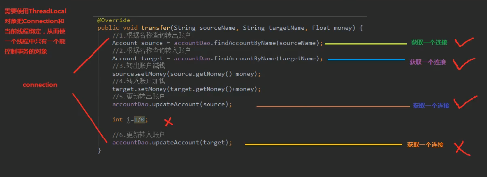


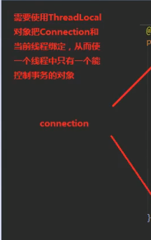


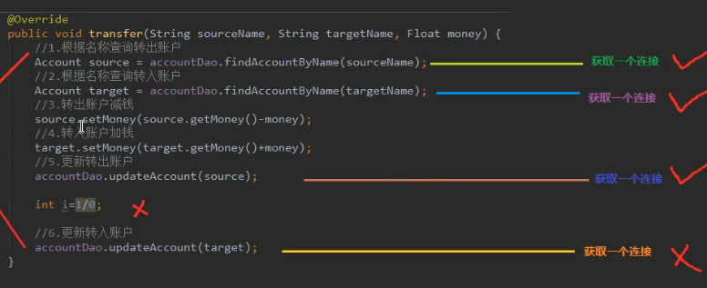


## 9.1spring中的专业术语


**Joinpoint(连接点):**
所谓连接点是指那些被拦截到的点。在 spring 中,这些点指的是方法,因为 spring 只支持方法类型的
连接点。

**Pointcut(切入点):**
所谓切入点是指我们要对哪些 Joinpoint 进行拦截的定义。

**Advice(通知/增强):**
**所**谓通知是指拦截到 Joinpoint 之后所要做的事情就是通知。
通知的类型：前置通知,后置通知,异常通知,最终通知,环绕通知。

**Introduction(引介):**
引介是一种特殊的通知在不修改类代码的前提下, Introduction 可以在运行期为类动态地添加一些方
法或 Field。

**Target(目标对象):**
代理的目标对象。

**Weaving(织入):**
是指把增强应用到目标对象来创建新的代理对象的过程。
spring 采用动态代理织入，而 AspectJ 采用编译期织入和类装载期织入。

**Proxy（代理）:**
一个类被 AOP 织入增强后，就产生一个结果代理类。

**Aspect(切面):**
是切入点和通知（引介）的结合


## 9.2基于xml的aop


### pom依赖

~~~java
   <dependencies>
        <dependency>
            <groupId>org.springframework</groupId>
            <artifactId>spring-context</artifactId>
            <version>5.0.2.RELEASE</version>
        </dependency>

        <dependency>
            <groupId>org.aspectj</groupId>
            <artifactId>aspectjweaver</artifactId>
            <version>1.8.7</version>
        </dependency>

        <dependency>
            <groupId>org.springframework</groupId>
            <artifactId>spring-aspects</artifactId>
            <version>4.3.19.RELEASE</version>
        </dependency>

    </dependencies>
~~~


```java
<!--spring中基于XML的AOP配置步骤
    1、把通知Bean也交给spring来管理
    2、使用aop:config标签表明开始AOP的配置
    3、使用aop:aspect标签表明配置切面
            id属性：是给切面提供一个唯一标识
            ref属性：是指定通知类bean的Id。
    4、在aop:aspect标签的内部使用对应标签来配置通知的类型
           我们现在示例是让printLog方法在切入点方法执行之前之前：所以是前置通知
           aop:before：表示配置前置通知
                method属性：用于指定Logger类中哪个方法是前置通知
                pointcut属性：用于指定切入点表达式，该表达式的含义指的是对业务层中哪些方法增强

        切入点表达式的写法：
            关键字：execution(表达式)
            表达式：
                访问修饰符  返回值  包名.包名.包名...类名.方法名(参数列表)
            标准的表达式写法：
                public void com.itheima.service.impl.AccountServiceImpl.saveAccount()
            访问修饰符可以省略
                void com.itheima.service.impl.AccountServiceImpl.saveAccount()
            返回值可以使用通配符，表示任意返回值
                * com.itheima.service.impl.AccountServiceImpl.saveAccount()
            包名可以使用通配符，表示任意包。但是有几级包，就需要写几个*.
                * *.*.*.*.AccountServiceImpl.saveAccount())
            包名可以使用..表示当前包及其子包
                * *..AccountServiceImpl.saveAccount()
            类名和方法名都可以使用*来实现通配
                * *..*.*()
            参数列表：
                可以直接写数据类型：
                    基本类型直接写名称           int
                    引用类型写包名.类名的方式   java.lang.String
                可以使用通配符表示任意类型，但是必须有参数
                可以使用..表示有无参数均可，有参数可以是任意类型
            全通配写法：
                * *..*.*(..)

            实际开发中切入点表达式的通常写法：
                切到业务层实现类下的所有方法
                    * com.itheima.service.impl.*.*(..)
-->
```
### 接口

~~~java
    /**
     * 模拟保存账户
     */
   void saveAccount();

    /**
     * 模拟更新账户
     * @param i
     */
   void updateAccount(int i);

    /**
     * 删除账户
     * @return
     */
   int  deleteAccount();
}

~~~

### 实现类

~~~java
/**
 * 账户的业务层实现类
 */
public class AccountServiceImpl implements IAccountService{

    @Override
    public void saveAccount() {
        System.out.println("执行了保存");
    }

    @Override
    public void updateAccount(int i) {
        System.out.println("执行了更新"+i);
    }

    @Override
    public int deleteAccount() {
        System.out.println("执行了删除");
        return 0;
    }
}
~~~

### log.java

~~~java
public class Logger {

    /**
     * 用于打印日志：计划让其在切入点方法执行之前执行（切入点方法就是业务层方法）
     */
 /**
     * 前置通知
     */
    public  void beforePrintLog(){
        System.out.println("前置通知Logger类中的beforePrintLog方法开始记录日志了。。。");
    }

    /**
     * 后置通知
     */
    public  void afterReturningPrintLog(){
        System.out.println("后置通知Logger类中的afterReturningPrintLog方法开始记录日志了。。。");
    }
    /**
     * 异常通知
     */
    public  void afterThrowingPrintLog(){
        System.out.println("异常通知Logger类中的afterThrowingPrintLog方法开始记录日志了。。。");
    }

    /**
     * 最终通知
     */
    public  void afterPrintLog(){
        System.out.println("最终通知Logger类中的afterPrintLog方法开始记录日志了。。。");
    }

    /**
     * 环绕通知
     * 问题：
     *      当我们配置了环绕通知之后，切入点方法没有执行，而通知方法执行了。
     * 分析：
     *      通过对比动态代理中的环绕通知代码，发现动态代理的环绕通知有明确的切入点方法调用，而我们的代码中没有。
     * 解决：
     *      Spring框架为我们提供了一个接口：ProceedingJoinPoint。该接口有一个方法proceed()，此方法就相当于明确调用切入点方法。
     *      该接口可以作为环绕通知的方法参数，在程序执行时，spring框架会为我们提供该接口的实现类供我们使用。
     *
     * spring中的环绕通知：
     *      它是spring框架为我们提供的一种可以在代码中手动控制增强方法何时执行的方式。
     */
    public Object aroundPringLog(ProceedingJoinPoint pjp){
        Object rtValue = null;
        try{
            Object[] args = pjp.getArgs();//得到方法执行所需的参数

            System.out.println("Logger类中的aroundPringLog方法开始记录日志了。。。前置.....环绕通知");

            rtValue = pjp.proceed(args);//明确调用业务层方法（切入点方法）

            System.out.println("Logger类中的aroundPringLog方法开始记录日志了。。。后置.....环绕通知");

            return rtValue;
        }catch (Throwable t){
            System.out.println("Logger类中的aroundPringLog方法开始记录日志了。。。异常.....环绕通知");
            throw new RuntimeException(t);
        }finally {
            System.out.println("Logger类中的aroundPringLog方法开始记录日志了。。。最终.....环绕通知");
        }
    }
}
~~~

### bean.xml

~~~java
 <!-- 配置srping的Ioc,把service对象配置进来-->
    <bean id="accountService" class="com.itheima.service.impl.AccountServiceImpl"></bean>

    <!-- 配置Logger类 -->
    <bean id="logger" class="com.itheima.utils.Logger"></bean>

    <!--配置AOP-->
    <aop:config>
       <!--切入点-->
       <aop:pointcut id="pt" expression="execution(* com.ith.service.impl.*.*(..))"/>
           
       <!--配置切面 -->
       <aop:aspect id="logAdvice" ref="logger">
           <!-- 配置前置通知的类型，并且建立通知方法和切入点方法的关联-->
           <aop:before method="printLog" pointcut-ref="pt"></aop:before>
               
  <!-- 配置后置通知：在切入点方法正常执行之后值。它和异常通知永远只能执行一个-->
            <aop:after-returning method="afterReturningPrintLog" pointcut-ref="pt1"></aop:after-returning>

            <!-- 配置异常通知：在切入点方法执行产生异常之后执行。它和后置通知永远只能执行一个-->
            <aop:after-throwing method="afterThrowingPrintLog" pointcut-ref="pt1"></aop:after-throwing>

            <!-- 配置最终通知：无论切入点方法是否正常执行它都会在其后面执行-->
            <aop:after method="afterPrintLog" pointcut-ref="pt1"></aop:after>

            <!-- 配置环绕通知 详细的注释请看Logger类中-->
            <aop:around method="aroundPringLog" pointcut-ref="pt1"></aop:around>
        </aop:aspect>
    </aop:config>

</beans>
~~~


## 9.3基于注解的aop

### 接口

~~~java
**
 * 账户的业务层接口
 */
public interface IAccountService {

    /**
     * 模拟保存账户
     */
   void saveAccount();

    /**
     * 模拟更新账户
     * @param i
     */
   void updateAccount(int i);

    /**
     * 删除账户
     * @return
     */
   int  deleteAccount();
}

~~~


### 实现类

~~~java
@Service("accountService")
public class AccountServiceImpl implements IAccountService{

    @Override
    public void saveAccount() {
        System.out.println("执行了保存");
//        int i=1/0;
    }

    @Override
    public void updateAccount(int i) {
        System.out.println("执行了更新"+i);

    }

    @Override
    public int deleteAccount() {
        System.out.println("执行了删除");
        return 0;
    }
}
~~~


### bean.xml

~~~java
<?xml version="1.0" encoding="UTF-8"?>
<beans xmlns="http://www.springframework.org/schema/beans"
       xmlns:xsi="http://www.w3.org/2001/XMLSchema-instance"
       xmlns:aop="http://www.springframework.org/schema/aop"
       xmlns:context="http://www.springframework.org/schema/context"
       xsi:schemaLocation="http://www.springframework.org/schema/beans
        http://www.springframework.org/schema/beans/spring-beans.xsd
        http://www.springframework.org/schema/aop
        http://www.springframework.org/schema/aop/spring-aop.xsd
        http://www.springframework.org/schema/context
        http://www.springframework.org/schema/context/spring-context.xsd">

    <!-- 配置spring创建容器时要扫描的包-->
    <context:component-scan base-package="com.itheima"></context:component-scan>

    <!-- 配置spring开启注解AOP的支持 -->
    <aop:aspectj-autoproxy></aop:aspectj-autoproxy>
</beans>
~~~


### loggin.java

~~~java
/**
 * 用于记录日志的工具类，它里面提供了公共的代码
 */
@Component("logger")
@Aspect//表示当前类是一个切面类
public class Logger {

    @Pointcut("(* com.itheima.service.impl.*.*(..))")
    private void pt1(){}

    /**
     * 前置通知
     */
    @Before("pt1()")
    public  void beforePrintLog(){
        System.out.println("前置通知Logger类中的beforePrintLog方法开始记录日志了。。。");
    }

    /**
     * 后置通知
     */
    @AfterReturning("pt1()")
    public  void afterReturningPrintLog(){
        System.out.println("后置通知Logger类中的afterReturningPrintLog方法开始记录日志了。。。");
    }
    /**
     * 异常通知
     */
    @AfterThrowing("pt1()")
    public  void afterThrowingPrintLog(){
        System.out.println("异常通知Logger类中的afterThrowingPrintLog方法开始记录日志了。。。");
    }

    /**
     * 最终通知
     */
    @After("pt1()")
    public  void afterPrintLog(){
        System.out.println("最终通知Logger类中的afterPrintLog方法开始记录日志了。。。");
    }

    /**
     * 环绕通知
     * 问题：
     *      当我们配置了环绕通知之后，切入点方法没有执行，而通知方法执行了。
     * 分析：
     *      通过对比动态代理中的环绕通知代码，发现动态代理的环绕通知有明确的切入点方法调用，而我们的代码中没有。
     * 解决：
     *      Spring框架为我们提供了一个接口：ProceedingJoinPoint。该接口有一个方法proceed()，此方法就相当于明确调用切入点方法。
     *      该接口可以作为环绕通知的方法参数，在程序执行时，spring框架会为我们提供该接口的实现类供我们使用。
     *
     * spring中的环绕通知：
     *      它是spring框架为我们提供的一种可以在代码中手动控制增强方法何时执行的方式。
     */
    @Around("pt1()")
    public Object aroundPringLog(ProceedingJoinPoint pjp){
        Object rtValue = null;
        try{
            Object[] args = pjp.getArgs();//得到方法执行所需的参数

            System.out.println("Logger类中的aroundPringLog方法开始记录日志了。。。前置....环绕通知");

            rtValue = pjp.proceed(args);//明确调用业务层方法（切入点方法）

            System.out.println("Logger类中的aroundPringLog方法开始记录日志了。。。后置....环绕通知");

            return rtValue;
        }catch (Throwable t){
            System.out.println("Logger类中的aroundPringLog方法开始记录日志了。。。异常....环绕通知");
            throw new RuntimeException(t);
        }finally {
            System.out.println("Logger类中的aroundPringLog方法开始记录日志了。。。最终....环绕通知");
        }
    }
}
~~~


## 9.4基于xml事务


### pom依赖

~~~java
<dependencies>
        <dependency>
            <groupId>org.springframework</groupId>
            <artifactId>spring-context</artifactId>
            <version>4.3.19.RELEASE</version>
        </dependency>
        <dependency>
            <groupId>org.springframework</groupId>
            <artifactId>spring-jdbc</artifactId>
            <version>4.3.19.RELEASE</version>
        </dependency>
        <dependency>
            <groupId>mysql</groupId>
            <artifactId>mysql-connector-java</artifactId>
            <version>5.1.47</version>
        </dependency>
        <dependency>
            <groupId>com.mchange</groupId>
            <artifactId>c3p0</artifactId>
            <version>0.9.5.5</version>
        </dependency>
        <dependency>
            <groupId>org.aspectj</groupId>
            <artifactId>aspectjweaver</artifactId>
            <version>1.6.8</version>
        </dependency>
        <dependency>
            <groupId>org.springframework</groupId>
            <artifactId>spring-tx</artifactId>
            <version>4.3.19.RELEASE</version>
        </dependency>
        <dependency>
            <groupId>log4j</groupId>
            <artifactId>log4j</artifactId>
            <version>1.2.12</version>
        </dependency>
    </dependencies>
~~~


### dao实现类

~~~java
@Repository
public class AccountDaoImpl implements AccountDao {

    //注入jdbc模板
    @Autowired
    private JdbcTemplate jdbcTemplate;

    /**
     * 转出
     * @param fromId，转出的账号
     * @param money，转出的金额
     */
    @Override
    public void fromMoney(Integer fromId, Double money) {
        String sql = "update account set money=money-? where id = ?";
        jdbcTemplate.update(sql, money, fromId);
    }

    /**
     * 转入
     * @param toId,转入的账号
     * @param money，转入的金额
     */
    public void toMoney(Integer toId, Double money) {
        String sql = "update account set money=money+? where id = ?";
        jdbcTemplate.update(sql, money, toId);
    }
}
~~~


### service实现类（实现事务控制）

~~~java
//事务的控制放在业务层
@Service
public class AccountServiceImpl implements AccountService {

    @Autowired
    private AccountDao accountDao;

    @Override
    public void transfor(Integer fromId, Integer toId, Double money) {
        //转出
        accountDao.fromMoney(fromId, money);
//        System.out.println(1/0);
        //转入
        accountDao.toMoney(toId, money);
    }
}
~~~


### bean.xml

~~~java
    <context:component-scan base-package="com.icss.service"/>
    <context:component-scan base-package="com.icss.dao"/>

    <context:property-placeholder location="classpath*:jdbc.properties"/>


    <bean id="dataSource" class="com.mchange.v2.c3p0.ComboPooledDataSource">
        <property name="driverClass" value="${jdbc.driverClass}"/>
        <property name="jdbcUrl" value="${jdbc.jdbcUrl}"/>
        <property name="user" value="${jdbc.user}"/>
        <property name="password" value="${jdbc.password}"/>
    </bean>

    <bean id="jdbcTemplate" class="org.springframework.jdbc.core.JdbcTemplate">
        <property name="dataSource" ref="dataSource"/>
    </bean>

<!--    定义事务管理器-->
    <bean id="txManager" class="org.springframework.jdbc.datasource.DataSourceTransactionManager">
        <property name="dataSource" ref="dataSource"/>
    </bean>


<!--    定义事务的通知-->
    <tx:advice id="txAdvice" transaction-manager="txManager">
        <tx:attributes>
            <tx:method name="transfor" isolation="DEFAULT" propagation="REQUIRED"
                       read-only="false" rollback-for="Throwable"/>
            <tx:method name="find*" read-only="true"></tx:method>
<!--            <tx:method name="select*"></tx:method>-->
<!--            <tx:method name="query*"></tx:method>-->
<!--            <tx:method name="save" read-only="false"></tx:method>-->
            <tx:method name="delete*"></tx:method>
            <tx:method name="update"></tx:method>
        </tx:attributes>
    </tx:advice>
    
<!--    aop织入事务管理-->
    <aop:config>
        <aop:pointcut id="serviceMethod" expression="execution(* com.icss.service..*.*(..))"/>
        <aop:advisor advice-ref="txAdvice" pointcut-ref="serviceMethod"/>
    </aop:config>
</beans>
~~~


### 测试类

~~~java
public class TestTx1 {

    public static void main(String[] args) {
        //获取容器
        ApplicationContext ctx = new ClassPathXmlApplicationContext("beans.xml");
        //获取service对象
        AccountService accountService = ctx.getBean(AccountService.class);
        //调用转账的方法
        accountService.transfor(2,3,500.0);
    }
}
~~~


## 9.5基于注解的事务

### service实现类

~~~java
/**
 * 账户的业务层实现类
 * <p>
 * 事务控制应该都是在业务层
 */
@Service("accountService")
@Transactional(propagation = Propagation.SUPPORTS, readOnly = true)//只读型事务的配置
public class AccountServiceImpl implements IAccountService {

    @Autowired
    private IAccountDao accountDao;


    @Override
    public Account findAccountById(Integer accountId) {
        return accountDao.findAccountById(accountId);

    }


    //需要的是读写型事务配置
    @Transactional(propagation = Propagation.REQUIRED, readOnly = false)
    @Override
    public void transfer(String sourceName, String targetName, Float money) {
        System.out.println("transfer....");
        //2.1根据名称查询转出账户
        Account source = accountDao.findAccountByName(sourceName);
        //2.2根据名称查询转入账户
        Account target = accountDao.findAccountByName(targetName);
        //2.3转出账户减钱
        source.setMoney(source.getMoney() - money);
        //2.4转入账户加钱
        target.setMoney(target.getMoney() + money);
        //2.5更新转出账户
        accountDao.updateAccount(source);

//            int i=1/0;

        //2.6更新转入账户
        accountDao.updateAccount(target);
    }
}
~~~


# 10.事务控制


@Transactional 是声明式事务管理 编程中使用的注解


## **1 .添加位置**

1）接口==实现类==或接口==实现方法==上，而不是接口类中。
2）访问权限：==public== 的方法才起作用。@Transactional 注解应该只被应用到 public 方法上，这是由 Spring AOP 的本质决定的。
系统设计：将标签放置在需要进行事务管理的方法上，而不是放在所有接口实现类上：只读的接口就不需要事务管理，由于配置了@Transactional就需要AOP拦截及事务的处理，可能影响系统性能。

3）错误使用：

```
1.接口中A、B两个方法，A无@Transactional标签，B有，上层通过A间接调用B，此时事务不生效。

2.接口中异常（运行时异常）被捕获而没有被抛出。
  默认配置下，spring 只有在抛出的异常为运行时 unchecked 异常时才回滚该事务，
  也就是抛出的异常为RuntimeException 的子类(Errors也会导致事务回滚)，
  而抛出 checked 异常则不会导致事务回滚 。可通过 @Transactional rollbackFor进行配置。
  
3.多线程下事务管理因为线程不属于 spring 托管，故线程不能够默认使用 spring 的事务,
  也不能获取spring 注入的 bean 。
  在被 spring 声明式事务管理的方法内开启多线程，多线程内的方法不被事务控制。
  一个使用了@Transactional 的方法，如果方法内包含多线程的使用，方法内部出现异常
  不会回滚线程中调用方法的事务。
```


## **2.声明式事务管理实现方式：**

基于 tx 和 aop 名字空间的 xml 配置文件

```xml
// 基本配置
<?xml version="1.0" encoding="UTF-8"?>
<beans xmlns="http://www.springframework.org/schema/beans"
       xmlns:xsi="http://www.w3.org/2001/XMLSchema-instance" xmlns:context="http://www.springframework.org/schema/context"
       xmlns:mvc="http://www.springframework.org/schema/mvc" xmlns:aop="http://www.springframework.org/schema/aop"
       xmlns:task="http://www.springframework.org/schema/task" xmlns:jms="http://www.springframework.org/schema/jms"
       xmlns:tx="http://www.springframework.org/schema/tx"
       xsi:schemaLocation="http://www.springframework.org/schema/mvc http://www.springframework.org/schema/mvc/spring-mvc-4.1.xsd
                          http://www.springframework.org/schema/beans http://www.springframework.org/schema/beans/spring-beans-4.1.xsd
                          http://www.springframework.org/schema/context http://www.springframework.org/schema/context/spring-context-4.1.xsd
                          http://www.springframework.org/schema/aop http://www.springframework.org/schema/aop/spring-aop-4.1.xsd
                          http://www.springframework.org/schema/task http://www.springframework.org/schema/task/spring-task-4.1.xsd
                          http://www.springframework.org/schema/tx http://www.springframework.org/schema/tx/spring-tx-4.1.xsd
                          http://www.springframework.org/schema/jms http://www.springframework.org/schema/jms/spring-jms-4.1.xsd">


<bean name="transactionManager"
        class="org.springframework.jdbc.datasource.DataSourceTransactionManager">
        <property name="dataSource" ref="shardingDataSource"></property>
 </bean>


<tx:annotation-driven transaction-manager="transactionManager" proxy-target-class="true" />


// MyBatis 自动参与到 spring 事务管理中，无需额外配置，

只要 org.mybatis.spring.SqlSessionFactoryBean 引用的数据源与

DataSourceTransactionManager 引用的数据源一致即可，否则事务管理会不起作用。

// <annotation-driven> 标签的声明，
是在 Spring 内部启用 @Transactional 来进行事务管理，使用 @Transactional 前需要配置。
```


## **3. @Transactional注解**

@Transactional 实质是使用了 JDBC 的事务来进行事务控制的
@Transactional 基于 Spring 的动态代理的机制
 

```
@Transactional 实现原理：

1) 事务开始时，通过AOP机制，生成一个代理connection对象，

   并将其放入 DataSource 实例的某个与 DataSourceTransactionManager 相关的某处容器中。

   在接下来的整个事务中，客户代码都应该使用该 connection 连接数据库，

   执行所有数据库命令。

   [不使用该 connection 连接数据库执行的数据库命令，在本事务回滚的时候得不到回滚]

  （物理连接 connection 逻辑上新建一个会话session；

   DataSource 与 TransactionManager 配置相同的数据源）


2) 事务结束时，回滚在第1步骤中得到的代理 connection 对象上执行的数据库命令，
   然后关闭该代理 connection 对象。
  （事务结束后，回滚操作不会对已执行完毕的SQL操作命令起作用）
```


## **4.声明式事务的管理实现本质：**

事务的两种开启方式：
   显示开启 start transaction | begin，通过 commit | rollback 结束事务
   关闭数据库中自动提交 autocommit set autocommit = 0；MySQL 默认开启自动提交；通过手动提交或执行回滚操作来结束事务


Spring 关闭数据库中自动提交：在方法执行前关闭自动提交，方法执行完毕后再开启自动提交

```
 // org.springframework.jdbc.datasource.DataSourceTransactionManager.java 源码实现
 // switch to manual commit if necessary. this is very expensive in some jdbc drivers,
 // so we don't want to do it unnecessarily (for example if we've explicitly
 // configured the connection pool to set it already).

 if (con.getautocommit()) {
     txobject.setmustrestoreautocommit(true);
     if (logger.isdebugenabled()) {
         logger.debug("switching jdbc connection [" + con + "] to manual commit");

     }

     con.setautocommit(false);

 }
```

问题：

关闭自动提交后，若事务一直未完成，即未手动执行 commit 或 rollback 时如何处理已经执行过的SQL操作？

C3P0 默认的策略是回滚任何未提交的事务
C3P0 是一个开源的JDBC连接池，它实现了数据源和 JNDI 绑定，支持 JDBC3 规范和 JDBC2 的标准扩展。目前使用它的开源项目有 Hibernate，Spring等
JNDI(Java Naming and Directory Interface,Java命名和目录接口)是SUN公司提供的一种标准的Java命名系统接口，JNDI提供统一的客户端API，通过不同的访问提供者接口JNDI服务供应接口(SPI)的实现，由管理者将JNDI API映射为特定的命名服务和目录系统，使得Java应用程序可以和这些命名服务和目录服务之间进行交互

\-------------------------------------------------------------------------------------------------------------------------------

## **5. spring 事务特性**

spring 所有的事务管理策略类都继承自 org.springframework.transaction.PlatformTransactionManager 接口

```
public interface PlatformTransactionManager {

  TransactionStatus getTransaction(TransactionDefinition definition)

  throws TransactionException;
  void commit(TransactionStatus status) throws TransactionException;

  void rollback(TransactionStatus status) throws TransactionException;

}
```

## **事务的隔离级别**

：是指若干个并发的事务之间的隔离程度

```
1. @Transactional(isolation = Isolation.READ_UNCOMMITTED)：读取未提交数据(会出现脏读,
 																		不可重复读) 基本不使用

2. @Transactional(isolation = Isolation.READ_COMMITTED)：读取已提交数据(会出现不可重复读和幻读)

3. @Transactional(isolation = Isolation.REPEATABLE_READ)：可重复读(会出现幻读)

4. @Transactional(isolation = Isolation.SERIALIZABLE)：串行化
```

## **事务传播行为**：

如果在开始当前事务之前，一个事务上下文已经存在，此时有若干选项可以指定一个事务性方法的执行行为

```
1. TransactionDefinition.PROPAGATION_REQUIRED：

   如果当前存在事务，则加入该事务；如果当前没有事务，则创建一个新的事务。这是默认值。

2. TransactionDefinition.PROPAGATION_REQUIRES_NEW：

   创建一个新的事务，如果当前存在事务，则把当前事务挂起。

3. TransactionDefinition.PROPAGATION_SUPPORTS：
   如果当前存在事务，则加入该事务；如果当前没有事务，则以非事务的方式继续运行。

4. TransactionDefinition.PROPAGATION_NOT_SUPPORTED：
   以非事务方式运行，如果当前存在事务，则把当前事务挂起。

5. TransactionDefinition.PROPAGATION_NEVER：

   以非事务方式运行，如果当前存在事务，则抛出异常。

6. TransactionDefinition.PROPAGATION_MANDATORY：

   如果当前存在事务，则加入该事务；如果当前没有事务，则抛出异常。

7. TransactionDefinition.PROPAGATION_NESTED：

   如果当前存在事务，则创建一个事务作为当前事务的嵌套事务来运行；
   如果当前没有事务，则该取值等价于TransactionDefinition.PROPAGATION_REQUIRED。
```

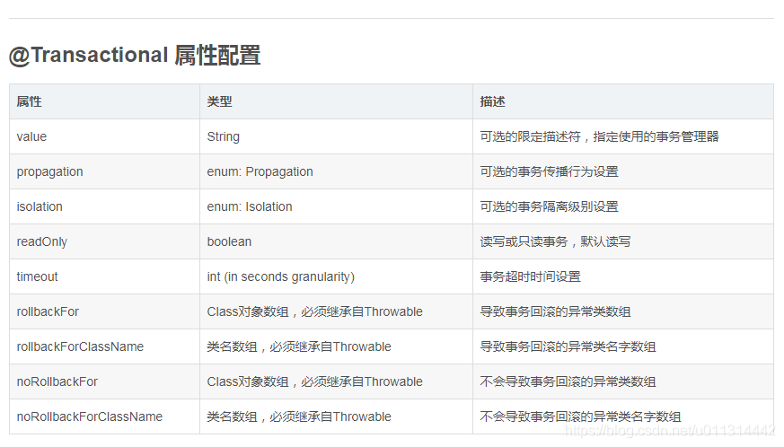

上表字段说明：

```
1. value ：主要用来指定不同的事务管理器；

   主要用来满足在同一个系统中，存在不同的事务管理器。

   比如在Spring中，声明了两种事务管理器txManager1, txManager2.然后，

   用户可以根据这个参数来根据需要指定特定的txManager.


2. value 适用场景：在一个系统中，需要访问多个数据源或者多个数据库，


   则必然会配置多个事务管理器的

3. REQUIRED_NEW：内部的事务独立运行，在各自的作用域中，可以独立的回滚或者提交；

   而外部的事务将不受内部事务的回滚状态影响。


4. ESTED 的事务，基于单一的事务来管理，提供了多个保存点。

   这种多个保存点的机制允许内部事务的变更触发外部事务的回滚。
   而外部事务在混滚之后，仍能继续进行事务处理，即使部分操作已经被混滚。 

   由于这个设置基于 JDBC 的保存点，所以只能工作在 JDB C的机制。


5. rollbackFor：让受检查异常回滚；即让本来不应该回滚的进行回滚操作。

6. noRollbackFor：忽略非检查异常；即让本来应该回滚的不进行回滚操作。
```

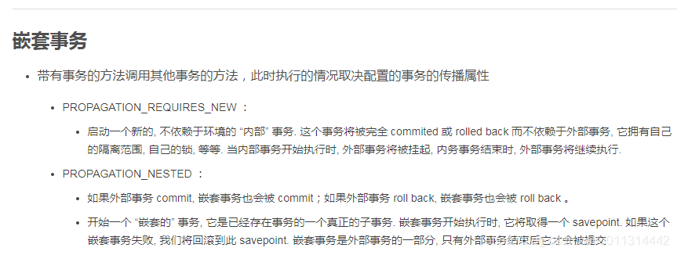

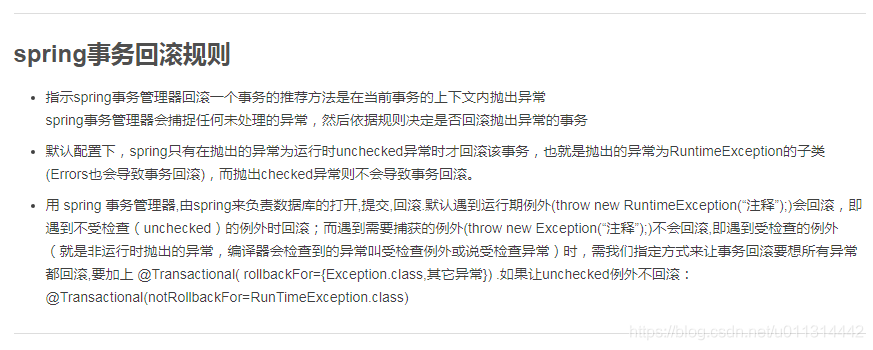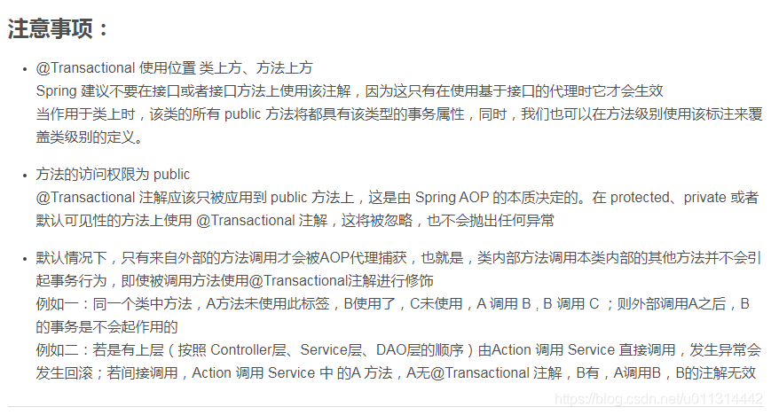

**6.其他：**

```
1. 事务方法的嵌套调用会产生事务传播。


2. spring 的事务管理是线程安全的


3. 父类的声明的 @Transactional 会对子类的所有方法进行事务增强；


   子类覆盖重写父类方式可覆盖其 @Transactional 中的声明配置。


 


4. 类名上方使用 @Transactional，类中方法可通过属性配置来覆盖类上的 @Transactional 配置；


   比如：类上配置全局是可读写，可在某个方法上改为只读。
```

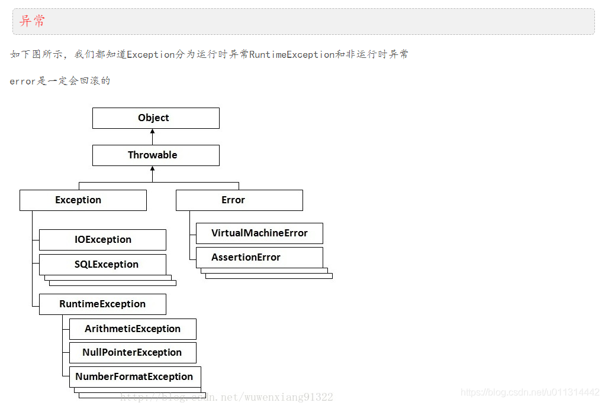 

如果不对运行时异常进行处理，那么出现运行时异常之后，要么是线程中止，要么是主程序终止。 
如果不想终止，则必须捕获所有的运行时异常，决不让这个处理线程退出。队列里面出现异常数据了，正常的处理应该是把异常数据舍弃，然后记录日志。不应该由于异常数据而影响下面对正常数据的处理。


非运行时异常是RuntimeException以外的异常，类型上都属于Exception类及其子类。如IOException、SQLException等以及用户自定义的Exception异常。对于这种异常，JAVA编译器强制要求我们必需对出现的这些异常进行catch并处理，否则程序就不能编译通过。所以，面对这种异常不管我们是否愿意，只能自己去写一大堆catch块去处理可能的异常。

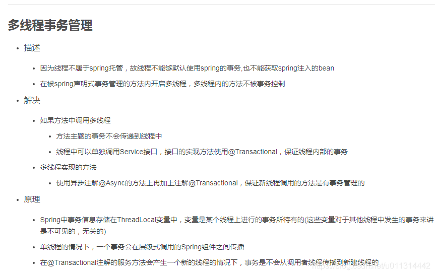
\--------------------- 


# 11.jdbctemplate

~~~java
@RunWith(SpringJUnit4ClassRunner.class)
@ContextConfiguration(locations = "classpath:bean.xml")
public class TestDemo {

    JdbcTemplate jt;

    @Before
    public void init() {
        ApplicationContext ac = new ClassPathXmlApplicationContext("bean.xml");
        jt = (JdbcTemplate) ac.getBean("jdbcTemplate");

    }


    //保存
    @Test
    public void saveAccount() {
        String sql = "insert into account(name,money) values(?,?)";
        jt.update(sql, "恕瑞玛", 998);
    }

    //删除
    @Test
    public void deleteAccount() {
        String sql = "delete from account where id=?";
        jt.update(sql, 17);
    }

    //更新
    @Test
    public void updateAccount() {
        String sql = "update account set name=?,money=? where id=?";
        jt.update(sql, "鬼谷", 999, 11);
    }

    //查询一个
    @Test
    public void selectOne() {
        String sql = "select * from account where id=?";
        List<Account> query = jt.query(sql, new BeanPropertyRowMapper<Account>(Account.class), 1);
//        jt.execute("insert into account(name,money)values('eee',500)");
        System.out.println(query);
    }

//    查询多个
    @Test
    public void selectMany(){
        String sql="select * from account where money>?";
        List<Account> accounts=jt.query(sql,new BeanPropertyRowMapper<Account>(Account.class),1);
        for (Account account : accounts) {
            System.out.println(account);
        }
    }

//    使用聚合函数
    @Test
    public void  function(){
        String sql="select count(*) from account where money>?";
        long result =jt.queryForObject(sql,Long.class,1);
        System.out.println(result);
    }
~~~


