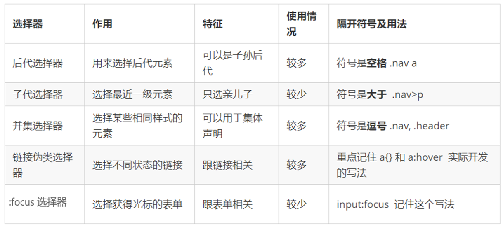

导航栏实例    字体12


#00a4ff		浅蓝色


# 一.CSS 语法规范

**CSS 规则由两个主要的部分构成：选择器以及一条或多条声明。**


 选择器是用于指定 CSS 样式的 HTML 标签，花括号内是对该对象设置的具体样式
 属性和属性值以“键值对”的形式出现
 属性是对指定的对象设置的样式属性，例如字体大小、文本颜色等
 属性和属性值之间用英文“:”分开
 多个“键值对”之间用英文“;”进行区分


示例

~~~html
<head>
<style>
	h4 {
	color: blue;
	font-size: 100px;
}
</style>
</head>
~~~


# 二.类命名规范


# 三.CSS 基础选择器


选择器分为**基础选择器**和**复合选择器**两个大类，我们这里先讲解一下基础选择器。


1.基础选择器是由单个选择器组成的

2.基础选择器又包括：**标签选择器**、**类选择器**、**id 选择器**和**通配符**选择器


## 1.标签选择器

~~~html
p{
	属性1: 属性值1;
}
~~~


## 2.类选择器

~~~html
.类名 {
	属性1: 属性值1;
	
}
~~~


## 3.类选择器-多类名

我们可以给一个标签指定**多个类名**，从而达到更多的选择目的。 这些类名都可以选出这个标签.
简单理解就是一个标签有多个名字.

****


css**部分**

~~~html
<style>
    .red{
        color: red;
    }
    .font35{
        font-size: 35px;
    }
</style>
~~~


**html部分**

~~~html
<div class="red font35">刘德华</div>
~~~


##  4.id 选择器

~~~HTML
#nav {
	color:red;
}
~~~


## 5.id 选择器和类选择器的区别

① 类选择器（class）好比人的名字，一个人可以有多个名字，同时一个名字也可以被多个人使用。
② id 选择器好比人的身份证号码，全中国是唯一的，不得重复。
③ id 选择器和类选择器最大的不同在于使用次数上。
④ 类选择器在修改样式中用的最多，id 选择器一般用于页面唯一性的元素上，经常和 JavaScript 搭配使用。


## 6. 通配符选择器

~~~html
* {
	margin: 0;
	padding: 0;
}
~~~


1. 通配符选择器不需要调用， 自动就给所有的元素使用样式
2. 特殊情况才使用，后面讲解使用场景(上面是清除所有的元素标签的内外边距,后期讲)


## 总结


# 四.CSS 字体属性


## 4.1字体系列


CSS 使用 font-family 属性定义文本的字体系列。

~~~html
p {
	font-family:‘微软雅黑’;
}


div {
	font-family: Arial,’Microsoft Yahei‘, ‘微软雅黑’;
}
~~~


1. 各种字体之间必须使用英文状态下的逗号隔开
2. 一般情况下,如果有空格隔开的多个单词组成的字体,加引号.
3.  尽量使用系统默认自带字体，保证在任何用户的浏览器中都能正确显示
4.  最常见的几个字体：body {font-family: 'Microsoft YaHei',tahoma,arial,'Hiragino Sans GB'; }


## 4.2字体大小

~~~html
p {
	font-size: 20px;
}
~~~


1.  px（像素）大小是我们网页的最常用的单位
2. 谷歌浏览器默认的文字大小为16 px
3.  不同浏览器可能默认显示的字号大小不一致，我们尽量给一个明确值大小，不要默认大小
4.  可以给 body 指定整个页面文字的大小


## 4.3字体粗细


CSS 使用 **font-weight** 属性设置文本字体的粗细。


~~~html
p {
	font-weight: bold;
	font-weight: 700;
}
~~~


1.学会让加粗标签（比如 h 和 strong 等) 不加粗，或者其他标签加粗

2.实际开发时，我们更喜欢用数字表示粗细


## 4.4文字样式

~~~html
p {
	font-style: normal;
}
~~~


**注意： 平时我们很少给文字加斜体，反而要给斜体标签（em，i）改为不倾斜字体。**


## 4.5字体复合属性

字体属性可以把以上文字样式综合来写, 这样可以更节约代码:


~~~html
body {
	font: font-style font-weight font-size/line-height font-family;
    font: italic 700 16px 'Microsoft yahei';
}
~~~


## 4.6字体属性总结

CSS Fonts (字体)属性用于定义字体系列、大小、粗细、和文字样式（如斜体）。


# 五.CSS 文本属性


##  5.1文本颜色

~~~html
div {
	color: red;
}
~~~


## 5.2对齐文本

**text-align** 属性用于设置元素内文本内容的水平对齐方式。

~~~html
div {
	text-align: center;
}
~~~


**一个小技巧 单行文字垂直居中的代码**


CSS 没有给我们提供文字垂直居中的代码. 这里我们可以使用一个小技巧来实现.
解决方案: **让文字的行高等于盒子的高度** 就可以让文字在当前盒子内垂直居中


~~~html
line-height: 40px         //40表示盒子的高度
~~~


## 5.3装饰文本


~~~html
div {
	text-decoration：underline;
}
~~~


## 5.4文本缩进

text-indent 属性用来指定文本的第一行的缩进，通常是将段落的**首行缩进。**


通过设置该属性，所有元素的第一行都可以缩进一个给定的长度，甚至该长度可以是负值。

~~~html
div {
	text-indent: 10px;
}
~~~


em 是一个相对单位，就是当前元素（font-size) **1 个文字的大小**, 如果当前元素没有设置大小，则会按照父元
素的 1 个文字大小。

~~~html
p {
	text-indent: 2em;
}
~~~


## 5.5行间距

line-height 属性用于设置行间的距离（行高）。可以控制文字行与行之间的距离.


~~~html
p {
	line-height: 26px;
}
~~~


## 5.6总结


# 六.CSS 引入方式


## 6.1 CSS 的三种样式表


按照 CSS 样式书写的位置（或者引入的方式），CSS 样式表可以分为三大类：

1.行内样式表（行内式）
2.内部样式表（嵌入式）
3.外部样式表（链接式）


## 6.2内部样式表


内部样式表（内嵌样式表）是写到html页面内部. 是将所有的 CSS 代码抽取出来，单独放到一个\ <style> 标签中。

~~~html
<style>
	div {
	  color: red;
	  font-size: 12px;
	}
</style>
~~~


1. \<style> 标签理论上可以放在 HTML 文档的任何地方，但一般会放在文档的**\<head>**标签中
2. 通过此种方式，可以方便控制当前整个页面中的元素样式设置
3. 代码结构清晰，但是并没有实现结构与样式完全分离
4. 使用内部样式表设定 CSS，通常也被称为嵌入式引入，这种方式是我们练习时常用的方式


## 6.3行内样式表


行内样式表（内联样式表）是在**元素标签内部**的 style 属性中设定 CSS 样式。适合于修改简单样式.


~~~html
<div style="color: red; font-size: 12px;">青春不常在，抓紧谈恋爱</div>
~~~


1. style 其实就是标签的属性
2.  在双引号中间，写法要符合 CSS 规范
3.  可以控制当前的标签设置样式
4.  由于书写繁琐，并且没有体现出结构与样式相分离的思想，所以不推荐大量使用，只有对当前元素添加简
   单样式的时候，可以考虑使用
5.  使用行内样式表设定 CSS，通常也被称为行内式引入


## 6.4 外部样式表


实际开发都是外部样式表. 适合于样式比较多的情况. 核心是:样式单独写到CSS 文件中，之后把CSS文件引入
到 HTML 页面中使用.


引入外部样式表分为两步：
1. 新建一个后缀名为 .css 的样式文件，把所有 CSS 代码都放入此文件中。
2. 在 HTML 页面中，使用\<link> 标签引入这个文件。


\<link rel="stylesheet" href="css文件路径">


使用外部样式表设定 CSS，通常也被称为外链式或链接式引入，这种方式是开发中常用的方式


## 6.5总结


# 七.CSS 的复合选择器


## 7.1 什么是复合选择器

在 CSS 中，可以根据选择器的类型把选择器分为**基础选择器**和**复合选择器**，复合选择器是建立在基础选择器之上，对基本选择器进行组合形成的。

1. 复合选择器可以更准确、更高效的选择目标元素（标签）
2.  复合选择器是由两个或多个基础选择器，通过不同的方式组合而成的
3.  常用的复合选择器包括：后代选择器、子选择器、并集选择器、伪类选择器等等


## 7.2后代选择器 (重要）

后代选择器又称为包含选择器，可以选择父元素里面子元素。其写法就是把外层标签写在前面，内层标签写在
后面，中间用空格分隔。当标签发生嵌套时，内层标签就成为外层标签的后代。

~~~html
ul li {
	样式声明 
}
/* 选择 ul 里面所有的 li标签元素 */


   <style>
        ol li {
            color: pink;
        }

        .abc li {
            color: pink;
        }
    </style>
~~~


## 7.3子选择器 (重要）

**子元素选择器**（子选择器）只能选择作为某元素的最近一级子元素。简单理解就是**选亲儿子元素.**


~~~html
ol>a {
            color: pink;
        }
~~~


1.元素1 和 元素2 中间用 大于号 隔开

2.元素1 是父级，元素2 是子级，最终选择的是元素2

3.元素2 必须是**亲儿子**，其孙子、重孙之类都不归他管. 你也可以叫他 亲儿子选择器


## 7.4并集选择器 (重要）


并集选择器可以选择多组标签, 同时为他们定义相同的样式。通常用于集体声明.
并集选择器是各选择器通过英文逗号（,）连接而成，任何形式的选择器都可以作为并集选择器的一部分。


~~~html
ul,div {
	color : black;
} 
~~~


1.元素1 和 元素2 中间用逗号隔开

2.逗号可以理解为和的意思

3.并集选择器通常用于集体声明


## 7.5链接伪类选择器


伪类选择器用于向某些选择器添加特殊的效果，比如给链接添加特殊效果，或选择第1个，第n个元素。
伪类选择器书写最大的特点是用冒号**（:）**表示，比如 :hover 、 :first-child 。
因为伪类选择器很多，比如有链接伪类、结构伪类等，所以这里先给大家讲解常用的链接伪类选择器。


**链接伪类选择器注意事项**

1. 为了确保生效，请按照 **LVHA** 的循顺序声明 **:link－:visited－:hover－:active。**
2. 记忆法：love hate 或者 lv 包包 hao 。
3. 因为 a 链接在浏览器中具有默认样式，所以我们实际工作中都需要给链接单独指定样式。


链接伪类选择器**实际工作开发**中的写法：


~~~html
/* a 是标签选择器 所有的链接 */
a {
 	color: gray;
}


/* :hover 是链接伪类选择器 鼠标经过 */
a:hover {
	color: red; /* 鼠标经过的时候，由原来的 灰色 变成了红色 */
}
~~~


## 7.6 focus 伪类选择器


:focus 伪类选择器用于选取获得焦点的表单元素。
焦点就是光标，一般情况 <input> 类表单元素才能获取，因此这个选择器也主要针对于表单元素来说。


~~~html
input:focus {
	background-color:yellow;
}
~~~


## 7.7总结




# 八. CSS 的元素显示模式


了解元素的显示模式可以更好的让我们布局页面.


## **8.1什么是元素的显示模式**

元素显示模式就是元素（标签）以什么方式进行显示，比如\<div>自己占一行，比如一行可以放多个\<span>。

HTML 元素一般分为**块元素**和**行内元素**两种类型。


## **8.2元素显示模式的分类**


### **8.2.1块元素**

常见的块元素有\<h1>~\<h6>、\<p>、\<div>、<ul>、<ol>、<li>等，

其中 <div> 标签是最典型的块元素。

**块级元素的特点：**
① 比较霸道，自己独占一行。
② 高度，宽度、外边距以及内边距都可以控制。
③ 宽度默认是容器（父级宽度）的100%。
④ 是一个容器及盒子，里面可以放行内或者块级元素。


**注意：**

1. 文字类的元素内不能使用块级元素
2.  \<p> 标签主要用于存放文字，因此 <p> 里面不能放块级元素，特别是不能放<div>
3. 同理， <h1>~<h6>等都是文字类块级标签，里面也不能放其他块级元素


### 8.2.2行内元素


常见的行内元素有 <a>、<strong>、<b>、<em>、<i>、<del>、<s>、<ins>、<u>、<span>等，

其中\<span> 标签是最典型的行内元素。有的地方也将行内元素称为**内联元素**。


行内元素的特点：
① 相邻行内元素在一行上，一行可以显示多个。
② 高、宽直接设置是无效的。
③ 默认宽度就是它本身内容的宽度。
④ 行内元素只能容纳文本或其他行内元素。


注意：

1. 链接里面不能再放链接
2.  特殊情况链接 <a> 里面可以放块级元素，但是给 <a> 转换一下块级模式最安全


### 8.2.3行内块元素

在行内元素中有几个特殊的标签 —— 、<input />、<td>，它们同时具有块元素和行内元素的特点。
有些资料称它们为行内块元素。

行内块元素的特点：
① 和相邻行内元素（行内块）在一行上，但是他们之间会有空白缝隙。一行可以显示多个（行内元素特点）。
② 默认宽度就是它本身内容的宽度（行内元素特点）。
③ 高度，行高、外边距以及内边距都可以控制（块级元素特点）。


## 8.3元素显示模式总结


学习元素显示模式的主要目的就是分清它们各自的特点，当我们网页布局的时候，在合适的地方用合适的标签元素。


## 8.4元素显示模式的转换


特殊情况下，我们需要元素模式的转换，简单理解: 一个模式的元素需要另外一种模式的特性

比如想要增加链接 <a> 的触发范围。


1. 转换为块元素：

   ~~~html
   display:block;
   ~~~

2.  转换为行内元素：

   ~~~html
   display:inline;
   ~~~

3.  转换为行内块：

   ~~~html
   display: inline-block;
   ~~~

   


# 九.CSS 的背景


## 9.1背景颜色


一般情况下元素背景颜色默认值是 **transparent**（透明），我们也可以手动指定背景颜色为透明色。


~~~html
background-color:transparent;
~~~


~~~html
background-color:颜色值;
~~~


## 9.2背景图片

background-image 属性描述了元素的背景图像。实际开发常见于 logo 或者一些装饰性的小图片或者是超
大的背景图片, 优点是非常便于控制位置. (精灵图也是一种运用场景)


~~~html
background-image : none | url (url)
~~~

eg.

~~~html
background-image: url(images/xx.png);
~~~


可以同时设置背景图片和背景颜色，但是背景图片会显示在背景颜色上方


**注意：背景图片后面的地址，千万不要忘记加 URL， 同时里面的路径不要加引号。**


## 9.3背景平铺


如果需要在 HTML 页面上对背景图像进行平铺，可以使用 background-repeat 属性。

~~~html
background-repeat: repeat | no-repeat | repeat-x | repeat-y
~~~


## 9.4背景图片位置

利用 background-position 属性可以改变图片在背景中的位置。

~~~html
background-position: x y;
~~~


### 9.4.1参数是方位名词

参数代表的意思是：x 坐标和 y 坐标。 可以使用 **方位名词** 或者 **精确单位**


1. 如果指定的两个值都是方位名词，则两个值前后顺序无关，比如 left top 和 top left 效果一致
2.  如果只指定了一个方位名词，另一个值省略，则第二个值**默认居中对齐**


### 9.4.2.参数是精确单位


1. 如果参数值是精确坐标，那么第一个肯定是 x 坐标，第二个一定是 y 坐标
2.  如果只指定一个数值，那该数值一定是 x 坐标，另一个默认**垂直**

~~~html
 background-position: 30px 30px;
~~~


### 9.4.3参数是混合单位


1. 如果指定的两个值是精确单位和方位名词混合使用，则第一个值是 x 坐标，第二个值是 y 坐标

   

~~~html
background-position: 30px center;
~~~


## 9.5背景图像固定（背景附着）


background-attachment 属性设置背景图像是否固定或者随着页面的其余部分滚动。

background-attachment 后期可以制作视差滚动的效果。


## 9.6背景复合写法

为了简化背景属性的代码，我们可以将这些属性合并简写在同一个属性 background 中。从而节约代码量.
当使用简写属性时，没有特定的书写顺序,一般习惯约定顺序为：

**background: 背景颜色 背景图片地址 背景平铺 背景图像滚动 背景图片位置;**


~~~htm
background: transparent url(image.jpg) repeat-y fixed top ;
~~~


## 9.7背景色半透明


~~~html
background: rgba(0, 0, 0, 0.3);
~~~


1. 最后一个参数是 alpha 透明度，取值范围在 0~1之间
2.  我们习惯把 0.3 的 0 省略掉，写为 background: rgba(0, 0, 0, .3);
3.  注意：背景半透明是指盒子背景半透明，盒子里面的内容不受影响
4.  CSS3 新增属性，是 IE9+ 版本浏览器才支持的
5.  但是现在实际开发,我们不太关注兼容性写法了,可以放心使用


## 9.8背景总结


背景图片:实际开发常见于 logo 或者一些装饰性的小图片或者是超大的背景图片, 优点是非常便于控制位置.
(精灵图也是一种运用场景)


# 十.css三大特性


# 十一.盒子模型


## 11.1 看透网页布局的本质


网页布局过程：
1. 先准备好相关的网页元素，网页元素基本都是盒子 Box 。

2. 利用 CSS 设置好盒子样式，然后摆放到相应位置。

3. 往盒子里面装内容.

  

  

  **网页布局的核心本质： 就是利用 CSS 摆盒子。**


## 11.2 盒子模型（Box Model）组成


所谓 盒子模型：就是把 HTML 页面中的布局元素看作是一个矩形的盒子，也就是一个盛装内容的容器。
CSS 盒子模型本质上是一个盒子，封装周围的 HTML 元素，它包括：**边框、外边距、内边距、和 实际内容**


## 11.3 边框（border）


border可以设置元素的边框。边框有三部分组成:**边框宽度(粗细) 边框样式 边框颜色**


### 11.3.1边框属性


### 11.3.2  边框简写：  没有顺序

~~~html
border : border-width || border-style || border-color
~~~


~~~html
border: 1px solid red; 
~~~


边框样式 border-style 可以设置如下值：

 none：没有边框即忽略所有边框的宽度（默认值）
 solid：边框为单实线(最为常用的)
 dashed：边框为虚线
 dotted：边框为点线


### 11.3.3边框分开写法：


/* 只设定上边框， 其余同理 */

~~~html
border-top: 1px solid red; 
~~~


| 上   | border-top    |
| ---- | ------------- |
| 下   | border-bottom |
| 左   | border-left   |
| 右   | border-right  |


### 11.3.4表格的细线边框


~~~html
border-collapse:collapse;
~~~


 collapse 单词是合并的意思
 border-collapse: collapse; 表示相邻边框合并在一起


使表格单元格之间的边框线不是两倍粗


### 11.3.5 边框会影响盒子实际大小


边框会额外增加盒子的实际大小。因此我们有两种方案解决:

1.测量盒子大小的时候,不量边框.
2.如果测量的时候包含了边框,则需要 width/height 减去边框宽度


### 11.3.6内边距（padding）

padding 属性用于设置内边距，即边框与内容之间的距离。


padding 属性（简写属性）可以有一到四个值。


**以上 4 种情况，我们实际开发都会遇到**


当我们给盒子指定 padding 值之后，发生了 2 件事情：

1. 内容和边框有了距离，添加了内边距。

2. padding影响了盒子实际大小。
    也就是说，如果盒子已经有了宽度和高度，此时再指定内边框，会撑大盒子。

  

  解决方案：
  如果保证盒子跟效果图大小保持一致，则让 width/height 减去多出来的内边距大小即可。


**如果盒子本身没有指定width/height属性, 则此时padding不会撑开盒子大小.**


## 11.4外边距（margin）


margin 属性用于设置外边距，即控制盒子和盒子之间的距离。


margin 简写方式代表的意义跟 padding 完全一致。


### 11.4.1外边距典型应用


外边距可以让块级盒子水平居中，但是必须满足两个条件：

① 盒子必须指定了宽度（width）。
② 盒子左右的外边距都设置为 auto 。


~~~html
.header{
	width:960px; margin:0 auto;
}
~~~


常见的写法，以下三种都可以：

1. margin-left: auto; margin-right: auto;

2.  margin: auto;

3.  margin: 0 auto;

   

   注意：以上方法是让块级元素水平居中，

   行内元素或者行内块元素水平居中给其   **父元素**   添加 **text-align:center** 即可


### 11.4.2 外边距合并


使用 margin 定义块元素的垂直外边距时，可能会出现外边距的合并。
主要有两种情况:

#### 1.相邻块元素垂直外边距的合并

当上下相邻的两个块元素（兄弟关系）相遇时，如果上面的元素有下外边距 margin-bottom，下面的元素有
上外边距 margin-top ，则他们之间的垂直间距**不是** margin-bottom 与 margin-top 之和。取两个值中的
**较大者**这种现象被称为相邻块元素垂直外边距的合并。


**解决方案：**
尽量只给一个盒子添加 margin 值。


#### 2.嵌套块元素垂直外边距的塌陷


对于两个嵌套关系（父子关系）的块元素，父元素有上外边距同时子元素也有上外边距，此时父元素会塌陷较大的外边距值。


解决方案：
① 可以为父元素定义上边框。
② 可以为父元素定义上内边距。
③ 可以为父元素添加 overflow:hidden

还有其他方法，比如浮动、固定，绝对定位的盒子不会有塌陷问题，后面咱们再总结。


## 11.5清除内外边距


网页元素很多都带有默认的内外边距，而且不同浏览器默认的也不一致。因此我们在布局前，首先要清除下网
页元素的内外边距。

~~~html
* {
	padding:0; /* 清除内边距 */
	margin:0; /* 清除外边距 */
}
~~~


**注意：**

**行内元素为了照顾兼容性，尽量只设置左右内外边距，不要设置上下内外边距。但是转换为块级和行内**
**块元素就可以了**


## 十二.总结


1. 布局为啥用不同盒子,我只想用div？
标签都是有语义的, 合理的地方用合理的标签。比如产品标题 就用 h, 大量文字段落就用p
2. 为啥用辣么多类名？
类名就是给每个盒子起了一个名字,可以更好的找到这个盒子, 选取盒子更容易,后期维护也方便。
3. 到底用 margin 还是 padding？
大部分情况两个可以混用，两者各有优缺点，但是根据实际情况，总是有更简单的方法实现。
4. 自己做没有思路？
布局有很多种实现方式，同学们可以开始先模仿我的写法，然后再做出自己的风格。


# 去掉 li 前面的 项目符号(小圆点


~~~html
list-style: none;
~~~


# 十三.圆角边框


border-radius 属性用于设置元素的外边框圆角。


~~~html
border-radius:length;
~~~


1. 参数值可以为数值或百分比的形式
2.  如果是正方形，想要设置为一个圆，把数值修改为高度或者宽度的一半即可，或者直接写为 50%
3.  该属性是一个简写属性，可以跟四个值，分别代表左上角、右上角、右下角、左下角
4.  分开写：border-top-left-radius、border-top-right-radius、border-bottom-right-radius 和
   border-bottom-left-radius
5.  兼容性 ie9+ 浏览器支持, 但是不会影响页面布局,可以放心使用.


# 十四.盒子阴影


CSS3 中新增了盒子阴影，我们可以使用 box-shadow 属性为盒子添加阴影。


~~~html
box-shadow: h-shadow v-shadow blur spread color inset;
~~~


~~~html
 box-shadow: -10px 10px 10px -4px rgba(0, 0, 0, 0.3);
~~~

h-shadow  向右为正方向

v-shadow 向下为正方向

blur  模糊透明度  数值越大，颜色越浅

spread  阴影的大小

rgba  数字越大，颜色越深


1. 默认的是外阴影(outset), 但是不可以写这个单词,否则造成阴影无效
2. .盒子阴影不占用空间，不会影响其他盒子排列。


~~~html
				transform: translateY(-2px);
				/* 鼠标移动到图片上  向y轴移动 */
~~~


~~~~html
   		 /* 鼠标变手 */
            cursor:pointer;

            /* 鼠标移动到图片上  向y轴移动 */
            transform: translateY(-2px);

            box-shadow: -10px 10px 10px -4px rgba(0, 0, 0, 0.9);
            
            transition: transform 1s,box-shadow 1s;
~~~~


# 十五. 文字阴影


~~~html
text-shadow: h-shadow v-shadow blur color;
~~~


~~~html
text-shadow:5px 5px 6px rgba(0, 0, 0, 0.9);
~~~


# 十六.浮动


## 16.1 传统网页布局的三种方式


CSS 提供了三种传统布局方式(简单说,就是盒子如何进行排列顺序)：

1. 普通流（标准流）
2. 浮动
3.  定位


## 16.2标准流（普通流/文档流）


**所谓的标准流: 就是标签按照规定好默认方式排列.**


1. 块级元素会独占一行，从上向下顺序排列。


  ~~~html
   常用元素：div、hr、p、h1~h6、ul、ol、dl、form、table
  ~~~

  

  

2. 行内元素会按照顺序，从左到右顺序排列，碰到父元素边缘则自动换行。

  ~~~html
   常用元素：span、a、i、em 等
  ~~~

  

  以上都是标准流布局，我们前面学习的就是标准流，标准流是最基本的布局方式。
  这三种布局方式都是用来摆放盒子的，盒子摆放到合适位置，布局自然就完成了。
  注意：实际开发中，一个页面基本都包含了这三种布局方式（后面移动端学习新的布局方式） 。


## 16.3浮动概念


 有很多的布局效果，标准流没有办法完成，此时就可以利用浮动完成布局。 因为浮动可以改变元素标
签默认的排列方式.
浮动最典型的应用：可以让多个块级元素一行内排列显示。
网页布局第一准则：多个块级元素**纵向**排列找**标准流**，多个块级元素**横向**排列找**浮动**。


float 属性用于创建浮动框，将其移动到一边，直到左边缘或右边缘触及包含块或另一个浮动框的边缘。

~~~html
选择器 { 
	float: 属性值;
	}
~~~


## 16.4浮动特性（重难点）


加了浮动之后的元素,会具有很多特性,需要我们掌握的.


**1.浮动元素会脱离标准流(脱标)**，**不再保留原先的位置**
2.浮动的元素会一行内显示并且元素顶部对齐
3.浮动的元素会具有行内块元素的特性.


~~~html
如果多个盒子都设置了浮动，则它们会按照属性值一行内显示并且顶端对齐排列。
注意： 浮动的元素是互相贴靠在一起的（不会有缝隙），如果父级宽度装不下这些浮动的盒子， 多出的盒子
		会另起一行对齐。
~~~


任何元素都可以浮动。不管原先是什么模式的元素，添加浮动之后具有行内块元素相似的特性。


 如果块级盒子没有设置宽度，默认宽度和父级一样宽，但是添加浮动后，它的大小根据内容来决定
 浮动的盒子中间是没有缝隙的，是紧挨着一起的
 行内元素同理


## 16.5 浮动布局注意点


1. **浮动和标准流的父盒子搭配。**

   先用标准流的父元素排列上下位置, 之后内部子元素采取浮动排列左右位置
   
2. **一个元素浮动了，理论上其余的兄弟元素也要浮动。**
    一个盒子里面有多个子盒子，如果其中一个盒子浮动了，那么其他兄弟也应该浮动，以防止引起问题。

  

    浮动的盒子只会影响浮动盒子后面的标准流,不会影响前面的标准流.


## 16.6 清除浮动本质


1. 清除浮动的本质是清除浮动元素造成的影响
2.  如果父盒子本身有高度，则不需要清除浮动
3.  清除浮动之后，父级就会根据浮动的子盒子自动检测高度。父级有了高度，就不会影响下面的标准流了


~~~html
选择器{
	clear:属性值;
}
~~~


我们实际工作中， 几乎只用 clear: both;
清除浮动的策略是: 闭合浮动.


## 16.7三种清除浮动的方法


1.额外标签法也称为隔墙法，是 W3C 推荐的做法。
2.父级添加 overflow 属性
3.父级添加after伪元素
4.父级添加双伪元素


清除浮动前


清除浮动后


父类盒子不添加高度

~~~html
    <style>
        * {
            margin: 0;
            padding: 0;
        }

        .box {
             overflow: hidden; 
            border: 1px solid pink;
            width: 900px;
            margin: 0 auto;
            margin-top: 50px;
            background-color: pink;
        }

        .box1 {
            float: left;
            width: 200px;
            height: 200px;
            background-color: blue;
        }

        .box2 {
            float: right;
            width: 200px;
            height: 200px;
            background-color: blue;
        }

        .box3 {
            /* float: right; */
            width: 300px;
            height: 400px;
            background-color: yellow;
        }
    </style>
</head>

<body>

    <div class="box">
        <!-- <p>qqqqaaaaaaaaaaaaaaaaaaaaaaaaaaaaaaaaqqq</p> -->
        <div class="box1"></div>
        <div class=box2></div>
        <div style="clear:both"></div>
    
    </div>
    <div class="box3"></div>

</body>
~~~


### 16.7.1清除浮动 —— 额外标签法


外标签法也称为隔墙法，是 W3C 推荐的做法。
额外标签法会在浮动元素末尾添加一个空的标签。例如\<div style="clear:both">\</div>，或者其他标签
（如\<br />）。

 优点： 通俗易懂，书写方便
 缺点： 添加许多无意义的标签，结构化较差

注意： 要求这个新的空标签必须是**块级元素**。


1. **清除浮动本质是?**
清除浮动的本质是清除浮动元素脱离标准流造成的影响
2. **清除浮动策略是?**
闭合浮动. 只让浮动在父盒子内部影响,不影响父盒子外面的其他盒子.
3. **额外标签法?**
隔墙法, 就是在最后一个浮动的子元素后面添加一个额外标签, 添加 清除浮动样式.
实际工作可能会遇到,但是不常用


### 16.7.2 清除浮动 —— 父级添加 overflow


可以给父级添加 overflow 属性，将其属性值设置为 hidden、 auto 或 scroll 。
子不教,父之过,注意是给父元素添加代码

**优点：代码简洁**

**缺点：无法显示溢出的部分**


给父元素添加

~~~html
overflow: hidden;
~~~


### 16.7.3 清除浮动 —— :after 伪元素法


:after 方式是额外标签法的升级版。也是给父元素添加


~~~html
.clearfix:after {
	content: "";
	dispay: block;
	height: 0;
	clear: both;
	visibility: hidden;
}
.clearfix { /* IE6、7 专有 */
	*zoom: 1;
}
~~~


 优点：没有增加标签，结构更简单
 缺点：照顾低版本浏览器
 代表网站： 百度、淘宝网、网易等


### 16.7.4  清除浮动 —— 双伪元素清除浮动


~~~html
.clearfix:before,.clearfix:after {
	content:"";
	display:table;
}
.clearfix:after {
	clear:both;
}
.clearfix {
	*zoom:1;
}
~~~


 优点：代码更简洁
 缺点：照顾低版本浏览器
 代表网站：小米、腾讯等


### 16.8清除浮动总结


**为什么需要清除浮动？**

① 父级没高度。
② 子盒子浮动了。
③ 影响下面布局了，我们就应该清除浮动了。


# 17 学成在线案例


## 17.1 CSS 属性书写顺序(重点)


建议遵循以下顺序：
1. 布局定位属性：display / position / float / clear / visibility / overflow（建议 display 第一个写，毕竟关系到模式）
2. 自身属性：width / height / margin / padding / border / background
3. 文本属性：color / font / text-decoration / text-align / vertical-align / white- space / break-word
4. 其他属性（CSS3）：content / cursor / border-radius / box-shadow / text-shadow / background:linear-gradient 


# 十八. 定位


## 18.1为什么需要定位


标准流或浮动都无法快速实现，此时需要定位来实现。


所以：
1.浮动可以让多个块级盒子一行没有缝隙排列显示， 经常用于横向排列盒子。
2.定位则是可以让盒子自由的在某个盒子内移动位置或者固定屏幕中某个位置，并且可以压住其他盒子


## 18.2定位组成


定位：将盒子定在某一个位置，所以定位也是在**摆放盒子**， 按照定位的方式**移动盒子**。
**定位 = 定位模式 + 边偏移 。**
定位模式用于指定一个元素在文档中的定位方式。边偏移则决定了该元素的最终位置。


### 18.2.1**定位模式**

定位模式决定元素的定位方式 ，它通过 CSS 的 position 属性来设置，其值可以分为四个：


### 18.2.2边偏移


边偏移就是定位的盒子移动到最终位置。有 top、bottom、left 和 right 4 个属性。


## 18.3 静态定位 static（了解）


静态定位是元素的默认定位方式，**无定位的意思。**


~~~html
选择器 {
	position: static; 
}
~~~


 静态定位按照标准流特性摆放位置，它没有边偏移
 静态定位在布局时很少用到


## 18.4相对定位 relative（重要）


**相对定位**是元素在移动位置的时候，是相对于它**原来的位置**来说的（**自恋型**）。


~~~html
选择器 {
	position: relative;
}
~~~


相对定位的特点：（务必记住）
1.它是相对于自己原来的位置来移动的（移动位置的时候参照点是自己原来的位置）。
2.**原来**在标准流的位置**继续占有**，后面的盒子仍然以标准流的方式对待它。
因此，相对定位并没有脱标。它最典型的应用是给绝对定位当爹的。


## 18.5绝对定位 absolute（重要）


绝对定位是元素在移动位置的时候，**是相对于它来说的**（拼爹型）


~~~html
选择器 { 
	position: absolute; 
}
~~~


绝对定位的特点：（务必记住）
1.如果没有祖先元素或者祖先元素没有定位，则以浏览器为准定位（Document 文档）。
2.如果祖先元素有定位（相对、绝对、固定定位），则以最近一级的有定位祖先元素为参考点移动位置。
3.绝对定位不再占有原先的位置。（脱标）

所以绝对定位是脱离标准流的。


## 18.6子绝父相的由来


弄清楚这个口诀，就明白了绝对定位和相对定位的使用场景。
这个“子绝父相”太重要了，是我们学习定位的口诀，是定位中最常用的一种方式这句话的意思是：**子级是绝**
**对定位的话，父级要用相对定位。**


**子绝父相的由来**

① **子级绝对定位，不会占有位置**，可以放到父盒子里面的任何一个地方，不会影响其他的兄弟盒子。
② 父盒子需要加定位限制子盒子在父盒子内显示。
③ 父盒子布局时，需要占有位置，因此父亲只能是相对定位。
这就是子绝父相的由来，所以相对定位经常用来作为绝对定位的父级。

总结： 因为父级需要占有位置，因此是相对定位， 子盒子不需要占有位置，则是绝对定位
当然，子绝父相不是永远不变的，如果父元素不需要占有位置，子绝父绝也会遇到。


##  18.7固定定位 fixed （重要）


**固定定位**是元素**固定于浏览器可视区**的位置。主要使用场景： 可以在浏览器页面滚动时元素的位置不会改变


~~~html
选择器 { 
	position: fixed; 
}
~~~


**固定定位的特点：（务必记住）**

1.以浏览器的可视窗口为参照点移动元素。 跟父元素没有任何关系。 **不随滚动条滚动。**

2.固定定位**不占有**原先的位置。固定定位也是**脱标**的，其实固定定位也可以看做是一种特殊的绝对定位。


~~~html
.daji {
            position: fixed;
            top: 100px;
            right: 0px;
        }
~~~


固定定位小技巧： 固定在**版心右侧位置**。


~~~html
 .fixed {        
            position: fixed;
            left: 50%;
            margin-left: 500px;

            width: 50px;
            height: 70px;
            background-color: pink;

        }
~~~


## 18.8粘性定位 sticky（了解）


粘性定位可以被认为是相对定位和固定定位的混合。 Sticky 粘性的


~~~html
选择器 { 
	position: sticky;
	top: 10px; 
}
~~~


**粘性定位的特点：**
1.以浏览器的可视窗口为参照点移动元素（固定定位特点）
2.粘性定位占有原先的位置（相对定位特点）
3.必须添加 top 、left、right、bottom 其中一个才有效
跟页面滚动搭配使用。 兼容性较差，IE 不支持


## 18.9定位的总结


1. 一定记住 相对定位、固定定位、绝对定位 

  两个大的特点： 1. 是否占有位置（脱标否） 2. 以谁为基准点移动位置。

2. 学习定位重点学会子绝父相。


## 18.10定位叠放次序 z-index


在使用定位布局时，可能会出现盒子重叠的情况。此时，可以使用 z-index 来控制盒子的前后次序 (z轴)


~~~html
选择器 {
	z-index: 1; 
}
~~~


 数值可以是正整数、负整数或 0, 默认是 auto，数值越大，盒子越靠上
 如果属性值相同，则按照书写顺序，后来居上
 数字后面不能加单位
 只有**定位**的盒子才有 z-index 属性


##  18.11定位的拓展


1. **绝对定位的盒子居中**
加了绝对定位的盒子不能通过 margin:0 auto 水平居中，但是可以通过以下计算方法实现水平和垂直居中。
① left: 50%;：让盒子的左侧移动到父级元素的水平中心位置。
② margin-left: -100px;：让盒子向左移动自身宽度的一半。


2.**定位特殊特性**

绝对定位和固定定位也和浮动类似。
1.行内元素添加绝对或者固定定位，可以直接设置高度和宽度。
2.块级元素添加绝对或者固定定位，如果**不给宽度或者高度，默认大小是内容的大小。**


3. **脱标的盒子不会触发外边距塌陷**
浮动元素、绝对定位(固定定位）元素的都不会触发外边距合并的问题。


4. **绝对定位（固定定位）会完全压住盒子**


浮动元素不同，只会压住它下面标准流的盒子，但是不会压住下面标准流盒子里面的文字（图片）
但是绝对定位（固定定位） 会压住下面标准流所有的内容。
浮动之所以不会压住文字，因为浮动产生的目的最初是为了做文字环绕效果的。 文字会围绕浮动元素


# 十九.网页布局总结


通过盒子模型，清楚知道大部分html标签是一个盒子。


通过CSS浮动、定位 可以让每个盒子排列成为网页。

一个完整的网页，是标准流、浮动、定位一起完成布局的，每个都有自己的专门用法。


1. 标准流
可以让盒子上下排列或者左右排列，**垂直**的块级盒子显示就用标准流布局。
2. 浮动
可以让多个块级元素一行显示或者左右对齐盒子，多个块级盒子**水平**显示就用浮动布局。
3. 定位
定位最大的特点是有层叠的概念，就是可以让多个盒子前后叠压来显示。如果元素自由在某个盒子内**移动**就
用定位布局。


# 二十.元素的显示与隐藏


类似网站广告，当我们点击关闭就不见了，但是我们重新刷新页面，会重新出现！

本质：让一个元素在页面中隐藏或者显示出来。
1.display 显示隐藏
2.visibility 显示隐藏
3.overflow 溢出显示隐藏


类似网站广告，当我们点击关闭就不见了，但是我们重新刷新页面，会重新出现！
**本质：让一个元素在页面中隐藏或者显示出来。**


## 20.1 display 属性


display 属性用于设置一个元素应如何显示。

1. display: none ；隐藏对象
2.  display：block ；除了转换为块级元素之外，同时还有显示元素的意思

**display 隐藏元素后，不再占有原来的位置。**
后面应用及其广泛，搭配 JS 可以做很多的网页特效。


## 20.2 visibility 可见性


visibility 属性用于指定一个元素应可见还是隐藏。

1. visibility：visible ; 元素可视

2.  visibility：hidden; 元素隐藏
   visibility 隐藏元素后，继续占有原来的位置。

   如果隐藏元素**想要**原来位置， 就用 visibility：hidden

   如果隐藏元素**不想要**原来位置， 就用 display：none (用处更多 重点）


## 20.3 overflow 溢出


overflow 属性指定了如果内容溢出一个元素的框（超过其指定高度及宽度） 时，会发生什么。


**但是如果有定位的盒子， 请慎用overflow:hidden 因为它会隐藏多余的部分。**


# 二十一.弹性布局


网页布局（layout）是 CSS 的一个重点应用。


布局的传统解决方案，基于[盒状模型](https://developer.mozilla.org/en-US/docs/Web/CSS/box_model)，依赖 [`display`](https://developer.mozilla.org/en-US/docs/Web/CSS/display) 属性 + [`position`](https://developer.mozilla.org/en-US/docs/Web/CSS/position)属性 + [`float`](https://developer.mozilla.org/en-US/docs/Web/CSS/float)属性。它对于那些特殊布局非常不方便，比如，[垂直居中](https://css-tricks.com/centering-css-complete-guide/)就不容易实现。


2009年，W3C 提出了一种新的方案----Flex 布局，可以简便、完整、响应式地实现各种页面布局。目前，它已经得到了所有浏览器的支持，这意味着，现在就能很安全地使用这项功能。


Flex 布局将成为未来布局的首选方案。本文介绍它的语法，[下一篇文章](http://www.ruanyifeng.com/blog/2015/07/flex-examples.html)给出常见布局的 Flex 写法。网友 [JailBreak](http://vgee.cn/) 为本文的所有示例制作了 [Demo](http://static.vgee.cn/static/index.html)，也可以参考。

以下内容主要参考了下面两篇文章：[A Complete Guide to Flexbox](https://css-tricks.com/snippets/css/a-guide-to-flexbox/) 和 [A Visual Guide to CSS3 Flexbox Properties](https://scotch.io/tutorials/a-visual-guide-to-css3-flexbox-properties)。

## 一、Flex 布局是什么？

Flex 是 Flexible Box 的缩写，意为"弹性布局"，用来为盒状模型提供最大的灵活性。

任何一个容器都可以指定为 Flex 布局。

> ```css
> .box{
>   display: flex;
> }
> ```

行内元素也可以使用 Flex 布局。

> ```css
> .box{
>   display: inline-flex;
> }
> ```

Webkit 内核的浏览器，必须加上`-webkit`前缀。

> ```css
> .box{
>   display: -webkit-flex; /* Safari */
>   display: flex;
> }
> ```

注意，设为 Flex 布局以后，子元素的`float`、`clear`和`vertical-align`属性将失效。

## 二、基本概念

采用 Flex 布局的元素，称为 Flex 容器（flex container），简称"容器"。它的所有子元素自动成为容器成员，称为 Flex 项目（flex item），简称"项目"。


容器默认存在两根轴：水平的主轴（main axis）和垂直的交叉轴（cross axis）。主轴的开始位置（与边框的交叉点）叫做`main start`，结束位置叫做`main end`；交叉轴的开始位置叫做`cross start`，结束位置叫做`cross end`。

项目默认沿主轴排列。单个项目占据的主轴空间叫做`main size`，占据的交叉轴空间叫做`cross size`。

## 三、容器的属性

以下6个属性设置在容器上。

> - flex-direction
> - flex-wrap
> - flex-flow
> - justify-content
> - align-items
> - align-content

### 3.1 flex-direction属性

`flex-direction`属性决定主轴的方向（即项目的排列方向）。

> ```css
> .box {
>   flex-direction: row | row-reverse | column | column-reverse;
> }
> ```


它可能有4个值。

> - `row`（默认值）：主轴为水平方向，起点在左端。
> - `row-reverse`：主轴为水平方向，起点在右端。
> - `column`：主轴为垂直方向，起点在上沿。
> - `column-reverse`：主轴为垂直方向，起点在下沿。

### 3.2 flex-wrap属性

默认情况下，项目都排在一条线（又称"轴线"）上。`flex-wrap`属性定义，如果一条轴线排不下，如何换行。


> ```css
> .box{
>   flex-wrap: nowrap | wrap | wrap-reverse;
> }
> ```

它可能取三个值。

（1）`nowrap`（默认）：不换行。


（2）`wrap`：换行，第一行在上方。


（3）`wrap-reverse`：换行，第一行在下方。


### 3.3 flex-flow

`flex-flow`属性是`flex-direction`属性和`flex-wrap`属性的简写形式，默认值为`row nowrap`。

> ```css
> .box {
>   flex-flow: <flex-direction> || <flex-wrap>;
> }
> ```

### 3.4 justify-content属性

`justify-content`属性定义了项目在主轴上的对齐方式。

> ```css
> .box {
>   justify-content: flex-start | flex-end | center | space-between | space-around;
> }
> ```


它可能取5个值，具体对齐方式与轴的方向有关。下面假设主轴为从左到右。

> - `flex-start`（默认值）：左对齐
> - `flex-end`：右对齐
> - `center`： 居中
> - `space-between`：两端对齐，项目之间的间隔都相等。
> - `space-around`：每个项目两侧的间隔相等。所以，项目之间的间隔比项目与边框的间隔大一倍。

### 3.5 align-items属性

`align-items`属性定义项目在交叉轴上如何对齐。

> ```css
> .box {
>   align-items: flex-start | flex-end | center | baseline | stretch;
> }
> ```


它可能取5个值。具体的对齐方式与交叉轴的方向有关，下面假设交叉轴从上到下。

> - `flex-start`：交叉轴的起点对齐。
> - `flex-end`：交叉轴的终点对齐。
> - `center`：交叉轴的中点对齐。
> - `baseline`: 项目的第一行文字的基线对齐。
> - `stretch`（默认值）：如果项目未设置高度或设为auto，将占满整个容器的高度。

### 3.6 align-content属性

`align-content`属性定义了多根轴线的对齐方式。如果项目只有一根轴线，该属性不起作用。

> ```css
> .box {
>   align-content: flex-start | flex-end | center | space-between | space-around | stretch;
> }
> ```


该属性可能取6个值。

> - `flex-start`：与交叉轴的起点对齐。
> - `flex-end`：与交叉轴的终点对齐。
> - `center`：与交叉轴的中点对齐。
> - `space-between`：与交叉轴两端对齐，轴线之间的间隔平均分布。
> - `space-around`：每根轴线两侧的间隔都相等。所以，轴线之间的间隔比轴线与边框的间隔大一倍。
> - `stretch`（默认值）：轴线占满整个交叉轴。

## 四、项目的属性

以下6个属性设置在项目上。

> - `order`
> - `flex-grow`
> - `flex-shrink`
> - `flex-basis`
> - `flex`
> - `align-self`

### 4.1 order属性

`order`属性定义项目的排列顺序。数值越小，排列越靠前，默认为0。

> ```css
> .item {
>   order: <integer>;
> }
> ```


### 4.2 flex-grow属性

`flex-grow`属性定义项目的放大比例，默认为`0`，即如果存在剩余空间，也不放大。

> ```css
> .item {
>   flex-grow: <number>; /* default 0 */
> }
> ```


如果所有项目的`flex-grow`属性都为1，则它们将等分剩余空间（如果有的话）。如果一个项目的`flex-grow`属性为2，其他项目都为1，则前者占据的剩余空间将比其他项多一倍。

### 4.3 flex-shrink属性

`flex-shrink`属性定义了项目的缩小比例，默认为1，即如果空间不足，该项目将缩小。

> ```css
> .item {
>   flex-shrink: <number>; /* default 1 */
> }
> ```


如果所有项目的`flex-shrink`属性都为1，当空间不足时，都将等比例缩小。如果一个项目的`flex-shrink`属性为0，其他项目都为1，则空间不足时，前者不缩小。

负值对该属性无效。

### 4.4 flex-basis属性

`flex-basis`属性定义了在分配多余空间之前，项目占据的主轴空间（main size）。浏览器根据这个属性，计算主轴是否有多余空间。它的默认值为`auto`，即项目的本来大小。

> ```css
> .item {
>   flex-basis: <length> | auto; /* default auto */
> }
> ```

它可以设为跟`width`或`height`属性一样的值（比如350px），则项目将占据固定空间。

### 4.5 flex属性

`flex`属性是`flex-grow`, `flex-shrink` 和 `flex-basis`的简写，默认值为`0 1 auto`。后两个属性可选。

> ```css
> .item {
>   flex: none | [ <'flex-grow'> <'flex-shrink'>? || <'flex-basis'> ]
> }
> ```

该属性有两个快捷值：`auto` (`1 1 auto`) 和 none (`0 0 auto`)。

建议优先使用这个属性，而不是单独写三个分离的属性，因为浏览器会推算相关值。

### 4.6 align-self属性

`align-self`属性允许单个项目有与其他项目不一样的对齐方式，可覆盖`align-items`属性。默认值为`auto`，表示继承父元素的`align-items`属性，如果没有父元素，则等同于`stretch`。

> ```css
> .item {
>   align-self: auto | flex-start | flex-end | center | baseline | stretch;
> }
> ```


该属性可能取6个值，除了auto，其他都与align-items属性完全一致。


# 二十二.[实用程序JavaScript 和jQuery DOM 选择元素](https://www.cnblogs.com/luck3368/p/13371421.html)

## jQuery vs JavaScript

jQuery 由 John Resig 于 2006 年创建。它旨在处理浏览器不兼容性并简化 HTML DOM 操作、事件处理、动画和 Ajax。

十多年来，jQuery 一直是世界上最受欢迎的 JavaScript 库。

但是，在 JavaScript Version 5（2009）之后，大多数 jQuery 实用程序都可以通过几行标准 JavaScript 来解决：

 

## 通过 id 来查找 HTML 元素

返回 id="intro" 的元素：

### jQuery

 

```
var` `myElement = $(``"#id01"``);
```

　　

### JavaScript

 

```
var` `myElement = document.getElementById(``"id01"``);
```

　　

## 通过标签名来查找 HTML 元素

返回所有 <p> 元素：

### jQuery

 

```
var` `myElements = $(``"p"``);
```

　　

### 实例

 

```
var` `myElements = document.getElementsByTagName(``"p"``);
```

　　

## 通过类名来查找 HTML 元素

返回 class="intro" 的所有元素。

### jQuery

 

```
var` `myElements = $(``".intro"``);
```

　　

### JavaScript

 

```
var` `myElements = document.getElementsByClassName(``"intro"``);
```

　　

按类名查找元素在 Internet Explorer 8 和早期版本中不起作用。

 

## 通过 CSS 选择器查找 HTML 元素

返回包含 class="intro" 的所有 <p> 元素的列表。

### jQuery

 

```
var` `myElements = $(``"p.intro"``);
```

　　

### JavaScript

 

```
var` `myElements = document.querySelectorAll(``"p.intro"``);
```


