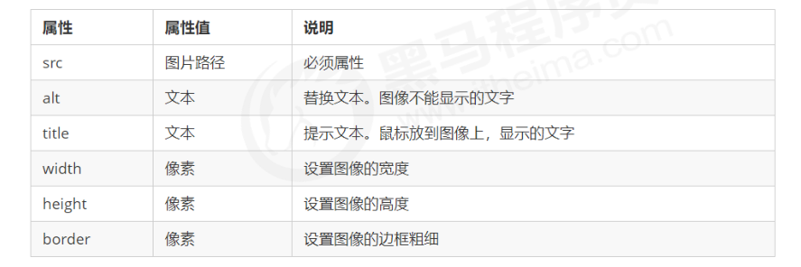

# 1.Web 标准的构成

主要包括结构（Structure） 、表现（Presentation）和行为（Behavior）三个方面。

# 2.html基本格式

~~~html
<html>
<head>
  <title>我的第一个页面</title>
</head>
<body>
你我之间,黑马洗练,月薪过万,一飞冲天
</body>
</html>
~~~

## vscode生成骨架快捷键

!+tab

#  3.lang 语言种类

1.en定义语言为英语
2.zh-CN定义语言为中文

简单来说,定义为en 就是英文网页, 定义为 zh-CN 就是中文网页

其实对于文档显示来说，定义成en的文档也可以显示中文，定义成zh-CN的文档也可以显示英文

这个属性对浏览器和搜索引擎(百度.谷歌等)还是有作用的

# 4.标题标签  h1-h6   (重要）

~~~html
<h1>标题一共六级选,</h1>
<h2>文字加粗一行显。</h2>
<h3>由大到小依次减，</h3>
<h4>从重到轻随之变。</h4>
<h5>语法规范书写后，</h5>
<h6>具体效果刷新见。</h6>
------pink老师
~~~

| 语义   | 标签                           | 说明       |
| ------ | ------------------------------ | ---------- |
| 加粗   | \<strong>\</strong>或\<b>\</b> | 推荐       |
| 倾斜   | \<em>\</em>或者\<i>\</i>       | 使用       |
| 删除线 | \<del>\</del>或\<s>\</s>       | 前一个     |
| 下划线 | \<ins>\</ins>或者\<u>\</u>     | 语义更强烈 |

# 5.图像标签的相关属性

# 6.图像标签和路径 (重点）

##  1.路径之相对路径

相对路径：以引用文件所在位置为参考基础，而建立出的目录路径。
这里简单来说，**图片相对于 HTML 页面的位置**

## 2.路径之绝对路径

绝对路径：是指目录下的绝对位置，直接到达目标位置，通常是从盘符开始的路径。
例如，“D:\web\img\logo.gif”或完整的网络地址“http://www.itcast.cn/images/logo.gif”。

# 7.超链接标签 (重点）

## 1.链接的语法格式

~~~html
<a href="跳转目标" target="目标窗口的弹出方式"> 文本或图像 </a>
~~~

_self表示在本网页跳转

__blank表示在新窗口跳转

## 2.链接分类：

### 1.外部链接: 

例如

~~~html
< a href="http:// www.baidu.com "> 百度</a >
~~~

### 2.内部链接:

网站内部页面之间的相互链接. 直接链接内部页面名称即可，例如 

~~~html
< a href="index.html"> 首页 </a>。
~~~

### 3.空链接:

 如果当时没有确定链接目标时，

~~~html
< a href="#"> 首页 </a > 
~~~

### 4.下载链接:

 如果 href 里面地址是一个文件或者压缩包，会下载这个文件。

### 5.网页元素链接: 

在网页中的各种网页元素，如文本、图像、表格、音频、视频等都可以添加超链接.

### 6.锚点链接: 

点我们点击链接,可以快速定位到页面中的某个位置.

#### 	6.1在链接文本的 href 属性中，设置属性值为 #名字 的形式，如

~~~html
<a href="#two"> 第2集 </a>
~~~

#### 	 6.2找到目标位置标签，里面添加一个 id 属性 = 刚才的名字 ，如

~~~html
<h3 id="two">第2集介绍</h3>
~~~

# 特殊字符

# 表格标签

~~~html
<table>
    
	<tr>
		<td>单元格内的文字</td>
	</tr>

</table>
~~~

1.\<table> \</table> 是用于定义表格的标签。

2.==\<tr>\</tr>== 标签用于定义表格中的==行==，必须嵌套在\<table> \</table>标签中。

3==.\<td>\</td>== 用于定义表格中的单元格，必须嵌套在\<tr>\</tr>标签中。
4.字母 td 指表格数据（table data），即数据单元格的内容

## 表头单元格标签

一般表头单元格位于表格的第一行或第一列，表头单元格里面的文本内容**加粗居中**显示.
**\==<th>**== 标签表示 HTML 表格的表头部分(table head 的缩写)		代替\<tr>

~~~html
<table>
    
	<tr>
		<th>姓名</th>
        <th>性别</th>
        <th>电话</th>
	</tr>
    
    <tr>
		<td>小王</td>
        <td>女</td>
        <td>123</td>
	</tr>

</table>
~~~

## 表格标题

**用==caption==标签**

~~~html
 <table border="1">

        <caption>个人资料</caption>
        
        <tr>
            <th> 姓名 </th>

            <th> 性别 </th>

            <th> 年龄 </th>
        </tr>

        <tr>
            <tr> 姓名 </tr>

            <td> 性别 </td>

            <td> 年龄 </td>
        </tr>

    </table>
~~~

##  表格属性

height                                                                           规定表格高度

## 表格结构标签

~~~html
 <thead></thead>：用于定义表格的头部。<thead> 内部必须拥有 <tr> 标签。 一般是位于第一行。
 <tbody></tbody>：用于定义表格的主体，主要用于放数据本体 。
 以上标签都是放在 <table></table> 标签中。
~~~

~~~html
 <table border="1" align="center" cellpadding="10" cellspacing="0" width="300px" height="149px">

        <caption>个人资料</caption>

        <thead>
            <tr>
                <th> 姓名 </th>

                <th> 性别 </th>

                <th> 年龄 </th>
            </tr>
        </thead>

        <tbody>
            <tr>
                <td> 德玛西亚 </td>

                <td> 男 </td>

                <td> 998 </td>
            </tr>
        </tbody>

    </table>
~~~

## 合并单元格

跨行合并：rowspan="合并单元格的个数"  ,**最上侧**单元格为目标单元格, 写合并代码

~~~html
<td rowspan="2"></td>
~~~

跨列合并：colspan="合并单元格的个数	,**最左侧**单元格为目标单元格, 写合并代码

~~~html
 <td colspan="2"></td>
~~~

### **合并单元格三步曲：**

1.先确定是跨行还是跨列合并。
2.找到目标单元格. 写上合并方式 = 合并的单元格数量。比如：<td colspan="2"></td>。
3.删除多余的单元格。

# 列表标签

表格是用来显示数据的，那么列表就是用来布局的。
列表最大的特点就是整齐、整洁、有序，它作为布局会更加自由和方便。

根据使用情景不同，列表可以分为三大类：**无序列表**、**有序列表**和**自定义列表**。

​																		**无序列表**

​													

​															

​																	**有序列表**

​		

​																**自定义列表**

## 无序列表

**\<ul>** 标签表示 HTML 页面中项目的无序列表，一般会以项目符号呈现列表项，而列表项使用 <li> 标签定义。
无序列表的基本语法格式如下：

~~~html
<ul>
<li>列表项1</li>
<li>列表项2</li>
<li>列表项3</li>
...
</ul>
~~~

1.无序列表的各个列表项之间没有顺序级别之分，是并列的。
2.\<ul>\</ul> 中只能嵌套\<li>\</li>，直接在\<ul>\</ul> 标签中输入其他标签或者文字的做法是不被允许的。

3.\<li> 与 \</li> 之间相当于一个容器，可以容纳所有元素。
4.无序列表会带有自己的样式属性，但在实际使用时，我们会使用 CSS 来设置。

## 有序列表

有序列表即为有排列顺序的列表，其各个列表项会按照一定的顺序排列定义。
在 HTML 标签中，\<ol> 标签用于定义有序列表，列表排序以数字来显示，并且使用 \<li> 标签来定义列表项。
有序列表的基本语法格式如下：

~~~html
<ol>
<li>列表项1</li>
<li>列表项2</li>
<li>列表项3</li>
...
</ol>
~~~

1.\<ol>\</ol>中只能嵌套<li></li>，直接在<ol></ol>标签中输入其他标签或者文字的做法是不被允许的。

2.\<li> 与 </li>之间相当于一个容器，可以容纳所有元素。
3.有序列表会带有自己样式属性，但在实际使用时，我们会使用 CSS 来设置。

## 自定义列表

自定义列表的使用场景:
自定义列表常用于对术语或名词进行解释和描述，定义列表的列表项前没有任何项目符号。

在 HTML 标签中，\<dl> 标签用于定义描述列表（或定义列表），该标签会与\<dt>（定义项目/名字）和
\<dd>（描述每一个项目/名字）一起使用。
其基本语法如下

~~~html
<dl>
	<dt>名词1</dt>
	<dd>名词1解释1</dd>
	<dd>名词1解释2</dd>
</dl>
~~~

1.\<dl>\</dl> 里面只能包含 \<dt> 和 \<dd>。

2.\<dt> 和\<dd>个数没有限制，经常是一个\<dt> 对应多个\<dd>。

## 列表总结

# 表单标签

在 HTML 中，一个完整的表单通常由**表单域**、**表单控件**（也称为表单元素）和 **提示信息**3个部分构成。

### 表单域

表单域是一个包含表单元素的区域。
在 HTML 标签中， \<form> 标签用于定义表单域，以实现用户信息的收集和传递。

\<form> 会把它范围内的表单元素信息提交给服务器.

~~~html
<form action=“url地址” method=“提交方式” name="表单域名称">
	各种表单元素控件
</form>
~~~

### 表单控件(表单元素)

​		

#### 1.\<input> 表单元素

在 <input> 标签中，包含一个 type 属性，根据不同的 type 属性值，输入字段拥有很多种形式（可以是文本
字段、复选框、掩码后的文本控件、单选按钮、按钮等）。

~~~html
<input type="属性值" />
~~~

**type** 属性的属性值及其描述如下：

除 type 属性外，\<input>标签还有其他很多属性，其常用属性如下：

placeholder                                                           提示信息

1.name 和value 是每个表单元素都有的属性值,主要给后台人员使用.
2.name 表单元素的名字, 要求 单选按钮和复选框要有相同的name值.
3.checked属性主要针对于**单选按钮**和**复选框,** 主要作用一打开页面,就要可以默认选中某个表单元素.
4.maxlength 是用户可以在表单元素输入的最大字符数, 一般较少使用

checked默认勾选

~~~html
<form action="" method="GET">

        性别：男<input type="radio" name="sex" value="男">
        女<input type="radio" name="sex" value="女">
        保密<input type="radio" name="sex" value="保密"> 

          
        爱好：吃饭<input type="checkbox" value="吃饭" name="hobby">
        睡觉<input type="checkbox" value="睡觉" name="hobby">
        打豆豆<input type="checkbox" value="打豆豆" name="hobby" checked>

    </form>
~~~

##### 1.1\<label> 标签

\<label> 标签为 input 元素定义标注（标签）。
\<label> 标签用于绑定一个表单元素, 当点击\<label> 标签内的文本时，浏览器就会自动将焦点(光标)转到或者
选择对应的表单元素上,用来增加用户体验.

~~~html
<label for="sex">男</label>
<input type="radio" name="sex" id="sex" />
~~~

核心： \<label> 标签的 **for** 属性应当与相关元素的 **id** 属性相同。

### 2.\<select> 表单元素

在页面中，如果有多个选项让用户选择，并且想要节约页面空间时，我们可以使用<select>标签控件定义下拉列表.

~~~html
<select>
<option>选项1</option>
<option>选项2</option>
<option>选项3</option>
...
</select>
~~~

1.\<select> 中至少包含一对\<option> 。
2.在\<option> 中定义 selected =“ selected " 时，当前项即为默认选中项。

### 3.\<textarea> 表单元素

使用场景: 当用户输入内容较多的情况下，我们就不能使用文本框表单了，此时我们可以使用 \<textarea> 标签。
在表单元素中，\<textarea> 标签是用于定义多行文本输入的控件。
使用多行文本输入控件，可以输入更多的文字，该控件常见于留言板，评论。

~~~html
<textarea rows="3" cols="20">
文本内容
</textarea>
~~~

1.通过 \<textarea> 标签可以轻松地创建多行文本输入框。
2.cols=“每行中的字符数” ，rows=“显示的行数”，我们在实际开发中不会使用，都是用 CSS 来改变大小。