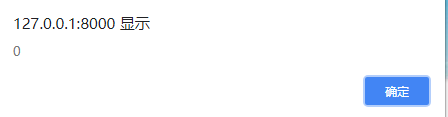

# 1.发送ajax请求

~~~html
<form onsubmit="return false">
     <input id="searchInput" name="value" type="text" placeholder="请输入搜索内容" 				autocomplete="off"  style="font-size:17px;font-weight:600; ">
     <input id="ai-topsearch" class="submit am-btn" value="搜索" index="1" 						type="submit">
</form>
~~~


## 1.直接表单序列化获取参数

~~~js
<script>
    // 首页点击搜索按钮后将输入框的数据传到session中，并跳转到搜索结果页 
    $("#ai-topsearch").click(function () {
        var key = $("#searchInput").val();
        alert(key);
        sessionStorage.setItem("value", key);
        if (key != null || key != "") {
            window.location.href = "search.html";
        }
    })
</script>
~~~


## 2.手动输入每个值

~~~js
    <script>
        $("#tijiao").click(function(e) {
            alert($("#email").val());
            e.preventDefault();
            $.ajax({
                url: "http://localhost:8080/user/shezi",
                type: "post",

                data: {
                    "username": $("#username").val(),
                    "introduce": $("#introduce").val(),
                    "email": $("#email").val(),
                    "tel": $("#tel").val(),
                    "sex": $(".sex").val(),
                    "truename": $("#name").val(),
                    "qq": $("#qq").val(),
                    "userid": $.cookie('userid'),
                },
                datatype: "json",
                success: function() {
                    alert("设置成功");
                }
            });
        });
    </script>
~~~


## 3.使用方法

~~~js
 <script>
      function getUserIcon() {
          $.ajax({
             url: "http://localhost:8080/user/getTouXiangById",
             data: bb(),
             success: function(pic) {

                 var li = '';
                 if (pic == "" || pic == null) {
                 li += '';
                    } 
                 else {
                        li += '';
                    }
                    $("li[id='touxiang']").append(li);
                }
            });
        }

        function bb() {
            var v = "id=" + sessionStorage.getItem("userid");
            console.log(v);
            return v;
        }
    </script>
~~~


## 4.挨个输入

~~~js
<form>
	<input type="text"/>
	<input type="text"/>
	<button id="button">提交</button>
/form>
~~~


~~~js
<script>
	 //发送异步请求，接收JSON格式的数据
   	//JS/Jquery
	//------点击submit按钮
	$("#button").click(function() {
		$.ajax({
			url: "http://localhost:8080/login",
			type: "get",
			//获取input的value---jquery
			data: "uname=aaa&pwd=123",
			dataType: "json",
			success: function(info) {
						console.log(info);
			  		}
				});
			})
</script>
~~~


## 5.表单自带输入，不能跨域

~~~js
<form class="navbar-form navbar-left" action="/untitled_war_exploded/indexServlet" method="get">
			<div class="form-group">
				<input type="text" name="pname" class="form-control" placeholder="请输入商品名称">
			</div>
			<button type="submit" class="btn btn-default">搜索</button>
		</form>
~~~


## 6.参数从函数和session获取


~~~java
   function getCourseId() {
            var str = location.search;
            if (str.indexOf("?") != -1) {
                str = str.substr(1);
                var strs = str.split("=");
                str = strs[1];
            }
            return parseInt(str);
        }
~~~

~~~java
       //点击立即加入按钮,如果免费直接加入我的学习,如果没有生成订单购买
        $(document).on("click", ".join-button", function() {
                if ($(".price").text() == '免费') {
                    $.ajax({
                        url: "http://localhost:8080/myStudy/addCourseToStudy",
                        data: 'courseid=' + getCourseId() + '&userid=' + sessionStorage.getItem("userid"),
                        dataType: 'text',
                        success: function(msg) {
                            if (msg.toString() == '加入成功') {
                                alert(msg);
                                window.location.href = "mystudy.html";
                            }
                        }
                    })
                }
~~~


# 2.点击图片获取id，作为参数发送ajax请求


## 1.

~~~html
li += '<div><h4>' + picture.des1 + '</h4>' +
        picture.des2 +'</div>';
~~~


~~~js
 <!--点击图片存session-->
    <script>
        $(document).on("click", ".p1", function() {
            var courseid = parseInt($(this).attr("data-courseid"));

            window.location.href = "details.html?courseid=" + courseid;
        })
    </script>
~~~


## 2.


 **==onclick="javascript:todetail(this.id)"==**

~~~html
 li += '<div class="danping" id="' + (pro.goodId) +
       '" onclick="javascript:todetail(this.id)"><div></div><br><div class="miaoshu">' + pro.goodDescribe +
        '</div><br><div><a class="price1">￥' + pro.goodCurrentPrice +
         '</a><a class="price2">&nbsp;&nbsp;&nbsp;<s>￥' + 									pro.goodOriginalPrice +
         '</s></a><br><a class="price2">月销' + pro.goodSale + '笔</a></div></div>'
~~~

~~~js

<!-- 点击商品后，发送请求，获取map集合后存入session -->
<script>
    function todetail(id) {
        alert(id);

        $.ajax({
            url: "http://localhost:8080/index/getGoodDetails",
            data: "goodId=" + id,
            success: function (deatailData) {
                var data = JSON.stringify(deatailData);
                sessionStorage.setItem("deatailData", data);   
                window.location.href = "introduction.html";
            },
            error() {
                console.log("error")
            }
        });
    }
</script>
~~~


# 3.ajax回调函数动态添加html代码，代码中包含变化的id值


~~~js
<!-- 添加导航栏 -->
<script>
    $.ajax({
        url: "http://localhost:8080/category/getAllCteGory",
        success: function (ctegory) {
            var li = '';
            var li2 = '';
            var li3 = '';
            var ids1 = ["aa", "bb", "cc", "dd", "ee", "ff", "gg", "hh", "ii", "jj", 							"kk", "ll", "mm"];
            var ids2 = ["aaa", "bbb", "ccc", "ddd", "eee", "fff", "ggg", "hhh", 								"iii", "jjj", "kkk", "lll"];

            for (var i = 0; i < ctegory.length; i++) {
                var cte = ctegory[i]; //数码

                li = cte.categoryName;
                $("a#t" + (i + 1)).append(li);

                for (var j = 0; j < cte.categories.length; j++) {
                    var ctee = cte.categories[j]; //电脑

                    li2 = '<dl class="dl-sort" id="' + (ids1[i] + ids2[j]) + '"><dt>							<span>' + ctee.categoryName + '</span></dt>' + '</dl>';

                    $("div#a" + (i + 1)).append(li2);

                    for (var k = 0; k < ctee.categories.length; k++) {
                        var cteee = ctee.categories[k];
                        li3 = '<dd><a  href="#"><span>' +
                            cteee.categoryName + '</span></a></dd>';
                        $("dl#" + (ids1[i] + ids2[j])).append(li3);
                    }
                }
            }
        }
    });
</script>
~~~

**==$("div#a" + (i + 1)).append(li2);==**


# 4.获取父节点元素


## 情景一：用onclick触发的函数


html代码：

```html
<div id="0" style="border-bottom:1px solid #000;margin:0 auto;">

    <div>1111</div>
    <div class="original">

        <div id="chartx1" class="chartstyle"></div>
        <div id="charty1" class="chartstyle" ></div>
        <button onclick="getDetail(this);" style="width:100%;height:30px;">查看信息			</button>
    </div>
</div>


<script>
    function getDetail(obj){
        alert(obj.parentNode.parentNode.id);    //1
    }

</script>
```

运行结果：



## 情景二:直接用click触发的函数


html代码：

```
<div id="0" style="border-bottom:1px solid #000;margin:0 auto;">

    <div>1111</div>
    <div class="original">
        <div id="chartx1" class="chartstyle"></div>
        <div id="charty1" class="chartstyle" ></div>
        <button class="info_detail" style="width:100%;height:30px;">查看信息</button>
    </div>
</div>


<script>
     $(".info_detail").click(function(){
         id=$(this).parent().parent().attr('id');
     })
</script>
```


.

# 5.解决动态添加的元素不能触发js问题


~~~html

    <div class="new-addr-btn">
        <a href="#"><i class="am-icon-edit"></i>编辑</a>
        <span class="new-addr-bar">|</span>
        <a >
         <i class="am-icon-trash"></i>
            删除
        </a>
     </div>
~~~


==live==

~~~js


<script>
    // 删除按钮事件
    $(".am-icon-trash").live('click', function () {

        $(this).parent().parent().remove();
        var id = $(this).parent().parent().attr('id');
        // alert(id);
        $.ajax({
            url: "http://localhost:8080/deliveryAddress/del",
            data:"id="+id,
            success(info){
                
                alert(info);
            }
        })

    });
</script>
~~~


# 6.监控元素，添加点击事件

~~~java
 $(document).on("click", ".nofee-watch", function() {
                var sectionid = $(this).attr("data-sectionid");
                window.location.href = "player.html?sectionid=" + sectionid;
            })
~~~


~~~java
        $(".second").click(function() {
                window.location.href = "details2.html?courseid=" + getCourseId();
            })
~~~


# 7.删除确认弹窗


~~~java
<p>点击按钮，显示确认框。</p>
<button onclick="myFunction()">点我</button>
<p id="demo"></p>
<script>
function myFunction(){
	var x;
	var r=confirm("按下按钮!");
	if (r==true){
		x="你按下了\"确定\"按钮!";
	}
	else{
		x="你按下了\"取消\"按钮!";
	}
	document.getElementById("demo").innerHTML=x;
}
</script>
~~~


