# 一.简单vue

已

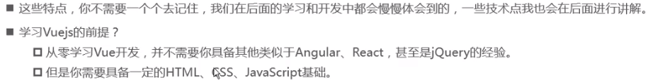

# 二.vue初体验

# 三.vue列表显示

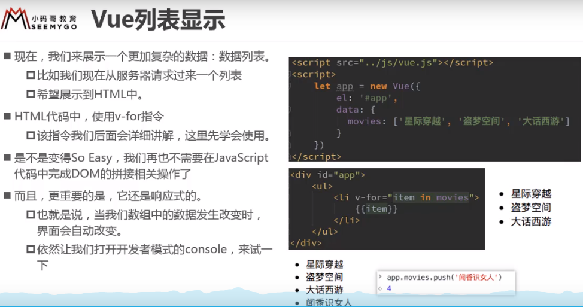

# 四.计数器

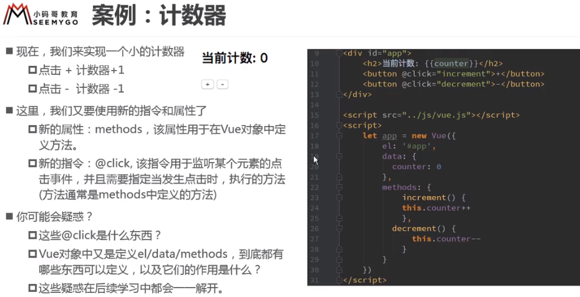

# 五.Vue中的MVVM

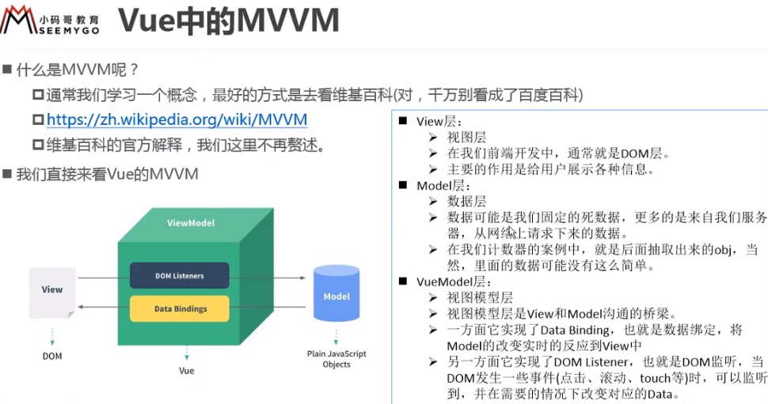

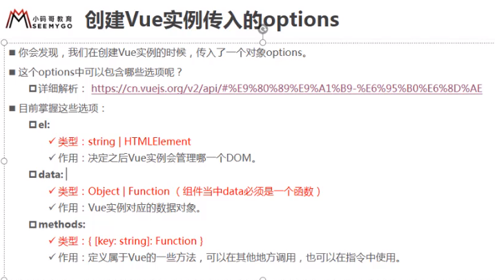

# 六.插值操作

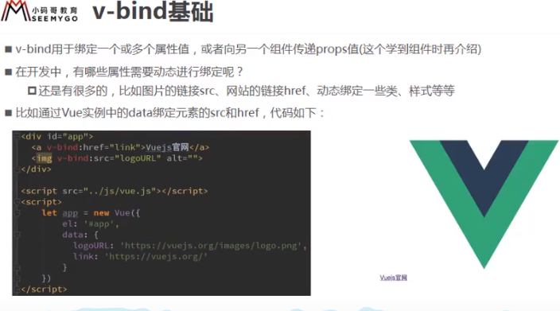

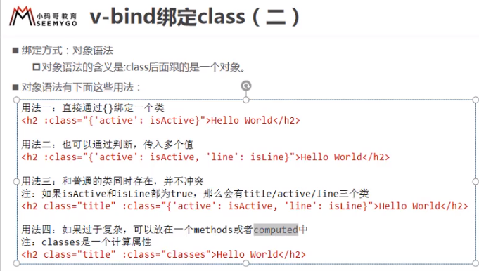

# 七.计算属性

# 八.es6补充

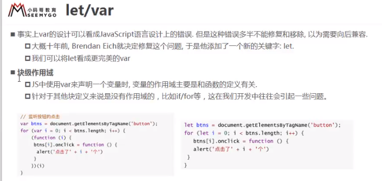

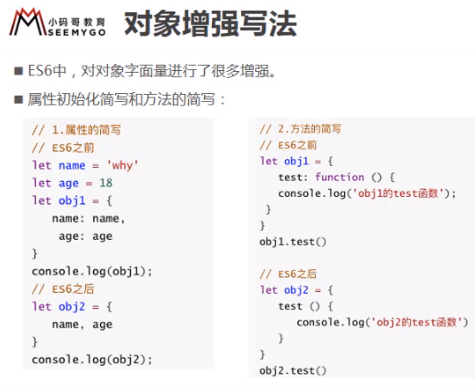

# 九.v-on传参

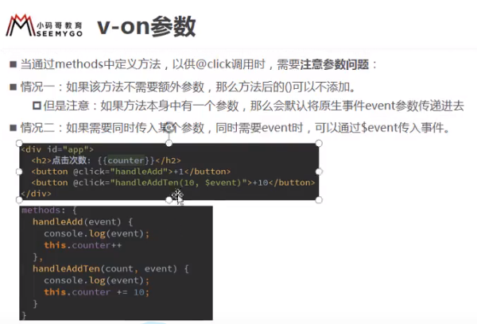

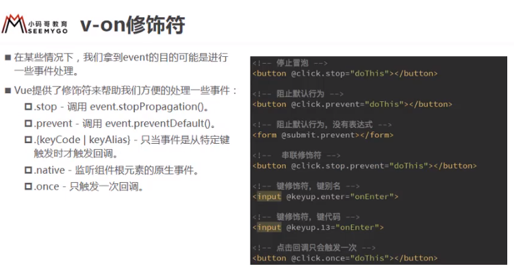

# 十.v-if

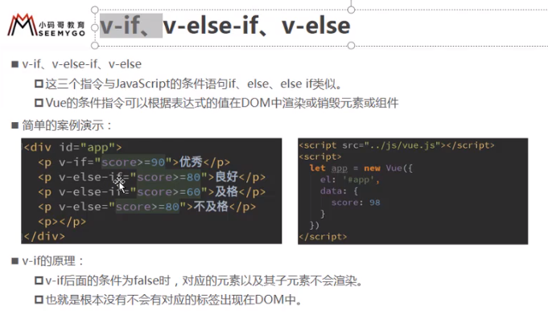

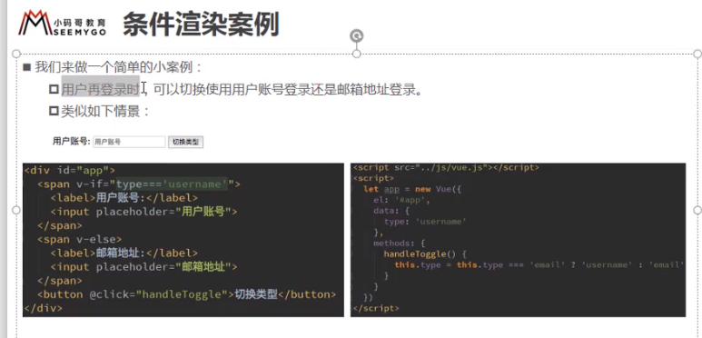

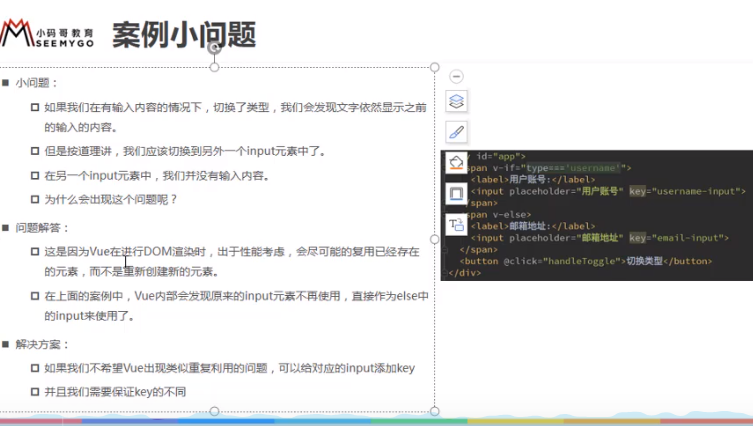

# 十一.v-show

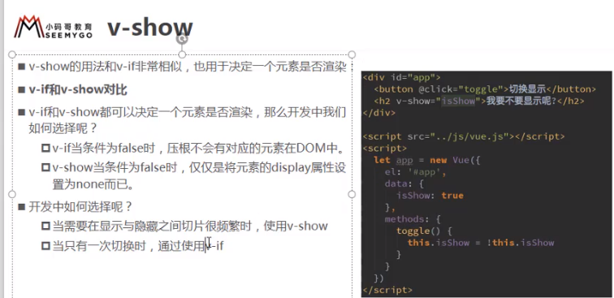

# 十二.v-for遍历数组

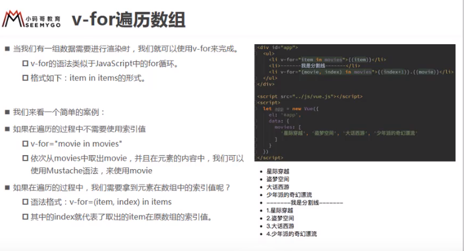

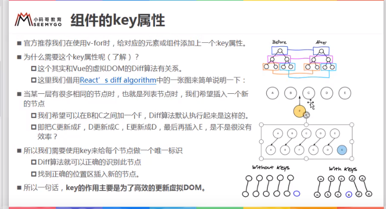

# 十三：v-model双向绑定

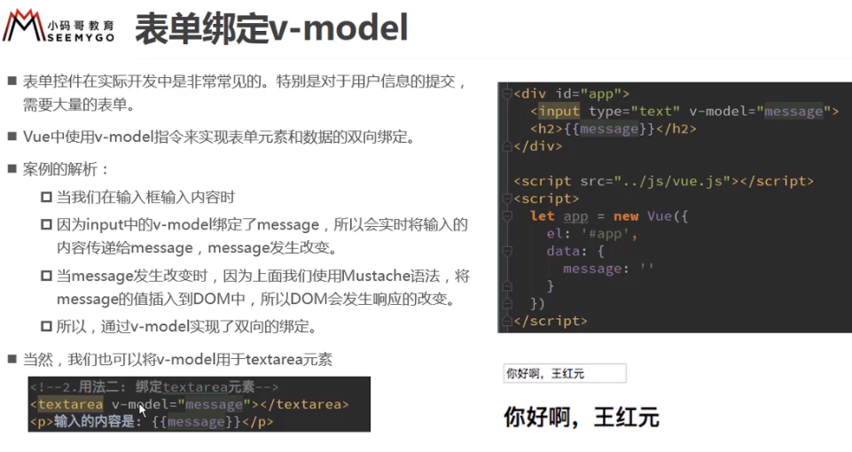

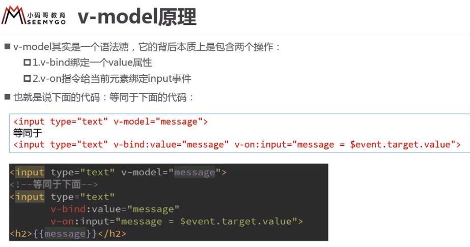

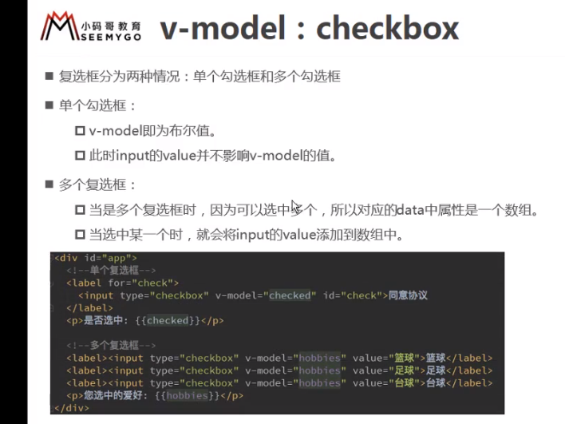

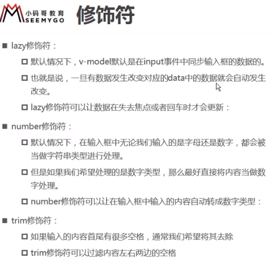

# 十四.组件化

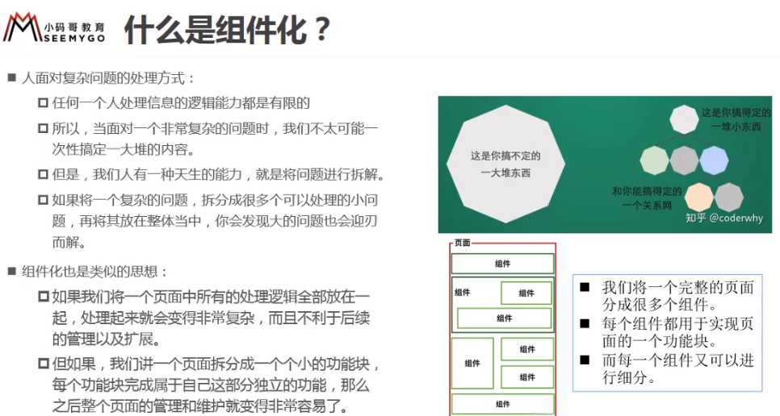

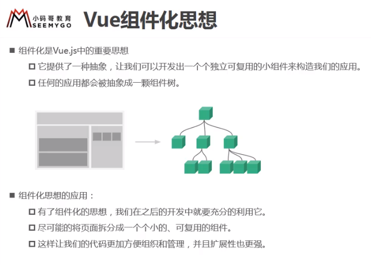

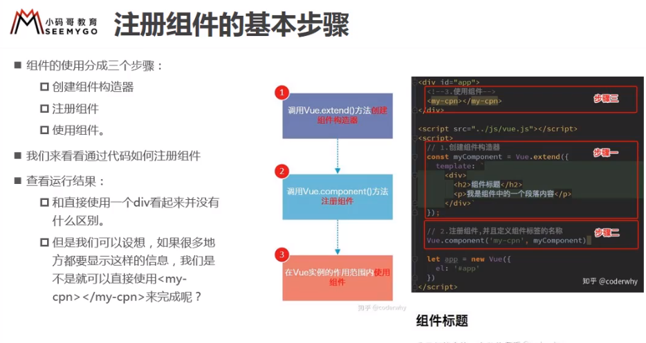

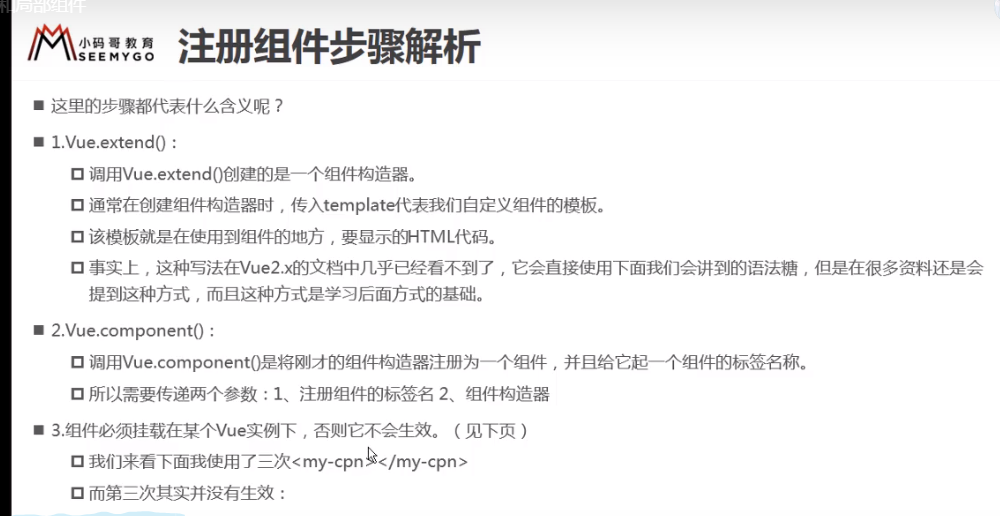

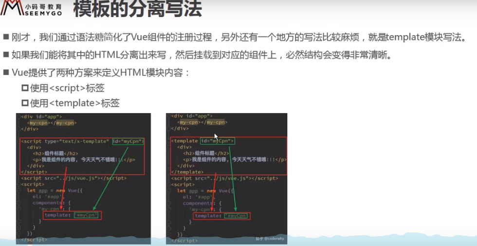

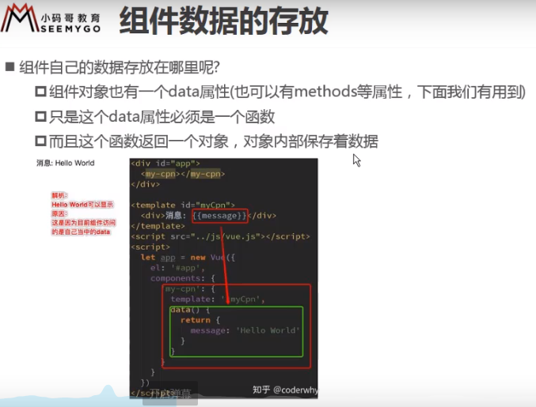

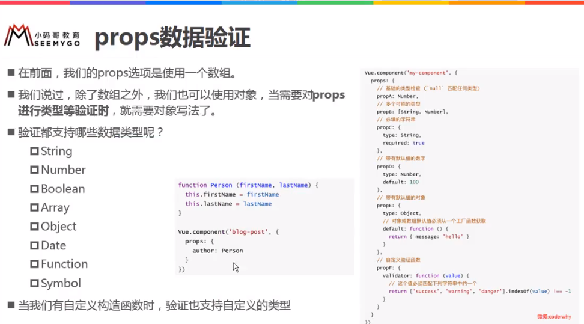

