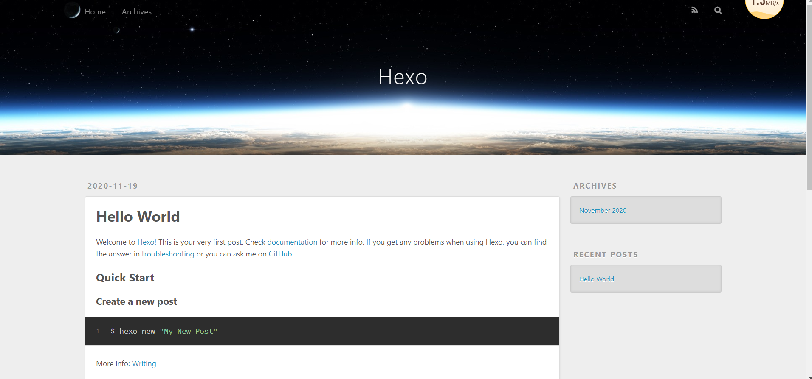

~~~java
node -v
~~~

~~~java
npm -v
~~~

~~~java
npm install -g cnpm --registry=https://registry.npm.taobao.org
~~~

~~~java
cnpm -v
~~~

~~~java
cnpm install -g hexo-cli
~~~

~~~java
hexo -v
~~~

# 开始博客搭建

## 新建文件夹

~~~java
hexo init
~~~

## 查看

~~~java
hexo s
~~~

http://localhost:4000/

## 清理

~~~java
hexo	clean
~~~

## 提交

~~~java
hexo g
~~~

## 启动

~~~java
hexo s
~~~

~~~java
cnpm install --save hexo-deployer-git
~~~

windows  用下面这个

~~~java
npm	install	hexo-deployer-git	--sava
~~~

## 改配置文件

~~~java
deploy:
  type: 'git'
  repo: https://github.com/zxq19970820/zxq19970820.github.io.git
  branch: master
~~~

## 推送

~~~java
hexo  d
~~~

## 克隆yilla主题

~~~java
 git clone https://github.com/litten/hexo-theme-yilia.git themes/yilla

~~~

改配置文件

~~~java
theme: yilia	
~~~

