转储mysql

~~~java
mysqldump -uroot -p 数据库名字 > 文件名
~~~

~~~java
mysqldump -uroot -p lemall > lemall.sql
~~~

# 1.创建数据库

~~~sql
CREATE  DATABASE	数据库名字
CHARACTER  SET  utf8  COLLATE

~~~

# 2.选择数据库

~~~sql
USE 数据库名
~~~

# 3.删除数据库

~~~sql
DROP  DATABASE  数据库名
~~~

# 4.创建数据表

~~~sql
CREATE TABLE 表明(
	字段1  类型,
	字段2  类型
	);

~~~

==主键==  	PRIMARY KEY

==外键==	FOREIGN KEY

==非空== 	NOT NULL

==唯一== 	UNIQUE

==自增==	auto_increment

# 5.修改表结构

## **把字段名的数据类型改为xxx**

~~~sql
ALTER 	TABLE 	表名
MODIFY  COLUMN  字段名  字段的目标数据类型

~~~

## 移动字段XX到xx之后

~~~sql
ALTER	TABLE   表名
MODIFY  字段	AFTRE 字段

~~~

## **改字段**

~~~sql
ALTER   TABLE   表名
CHANGE   原字段  目标字段 类型

~~~

## **删除字段**

~~~sql
ALTER	TABLE  表名
DROP  COLUMN  字段名

~~~

## 在xxx字段后添加新字段

~~~sql
ALTER  TABLE 表名
ADD  COLUMN 新字段名 新字段类型 AFTER  XXX
~~~

## **重命名表名**

~~~sql
ALTER  TABLE   原表名
RENAME TO    新表名

~~~

# 删除表

~~~sql
DROP	TABLE    表名
~~~

# 导入数据

~~~sql
INSERT   INTO  表名（字段1，字段2，字段3）
VALUES  (数据1，数据2，数据3)，
		(数据1，数据2，数据3)，
		(数据1，数据2，数据3)；
~~~

==字符型要用    ’   ’==

# 将一张表的查询结果插入到另一张表

~~~sql
INSERT  INTO  person_new
select  * FROM  person

~~~

# 更新表数据

将id（字段名）为3的address（字段名）更新成xxx

~~~sql
Update   表名
SET  address=’新数据’  
WHERE  ID=3

~~~

# 删除表数据

~~~sql
DELECT  FROM  表名
WHERE   Sname=”xx”

~~~

# 查找

## 查找表中所有数据

~~~sql
SELECT  *
FROM 表名
~~~

## 查找表中第4-5条记录

~~~sql
select   *
from  表名  limit 3,2

~~~

（注释：limit是mysql的语法

select *

 from table limit m,n

其中m是指记录开始的index，从==0开始==，表示==第一条记录==

n是指取==n条==。）

## 查找多个字段

~~~sql
Select  字段1,字段2,字段3
FROM 表名

~~~

## 去掉重复行

~~~sql
SELECT 	DISTINCT  字段
FROM 表名

~~~

## 查询带条件的

~~~sql
SELECT   字段
From   表名
Where   条件
~~~

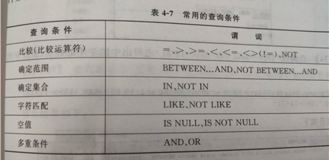

## 对查找结果排序

~~~sql
SELECT  字段
FROM   表名
WHERE字段1=’ xxx’ 
ORDER  BY  字段1, 字段2 DESC

~~~

 

备注 ==DESC==降序

​     ==ASC== 升序  ==默认==

## 对查询结果分组

~~~sql
SELECT  字段1     COUNT(字段2)
FROM  表名
GROUP  BY   字段1
HAVING 

~~~

# 视图

## 创建视图

~~~sql
CREATE  view  视图名
AS  SELECT  字段 
from   表名
WHERE    age>20  
~~~

## 查看视图内容

~~~sql
SELECT * FROM my_view1
~~~

## 查看视图定义

~~~sql
DESC 视图名
~~~

## 修改视图定义

~~~sql
CREATE  OR  REPLACE   VIEW  
视图名（目标字段1,目标字段2）
AS  字段1,字段2
FROM   表名
WHERE  

~~~

## 删除视图

~~~sql
DROP  VIEW
视图名

~~~

# 创建用户账号

~~~sql
CREATE   USER   

‘用户名’@’主机号’
IDENTIFIED    BY  ‘密码’
删除用户
DROP   USER  用户名@主机

~~~

# 授予权限

~~~sql
GRANT   SELECT(字段1,字段2)
ON   数据库名.表名               或   ON  TABLE  表名
TO  ‘用户名’

~~~

# 收回权限

~~~sql
REMOVE   SELECT
ON  ‘数据库名.用户名‘
FROM  ‘用户名’

~~~

# 六大约束

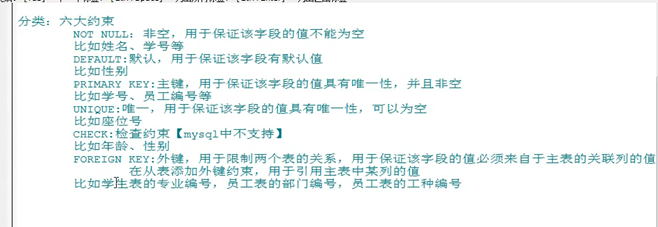

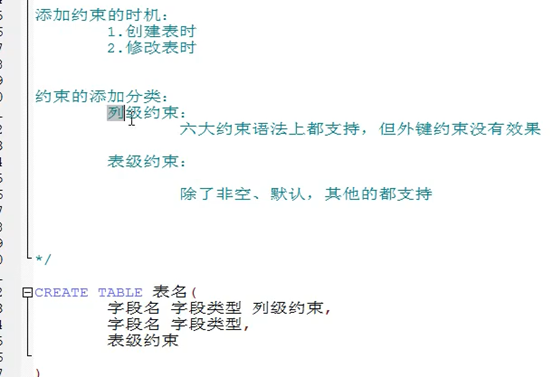

## 查看索引

## 添加列级约束

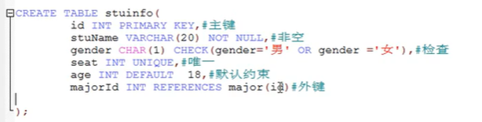

## 主键和唯一区别

## 外键

## 添加表级约束

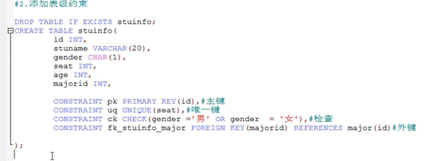

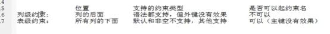

# 添加约束

## 列级约束

~~~sql
Alter    table  表名  
modify   column  字段名  [长度]   primary key  |not  null   |  default

~~~

## 表级约束

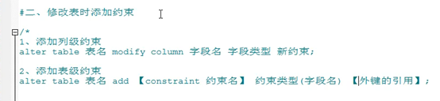

### 添加主键

~~~sql
Alter   table  表名 
add   constraint   别名 primary key(字段);

~~~

### 添加外键

~~~sql
Alter   table   表名 
Add    [constraint   名字] foreign  key  字段  references  表名 (字段)
~~~

# 删除

## 删除表约束

~~~sql
Alter table  表名
Modify  column  字段名

~~~

## 删除唯一

~~~sql
Altrer  table  表名
Drop   index   字段名
~~~

## 删除主键

~~~sql
Alter  table 表名
Drop   pimary   key; 

~~~

# 更换主键

1.首先创建一个数据表table_test：

~~~sql
create table table_test(
	`id` varchar(100) NOT NULL,
	`name` varchar(100) NOT NULL,
	PRIMARY KEY (`name`)
)ENGINE=MyISAM DEFAULT CHARSET=gb2312;

~~~

2、如果发现主键设置错了,应该是id是主键,但如今表里已经有好多数据了,不能删除表再重建了，仅仅能在这基础上改动表结构。

 先删除主键

~~~sql
alter table table_test drop primary key;
~~~

然后再增加主键

~~~sql
alter table table_test add primary key(id)
~~~

==注:在增加主键之前,必须先把重复的id删除掉。==

# 查看，设置时区

~~~sql
SELECT * FROM  tmp7

SET time_zone='+10:00'

~~~

# 设置变量

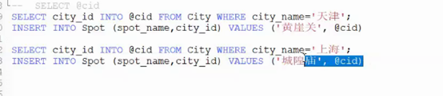

# **删除外键**

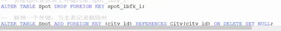

# 主从表记录删除和修改，分为以下三种

~~~sql
1  on  delete  cascade   级联删除   从表记录和主表记录一起被删除
2  no   action  或  restrict    主要从表里有数据，主表记录就不能被删除
3  on  delete  set  null    主表记录删除时，从表记录的相关值设置为空
关于三个删除

~~~

# 关于三个删除

## 1  delete table 表名

​	有事务约束，执行效率比较慢，数据最安全，**只删除数据，不删索引**

## 2 truncate  [table] 表名

​		 速度快  数据找回不太可能，但是表结构还在  能清除自增数据 **删除数据和索引**

## 3 drop  table  表名 

​		 数据和表结构都会被删除

# 其他

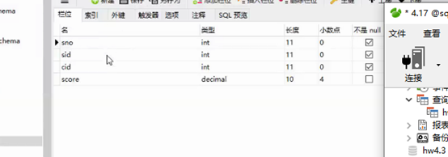

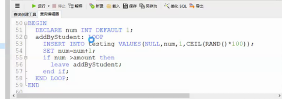

## 给表取别名

## 如果空，显示 外聘人员

## 复合条件

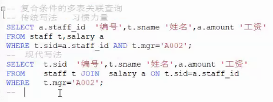

## 自连接

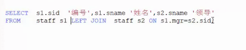

为空就显示本人

# 多表查询join连接三个表

连接三个数据表的用法：

~~~sql
 FROM  ( Member  INNER 
        JOIN  MemberSort 
        ON Member.MemberSort=MemberSort.MemberSort )
		 INNER   JOIN    MemberLevel  
		 ON   Member.MemberLevel  = MemberLevel.MemberLevel

~~~

语法格式可以概括为：

~~~sql
 FROM (表1 INNER JOIN 表2

 ON 表1.字段号=表2.字段号)

 INNER JOIN 表3 

ON 表1.字段号=表3.字段号
~~~

# 索引

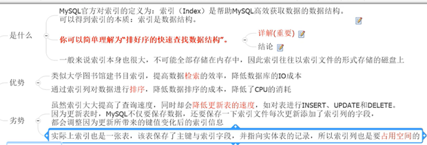

表示比any中任何一个高的 人的信息

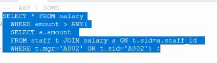

性能优化，理解有难度

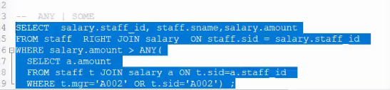

# End 

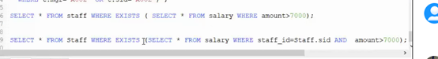

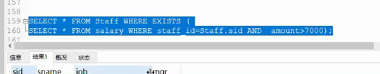

