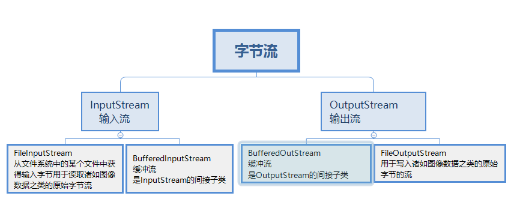
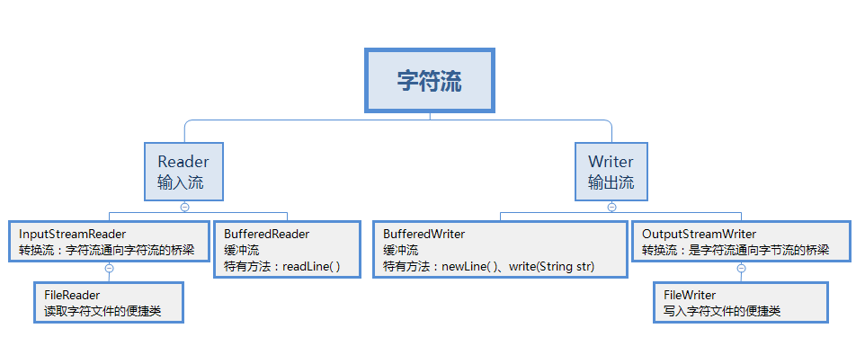

# 一.io简单分类


# 二.字节流




## 2.1字节流读取文件


~~~java
public class t1_fileinputstream {
    public static void main(String[] args)  throws IOException {

        FileInputStream in=new FileInputStream("aaa.txt");

        int b=0;

        while (true){
            b=in.read();
            if (b==-1){
                break;
            }
            System.out.println(b);
        }
    }
}
~~~


## 2.2字节流输出文件

```java
public class t2_fileOutStream {
    public static void main(String[] args) throws IOException {

        FileOutputStream out = new FileOutputStream("bbb.txt");
        String str = "艾欧尼亚";
        byte[] bytes = str.getBytes();
//        for (byte aByte : bytes) {
//            System.out.println(aByte);
//        }
        for (int i = 0; i < bytes.length; i++) {
            out.write(bytes[i]);
        }
        out.close();
    }
}
```


如果是通过fileoutputstream向一个已经存在的文件中写入数据，那么改文件中的数据首先会被清空，再写入新的数据。

若希望在已存在的文件内容之后追加新的内容，可以在FileOutputStream的构造函数

Fileoutputstream（string fileName，boolean append）来创建文件输出流对象，并把append值设置成==true==

如：

```java
FileOutputStream out = new FileOutputStream("bbb.txt",true);
```


## 2.3文件的拷贝

```java
public class t3_copy {
    public static void main(String[] args) throws IOException {

        InputStream in = new FileInputStream("aaa.txt");
        OutputStream out = new FileOutputStream("ddd.txt");

        int len = 0;
        while ((len = in.read()) != -1) {
            out.write(len);
        }
        in.close();
        out.close();
        
    }}
```


## 2.4字节流的缓冲区

```JAVA
public class t4_copy_buff_byte {
    public static void main(String[] args) throws IOException {

        InputStream in=new FileInputStream("aaa.txt");
        OutputStream out =new FileOutputStream("bbb.txt");

        byte[] buff=new byte[1024];  //定义数组，作为缓冲区

        int len;    //定义一个int类型的变量len记住读取堵路缓冲区的字节数
        long beginTime=System.currentTimeMillis();

//        while (in.read(buff)!=-1){
//
//        }
//        out.write(buff);

        while ((len=in.read(buff))!=-1){
            out.write(buff,0,len); //从第一个字节开始，向文件写入len个字节
        }

        long endTime=System.currentTimeMillis();
        System.out.println("拷贝所花时间为"+(endTime-beginTime)+"毫秒");

        in.close();
        out.close();


    }
}
```


## 2.5字节缓存流

```java
public class t6_buff {
    public static void main(String[] args) throws IOException {
        FileInputStream in=new FileInputStream("aaa.txt");
        FileOutputStream out=new FileOutputStream("bbb.txt");

        BufferedInputStream bis=new BufferedInputStream(in);
        BufferedOutputStream bos=new BufferedOutputStream(out);

        int len=0;

        while ((len=bis.read())!=-1){
          bos.write(len);
        }

        bis.close();
        bos.close();

    }
}
```


# 三.字符流



## 3.1读取字符流


```java
public class t1_filReader {
    public static void main(String[] args) throws IOException {
    
        FileReader fr=new FileReader("aaa.txt");
        int ch;
        
        while ((ch=fr.read())!=-1){
            System.out.println(ch);
            System.out.println((char) ch);
        }
       fr.close();
        
    }
}
```


## 3.2字符流输出

```java
public class t2_fileWriter {
    public static void main(String[] args) throws IOException {
        FileWriter fw=new FileWriter("bbb.txt");
        String str="嘻嘻嘻嘻嘻";

        fw.write(str);
        fw.write("\r\n");
        fw.close();
    }
}
```


FilterWriter通往FilterOutPutStream一样，如果指定的文件不存在，就会先创建文件，再写入数据，如果文件存在，则会清空文件中的内容。如果想在文件末尾追加数据，需要重载构造方法，

~~~java
 FileWriter fw=new FileWriter("bbb.txt",true);
~~~


## 3.3字符流使用缓冲区进行整行复制

~~~java
public class t3_copy_buff {
    public static void main(String[] args) throws IOException {
        FileReader fileReader = new FileReader("aaa.txt");
        FileWriter fileWriter = new FileWriter("bbb.txt", true);

        BufferedReader bufferedReader = new BufferedReader(fileReader);
        BufferedWriter bufferedWriter = new BufferedWriter(fileWriter);

        String str;

        while ((str = bufferedReader.readLine()) != null) {
            
//            System.out.println(str);
            bufferedWriter.write(str);
            bufferedWriter.newLine();           //换行


        }
        bufferedReader.close();
        bufferedWriter.close();
    }
}
~~~


## 3.4字符流获取行号

```java
public class t4_lineNumReader_copy {
    public static void main(String[] args) throws IOException {
        FileReader fr=new FileReader("aaa.txt");
        FileWriter fw=new FileWriter("bbb.txt");

        LineNumberReader lr=new LineNumberReader(fr);    //包装

        lr.setLineNumber(0);    //设置读取文件的起始行号
        String line=null;
        while ((line=lr.readLine()   )!=null){
            fw.write(lr.getLineNumber()+":"+line);   //将行号写入到文件中
            fw.write("\r\n");           //写入行号
        }

        lr.close();
        fw.close();

    }
}
```


